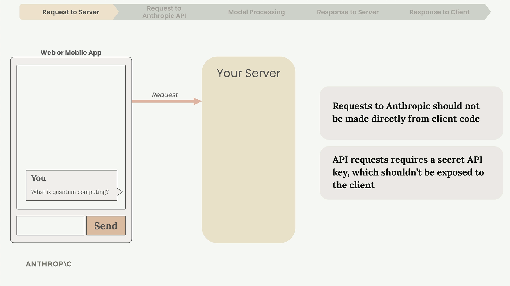
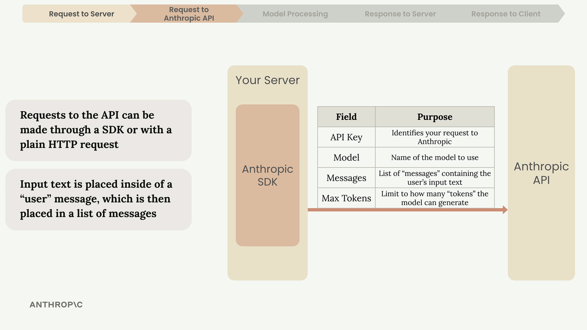
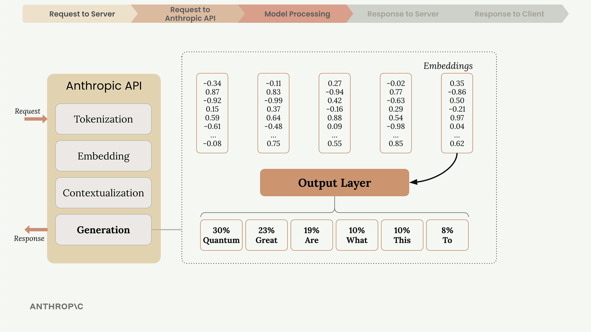
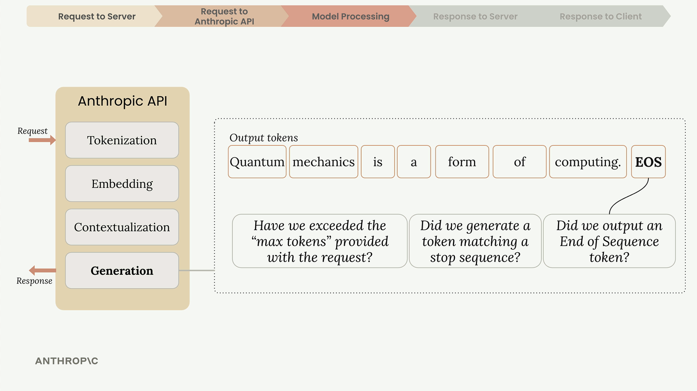

> 本文翻译自[Building with the Claude API](https://anthropic.skilljar.com/claude-with-the-anthropic-api)

# About this course

这个课程主要集中在如何使用Anthropic API将Claude AI集成到应用程序中。课程内容涵盖基础API操作、高级提示技术、工具集成以及构建AI驱动系统的架构模式。通过实践练习和实际案例，参与者将学习如何实现对话式AI、检索增强生成、自动化工作流，并利用Claude的多模态功能处理文本、图像和文档。

---

# Accessing Claude with the API

## Accessing the API

在使用Claude构建应用程序时，我们有必要理解完整的request lifecycle，从而帮助我们更好地做出架构决策与高效地调试问题。我们将会逐步了解从聊天界面点击“发送”到Claude响应消息的屏幕上的完整的过程。

### The Five-Step Request Flow

与Claude的每次交互都遵循一个固定的模式，可以分为五个不同的阶段：

请求服务器 -> 请求Anthropic API -> 模型处理 -> 回应到服务器 -> 回应到客户端



### Why You Need a Server

为什么不能直接请求到Anthropic API，而是需要经由服务器呢？原因如下：

- API请求需要一个API key作为验证手段
- 将API key暴露在客户端代码中存在严重的安全隐患
- 拿到API key的任何人都可以直接发送未经你授权的请求

所以，通过客户端将请求发送到自己的服务器，该服务器然后使用安全存储的密钥与Anthropic API进行通信是更合理的方案。

### Making API Requests

当你的服务器与Anthropic API交互时，有两种选项，一是官方的SDK，或者直接发送普通的HTTP请求。Anthropic为以下语言提供了SDK：Python，Typescript，JavaScript，Go，Ruby。



每次请求需要包含以下这些核心信息：

- API Key - Anthropic需要通过API来识别你的请求
- Model - 所使用的模型的名称，比如说claude-3-sonnet
- Messages - 一个包含用户输入文本的列表
- Max Tokens - Claude所生成的token的数量限制

### Inside Claude's Processing

一旦Anthropic接收到了你的请求，Claude对于请求的处理会经历四个主要阶段：

tokenization、embedding、contextualization、generation


#### Tokenization

Claude首先会将你的输入打碎为更小的组成部分，我们将其成为token（词元）。Token可以是整个单子，单词的一部分，空格，或标点。为了简化，我们可以将每个单词作为一个token。

#### Embedding

每个token会被转换为一个embedding（嵌入） —— 一长串数字，用来表示这个token所对应的单词的所有可能的含义。我们可以将embedding理解为一个**数值化的定义**，它能够捕捉词语之间的语义关系。


单词通常具有多种含义。如上图所示。

#### Contextualization

Claude 会根据周围的词语对每个嵌入（embedding）进行调整，以确定在当前语境中最可能的含义。这个过程会对数值表示进行修正，从而突出最合适的词义。


#### Generation

这些**上下文化的嵌入（contextualized embeddings）**会通过一个**输出层（output layer）**，**该层会为每一个可能的下一个词计算概率**。Claude 并不总是选择概率最高的词——**它会结合概率与受控的随机性，从而生成自然且多样化的回答**。



在选择出每一个词之后，**Claude** 会将其加入到序列中，然后为下一个词重复整个过程。

### When Claude Stops Generating

在生成每个 **token** 之后，Claude 会检查若干条件，以决定是否继续生成：



- Max tokens reached - 是否达到了我们所指定的token数量限制
- Natural ending - 是否生成了一个 **序列结束标记（end-of-sequence token）**？
- Stop sequence - 是否遇到了预先定义的**停止短语（stop sequence）**？

### The API Response

当模型生成的部分结束后，API会将结构化的响应，包含如下信息：

- **Message** - 生成的文本
- **Usage** - 输入与输出的token数量
- **Stop Reason** - 生成过程结束的原因


你的服务器会接收这个响应，并将生成的文本转发回你的客户端应用程序，随后它会显示在用户界面中


### Key Takeaways

理解这一流程可以帮助你：

- **设计安全的架构**，以保护你的 API 密钥
- **为你的使用场景设置合适的 token 限制**
- **在应用逻辑中处理不同的停止原因（stop reasons）**
- **通过理解问题可能出现在流程管道中的位置来调试问题**

不必担心需要记住每一个细节——目标是让你**熟悉相关术语以及在使用 Claude API 时会遇到的整体流程**。

## Getting an API key

这部分是官方给出教程，国内可能需要用中转站了。

## Making a request

一旦你理解了基本设置和结构，向Anthropic API发起第一个请求就很简单了。本小节将带你了解使用Python让Claude响应你的提示的必要步骤。

### Setting Up Your Environment

在创建任何的API调用前，我们首先需要安装必要的包：

```cmd
%pip install anthropic python-dotenv
```

然后创建一个`.env`文件，并将API Key存储起来：

```python
ANTHROPIC_API_KEY="your-api-key-here"
```

接下来就可以载入环境变量，并创建一个API client：

```python
from dotenv import load_dotenv
load_dotenv()

from anthropic import Anthropic

api_key = os.getenv("ANTHROPIC_API_KEY")
if not api_key:
    print("Missing ANTHROPIC_API_KEY environment variable. Set it in .env or system env.")
    sys.exit(1)

client = Anthropic(api_key=api_key, base_url="https://api.gemai.cc")
model = "claude-haiku-4-5-20251001"
```

### The Creat Function

发送API请求的核心是`client.messages.create()`函数，这个函数需要三个关键参数：


- **model** - 你想要使用的Claude模型的名称
- **max_tokens** - 响应长度的安全限制（并非响应的目标长度）
- **messages** - 需要发送给Claude的对话历史

`max_tokens`实际上是一个安全机制。如果你将其设置为1000，那么Claude将会在达到1000tokens后停止生成，即使Claude还没生成完整的响应。无论max_tokens的数值是多少，Claude都只会按照它所认为合适的方式响应。

### Understading Messages

`messages`参数表示的是你跟Claude之间的对话，类似AI聊天应用，下图是一个`messages`的例子：


每个`messages`是一个`dictionary`，包含`role`（要么是`user`要么是`assistant`）和`content`（实际的文本）。

### Making Your First Request

下面是一个完整的向Claude发送请求的例子：

```python
message = client.messages.create(
    model=model,
    max_tokens=1000,
    messages=[
        {
            "role": "user",
            "content": "What is quantum computing? Answer in one sentence"
        }
    ]
)
```

当运行这段代码时，Claude会处理你的请求，并返回一个`response`对象，包含生成的文本，以及请求相关的元数据。

### Extracting the Response

返回的response对象包含了很多信息，而我们通常只需要生成的文本。我们可以通过这样的方式访问：

```python
message.content[0].text
```

### Full Code

```python
from dotenv import load_dotenv
import os
import sys

load_dotenv()

from anthropic import Anthropic

api_key = os.getenv("ANTHROPIC_API_KEY")
if not api_key:
    print("Missing ANTHROPIC_API_KEY environment variable. Set it in .env or system env.")
    sys.exit(1)

client = Anthropic(api_key=api_key, base_url="https://api.gemai.cc")
model = "claude-haiku-4-5-20251001"

try:
    message = client.messages.create(
        model=model,
        max_tokens=1000,
        messages=[
            {
                "role": "user",
                "content": "What is quantum computing? Answer in one sentence"
            }
        ]
    )
    print("Response:", message.content[0].text)
except Exception as e:
    print("Request failed:", e)
```

## Multi-Turn conversations

[Multi-Turn conversations](https://anthropic.skilljar.com/claude-with-the-anthropic-api/287735)
