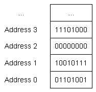
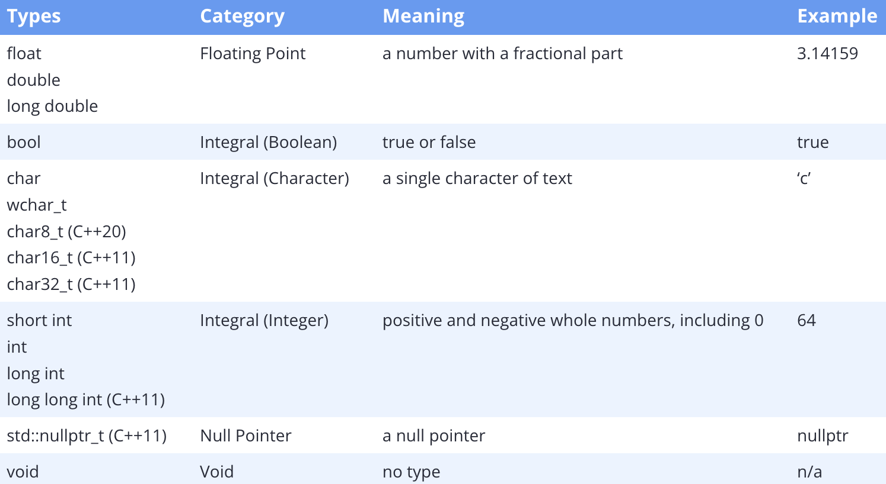

### Introduction to fundamental data types

---

变量实际上是可以用来存储信息的一段内存的名字。内存的最小单位是**binary digit**，也称为**bit**，可以保存两个值：0或1。在计算机中，内存被组织称称为内存地址的顺序单元，我们可以通过内存地址在特定位置上查找和访问内容。

在现代计算机架构中，每个bit并不会用一个自己唯一的内存地址，这是因为内存地址的数量是有限的，并且很少需要逐bit的访问内存。相反，每个内存地址存储的是一个字节的信息。一个字节byte由8个顺序的bit组成。下图中展示了一些顺序的内存地址，以及对应的字节中的数据

因为计算机上的所有数据都只是一个bit的序列，所以我们使用**data type**来告诉编译器，如何以某种有意义的方式解释内存中的内容。也就是说，当我们声明一个变量为整数时，就会告诉编译器“该变量使用的内存将被解释为整数值”。

当我们为对象指定一个值时，编译器和CPU会将值编码为该数据类型的适当的bit序列，然后将这些bit存储在内存中。例如，如果给一个整数对象赋值为65，则该值将会转换为bit序列`0100 0001`，并存储在分配给这个对象的内存中。相反，当计算对象以生成一个值时，bit序列将会重构会原值，也就是`0100 0001`被转换为65。这些工作都是编译器和CPU实现的，我们无需关心其中的细节。

我们需要做的就是为对象选择合适的数据类型。

C++中有一些内置的数据类型，被称为基础类型，也会被称为basic types，primitive types，built-in types。基础类型包括以下：

