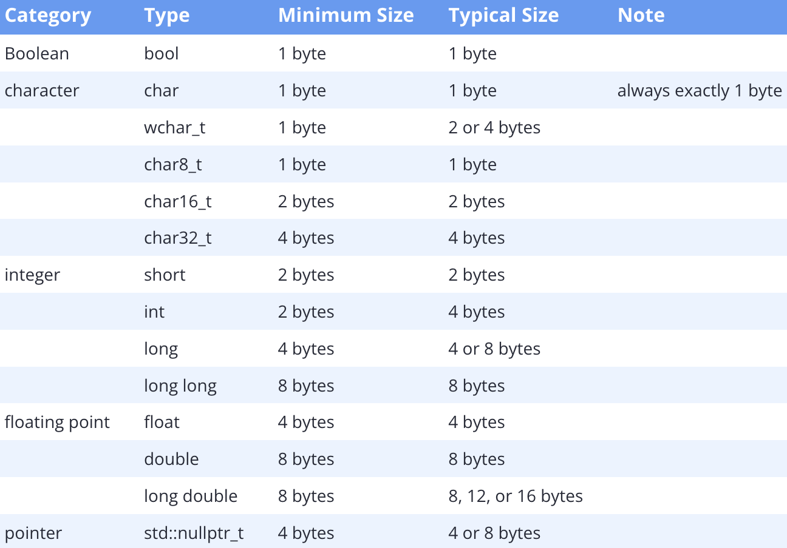

### Object sizes and the sizeof operator

---

在现代计算上，内存通常被组织为以字节为大小的单位，内存中的每个字节都有自己唯一的地址。基于这一点，我们可以将内存是为可以存取信息的邮箱，变量就是方位这些邮箱的名称。然而，大多数对象实际上都会占用一个字节以上的内存，单个对象就可能会使用到多个连续的内存地址，对象使用的内存量取决于其数据类型。

因为我们通常使用变量名来访问内存，编译器会隐藏给定对象使用多少字节的细节。当我们访问某个变量时，编译器会清楚要检索多少字节的数据，而无需我们了解其中的细节。

只不过，作为C++开发者，我们还是应该了解不同数据类型使用了多少内存。

#### Fundamental data type sizes

在主流的开发流程中，我们通常会采用一些假设，并在此基础上定义数据类型的大小

- 一个字节是8bit
- 内存是byte adressable，最小的对象为1个字节
- 浮点数支持IEEE-754标准
- 使用32位或64位架构

#### The sizeof operator

为了能够确定特定计算机上数据类型的大小，C++提供了`sizeof`操作符，`sizeof`是一个一元运算符，用于返回一个变量或类型的大小，以字节为单位。
