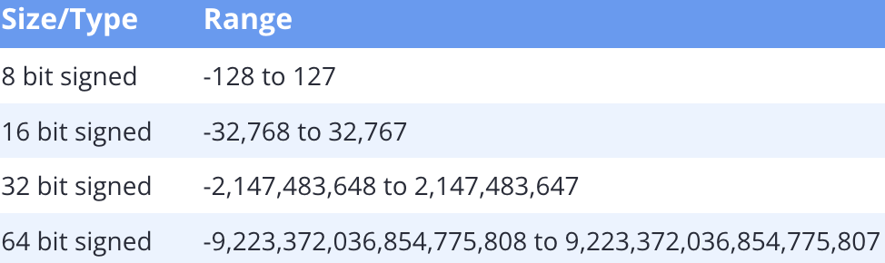

### Signed integers

---

Integer时一种Integral类型，可以表示正整数和负整数。整数类型主要包括四种基本类型

- `short int`最小两个字节
- `int`最小两个字节
- `long int`最小四个字节
- `long long int`最小八个字节

技术上来讲，`bool` 和`char`也属于整数类型，因为它们将值存储位整数值。但是我们暂时先抛开这两个讨论

默认情况下，C++中的整数是带有符号的，这意味着，数字的符号也会被存储为数字的一部分。因此，signed整数会同时包含正数、负数以及0。

#### Signed integer ranges

我们已经知道，一个由n个bit的变量，可以包含2的n次方个值。一个整数的范围是由两个因素决定的，大小以及是否含有符号。比如说，一个有八个bit的整数，可以容纳256个可能的值，其中7个bit用于存储数字的大小，一个bit用来保存符号。有符号的整数的范围如下表所示

用数学来表示的话，则是[-(2n-1), 2n-1-1]

#### Integer division

由于整数不能保存小数值，因为整数除法中的小数部分会被直接删除，而非进行四舍五入
