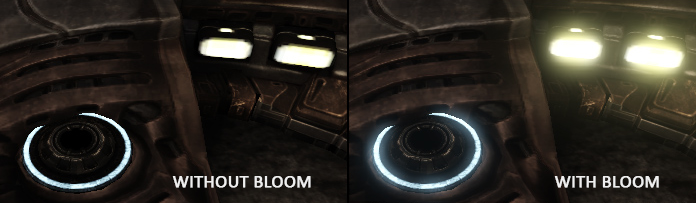
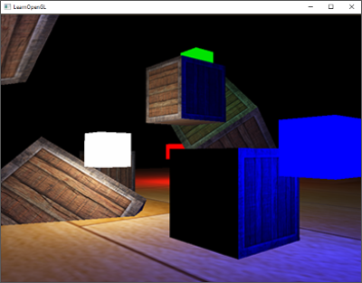
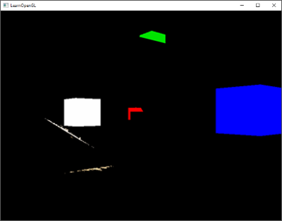
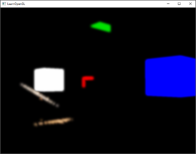
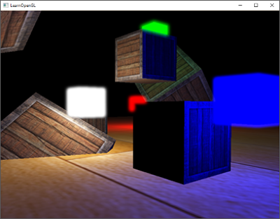
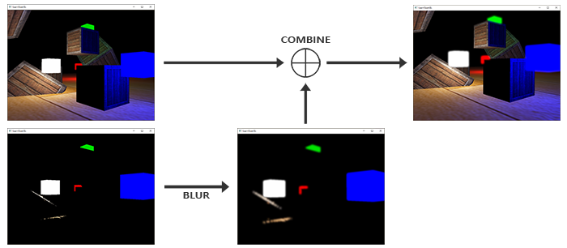
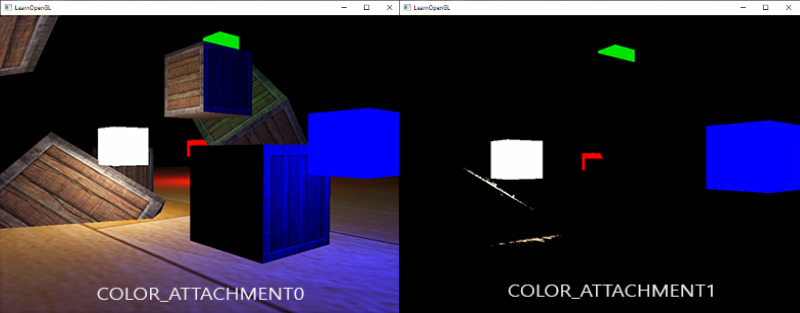
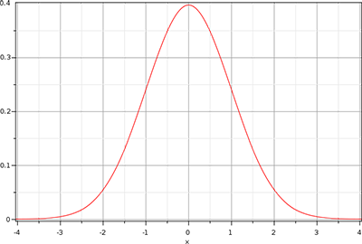
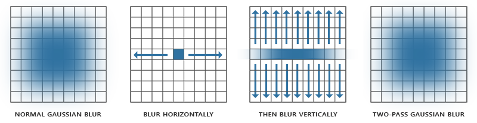
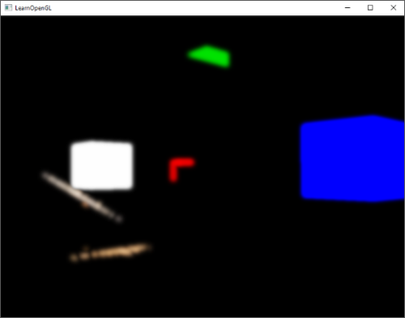

### Bloom

---

由于监视器的强度范围有限，因此通常很难将明亮的光源和明亮的区域传达给观看者。区分显示器上明亮光源的一种方法是让它们发光;然后光线在光源周围渗出。这有效地给观众一种错觉，即这些光源或明亮区域非常明亮。如下图所示：



Bloom通常与HDR配合使用，HDR可以使Bloom的效果更好，但二者本身是完全不同的技术，且都可以独立实现。

为了实现Bloom，我们会绘制一个有光源的场景，然后分离处场景的HDR color buffer以及只有明亮区域可见的场景图像。然后对这个提取的亮度图像进行模糊处理，结果加在原始HDR场景图像上。

让我们用逐步的方式来描绘这个过程。我们渲染一个场景，场景中填充了4个明亮的光源，以彩色的立方体形式显示。这些彩色的光源立方体具有1.5到15.0之间的亮度值。如果我们将此渲染到HDR颜色缓冲区，场景将如下所示：



我们取这个HDR颜色缓冲纹理，并提取出超过某个特定亮度的所有片段。这给我们一个只显示亮色区域的图像，因为它们的片段强度超过了一定的阈值：



然后我们取这个经过阈值处理的亮度纹理并对结果进行模糊处理。Bloom效果的强度在很大程度上由使用的模糊滤镜的范围和强度确定：



得到的模糊纹理就是我们用来获得发光效果的。这个模糊纹理被添加到原始的HDR场景纹理上。由于模糊滤镜使亮区在宽度和高度上都得到了扩展，场景的亮区似乎在发光：



下面这幅图简要的概括了Bloom 后处理的步骤：



---

第一步是用渲染的场景中提取处两个图片。我们可以渲染场景两次，分别不同的shader，绘制到不同的framebuffer中，但是我们也可以利用被称为Multiple Render Targets的技术。它允许我们在fragment shade中有多个输出值，也就说，我们可以一个pass中就提取到两个图片。在片段着色器的输出值前面，我们可以添加指定的layout location，从而控制我们要写入哪个color buffer：

```glsl
layout (location = 0) out vec4 FragColor;
layout (location = 1) out vec4 BrightColor;
```

不过，仅仅这样还是不行，使用multiple fragment shader outputs的前提是，我们当前绑定的framebuffer绑定有多个color buffer。在之前的博客中，我们总是使用`GL_COLOR_ATTACHMENT0`来绑定color buffer，现在我们也可以使用`GL_COLOR_ATTACHMENT1`：

```c++
// set up floating point framebuffer to render scene to
unsigned int hdrFBO;
glGenFramebuffers(1, &hdrFBO);
glBindFramebuffer(GL_FRAMEBUFFER, hdrFBO);
unsigned int colorBuffers[2];
glGenTextures(2, colorBuffers);
for (unsigned int i = 0; i < 2; i++)
{
    glBindTexture(GL_TEXTURE_2D, colorBuffers[i]);
    glTexImage2D(
        GL_TEXTURE_2D, 0, GL_RGBA16F, SCR_WIDTH, SCR_HEIGHT, 0, GL_RGBA, GL_FLOAT, NULL
    );
    glTexParameteri(GL_TEXTURE_2D, GL_TEXTURE_MIN_FILTER, GL_LINEAR);
    glTexParameteri(GL_TEXTURE_2D, GL_TEXTURE_MAG_FILTER, GL_LINEAR);
    glTexParameteri(GL_TEXTURE_2D, GL_TEXTURE_WRAP_S, GL_CLAMP_TO_EDGE);
    glTexParameteri(GL_TEXTURE_2D, GL_TEXTURE_WRAP_T, GL_CLAMP_TO_EDGE);
    // attach texture to framebuffer
    glFramebufferTexture2D(
        GL_FRAMEBUFFER, GL_COLOR_ATTACHMENT0 + i, GL_TEXTURE_2D, colorBuffers[i], 0
    );
}  
```

我们必须明确地告诉OpenGL，我们要通过`glDrawBuffers`绘制到多个color buffer。默认下，OpenGL只会渲染framebuffer的第一个color buffer：

```c++
unsigned int attachments[2] = {GL_COLOR_ATTACHMENT0, GL_COLOR_ATTACHMENT1};
glDrawBuffers(2, attachments);
```

现在我们可以完善我们的fragment shader了：

```glsl
#version 330 core
layout (location = 0) out vec4 FragColor;
layout (location = 1) out vec4 BrightColor;

[...]

void main()
{
	// first do noraml lighting calculations and output results
	[...] 
	FragColor = vec4(lighting, 1.0);
	// check whether fragment output is higher than threshold, 
	// if so outout as brightness color
	float brightness = dot(FragCOlor.rgb, vec3(0.2126, 0.7152, 0.0722))l
	if (brightness > 1.0)
		BrightColor = FragColor;
    else
    	BrightColor = vec4(1.0, 1.0, 1.0, 1.0);
}
```

首先，我们正常计算光照并把它传递给第一个片段着色器的输出变量`FragColor`。然后，我们使用当前存在`FragColor`中的内容来确定其亮度是否超过了特定阈值。我们首先通过正确的将其转换为灰度（通过计算两个向量的点积，我们实际上乘以了两个向量的每个单独组件，并将结果加在一起），来计算片段的亮度。如果亮度超过了某个阈值，我们将颜色输出到第二个颜色缓冲区。我们对光源的立方体也做同样的处理

现在，我们通过一个fragment shader可以得到以下两个图片：



对于提取的明亮区域的图像，我们现在需要对图像进行模糊处理。我们可以用一个简单的箱形滤镜来做到这一点，就像我们在 framebuffers 一章的后期处理部分所做的那样，但我们更愿意使用更高级（更好看）的模糊滤镜，称为高斯模糊。

---

高斯模糊基于高斯曲线，它通常被描述为一个钟形曲线，其在中心附近给出高值，随着距离的增加逐渐消失。高斯曲线在数学上可以用不同的形式表示，但通常具有以下形状：



由于高斯曲线在中心附近的面积较大，使用其值作为权重来模糊图像会产生更自然的结果，因为近处的样本具有更高的优先级。例如，如果我们在一个片段周围采样一个32x32的方块，与片段的距离越大，对应的权重越小。这给出了一个更好、更真实的模糊，这就是所谓的高斯模糊

为实现高斯模糊滤镜，我们需要从二维高斯曲线方程得到一个二维的权重框。然而，这种方法的问题是它很快会对性能产生极大的负担。例如，如果取一个32乘32的模糊内核，这将需要我们对每个片段的纹理进行高达1024次的采样

所幸，高斯函数有一个很好的属性，就是我们可以将二维高斯函数分解成两个一维函数，从而将二维的处理变为一维处理。换句话说，我们可以单独计算水平方向的模糊和垂直方向的模糊。这样，我们只需要32（水平）+32（垂直）=64次的采样，大大减少了计算量，而结果与对1024次采样的二维高斯函数的结果相同



这确实意味着我们需要对一张图像进行至少两次模糊处理，这种方法在使用帧缓冲对象时效果最好。具体来说，对于我们要实现的两步高斯模糊，我们将实现乒乓帧缓冲。乒乓帧缓冲是一对帧缓冲，我们在其中渲染和交换，给定次数，其他帧缓冲的颜色缓冲区到当前帧缓冲的颜色缓冲区，并通过交替的着色器效果。我们基本上持续地切换渲染的帧缓冲和绘制的纹理。这允许我们首先在第一个帧缓冲中模糊场景的纹理，然后将第一个帧缓冲的颜色缓冲模糊到第二个帧缓冲中，然后将第二个帧缓冲的颜色缓冲模糊到第一个帧缓冲中，如此反复

我们先来看一下高斯模糊用的shader：

```glsl
#version 330 core
out vec4 FragColor;

in vec2 TexCoords;

uniform sampler2D image;

uniform bool horizontal;
uniform float weight[5] = float[] (0.227027, 0.1945946, 0.1216216, 0.054054, 0.016216);

void main()
{
	vec2 tex_offset = 1.0 / textureSize(image, 0);
	vec3 result = texture(image, TexCoords).rgb * weight[0];
    if(horizontal)
    {
        for(int i = 1; i < 5; ++i)
        {
            result += texture(image, TexCoords + vec2(tex_offset.x * i, 0.0)).rgb * weight[i];
            result += texture(image, TexCoords - vec2(tex_offset.x * i, 0.0)).rgb * weight[i];
        }
    }
    else
    {
        for(int i = 1; i < 5; ++i)
        {
            result += texture(image, TexCoords + vec2(0.0, tex_offset.y * i)).rgb * weight[i];
            result += texture(image, TexCoords - vec2(0.0, tex_offset.y * i)).rgb * weight[i];
        }
    }
    FragColor = vec4(result, 1.0);
}
```

为了模糊图像，我们需要两个frame buffer，每个只绑定一个 color buffer texture：

```c++
unsigned int pingpongFBO[2];
unsigned int pingpongBuffer[2];
glGenFramebuffers(2, pingpongFBO);
glGenTextures(2, pingpongBuffer);
for (unsigned int i = 0; i < 2; i++)
{
    glBindFramebuffer(GL_FRAMEBUFFER, pingpongFBO[i]);
    glBindTexture(GL_TEXTURE_2D, pingpongBuffer[i]);
    glTexImage2D(
        GL_TEXTURE_2D, 0, GL_RGBA16F, SCR_WIDTH, SCR_HEIGHT, 0, GL_RGBA, GL_FLOAT, NULL
    );
    glTexParameteri(GL_TEXTURE_2D, GL_TEXTURE_MIN_FILTER, GL_LINEAR);
    glTexParameteri(GL_TEXTURE_2D, GL_TEXTURE_MAG_FILTER, GL_LINEAR);
    glTexParameteri(GL_TEXTURE_2D, GL_TEXTURE_WRAP_S, GL_CLAMP_TO_EDGE);
    glTexParameteri(GL_TEXTURE_2D, GL_TEXTURE_WRAP_T, GL_CLAMP_TO_EDGE);
    glFramebufferTexture2D(
        GL_FRAMEBUFFER, GL_COLOR_ATTACHMENT0, GL_TEXTURE_2D, pingpongBuffer[i], 0
    );
}
```

然后我们将提取到的亮度纹理传递给其中一个ping-pong frame buffer：

```c++
bool horizontal = true, first_iteration = true;
int amount = 10;
shaderBlur.use();
for (unsigned int i = 0; i < amount; i++)
{
    glBindFramebuffer(GL_FRAMEBUFFER, pingpongFBO[horizontal]); 
    shaderBlur.setInt("horizontal", horizontal);
    glBindTexture(
        GL_TEXTURE_2D, first_iteration ? colorBuffers[1] : pingpongBuffers[!horizontal]
    ); 
    RenderQuad();
    horizontal = !horizontal;
    if (first_iteration)
        first_iteration = false;
}
glBindFramebuffer(GL_FRAMEBUFFER, 0); 
```

最终会得到模糊的明亮区域：



最后一步是将模糊的区域与HDR的场景颜色合并在一起。

```glsl
#version 330 core
out vec4 FragColor;
  
in vec2 TexCoords;

uniform sampler2D scene;
uniform sampler2D bloomBlur;
uniform float exposure;

void main()
{             
    const float gamma = 2.2;
    vec3 hdrColor = texture(scene, TexCoords).rgb;      
    vec3 bloomColor = texture(bloomBlur, TexCoords).rgb;
    hdrColor += bloomColor; // additive blending
    // tone mapping
    vec3 result = vec3(1.0) - exp(-hdrColor * exposure);
    // also gamma correct while we're at it       
    result = pow(result, vec3(1.0 / gamma));
    FragColor = vec4(result, 1.0);
}  
```


