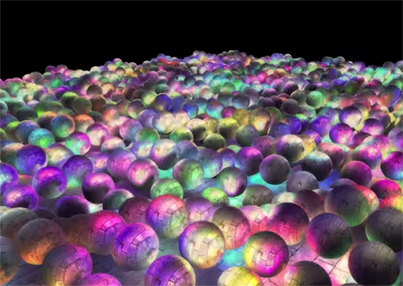
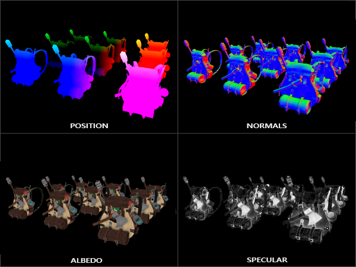
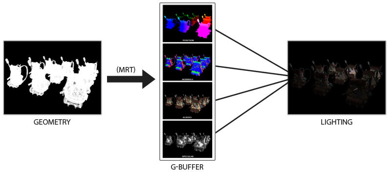
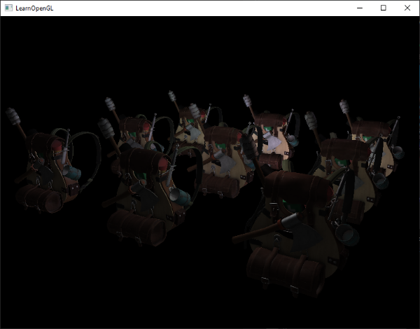
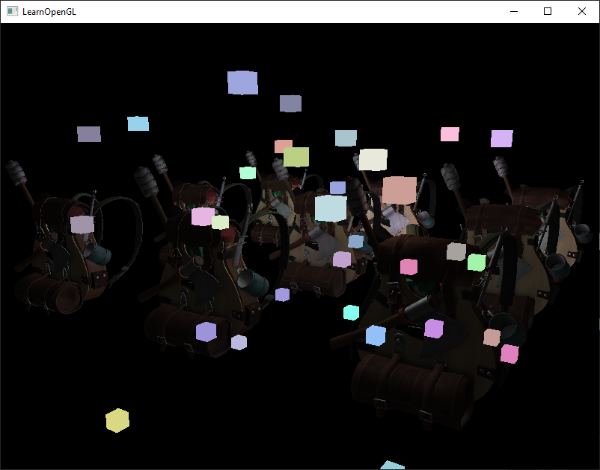
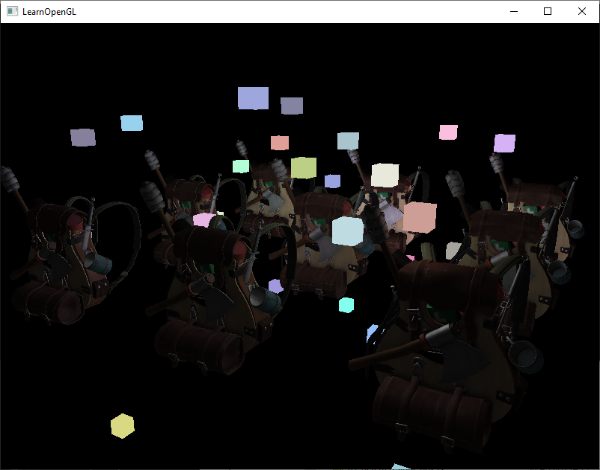
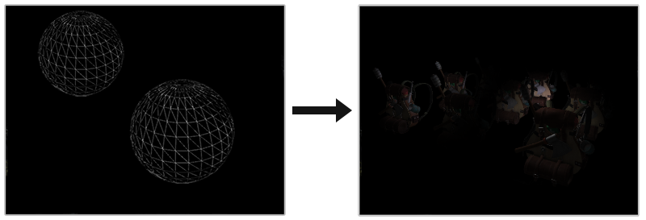

### Deferred Shading

---

我们之前所用的渲染都是前向渲染，每个物体根据场景中的所有光源逐一进行渲染和光照处理。前向渲染直白且操作简单，但是可能会带来严重的性能负担。因为每个渲染的物体都要对每个光源进行迭代计算，这对于逐片段的渲染方式来说计算量很大。其外，当场景深度比较复杂，会出现多个物体覆盖同一个屏幕像素的情况，片段着色器的输出会被覆盖，也会带来性能负担。

延迟渲染很好地解决了这个问题，下图中的场景包含了1847个光源，这是前向渲染所不能实现的：



延迟渲染得名的原因是，我们将推迟计算量大的渲染（比如光照）。延迟渲染包含了两个pass，第一个pass我们命名为**geometry pass**，我们绘制一遍场景，获取所有相关的几何信息，将其存储在一组纹理的集合中，称为**G-buffer**，它会记录位置向量、颜色、法线等等。G-buffer会在后续的光照计算中使用到。下图是G-buffer的一个例子：



延迟渲染中的第二个Pass称为Lighting Pass，我们绘制一个屏幕大小的Quad，并使用G-buffer中的纹理。

下面这个图概括了延迟渲染的过程：



延迟渲染也有一些缺点，它要求我们在texture color buffer中存储大量的场景信息，会带来较大的内存占用，尤其是位置信息这种精度较高的数据。另一个缺点是，它无法支持混合，因为我们只保留了显示在最前面的像素，MSAA也不能用了。

---

在深入延迟渲染之前，我们先回顾以下在前向渲染中，我们计算光照都用到了哪些信息：

- 三维的世界空间中的位置，我们需要位置信息来计算`viewDir`、`lightDir`等
- albedo
- normal
- specular intensity
- 所有光源的位置和颜色
- 相机位置

其中，光源的位置和颜色、以及相机位置可以作为`uniform`变量，其他信息的都是片段相关的，我们将要把这些信息存储在G-buffer的纹理中。G-buffer的纹理与lighting pass中quad尺寸相同。我们可以先看看OpenGL中延迟渲染的伪代码：

```c++
while(...) // render loop
{
	// 1. geometry pass: render all geometric/color data to g-buffer
	glBindFramebuffer(GL_FRAMEBUFFER, gBufffer);
	glClearColor(0.0, 0.0, 0.0, 1.0); // keep it black so it doesn't leak into g-buffer
	glClear(GL_COLOR_BUFFER_BIT | GL_DEPTH_BUFFER_LIT);
	glBufferShader.use();
	for (Object obj: Objects)
	{
		ConfigureShaderTransformsAndUniforms();
		obj.Draw();
	}
	// 2. lighting pass: use g-buffer to calculate the scene's lighting
	glBindFramebuffer(GL_FRAMEBUFFER, 0);
	lightingPassSahder.use();
	BindAllGBufferTextures();
	SetLightingUniforms();
	RenderQuad();
}
```

对于Geometry Pass来说，我们需要初始化一个framebuffer object，我们将其命名为`gBuffer`，它有多个color buffer和一个depth render buffer object。对于位置和法线纹理，我们要尽可能使用高精度纹理；对于albedo和specular intensity，可以使用默认的纹理精度。请注意，我们最好使用`GL_RGBA16F`而不是`GL_RGB16F`，一方面GPU更喜欢4个分量的数据，这样可以更好的对齐内存，另一方面一些驱动可能认为framebuffer是不完整的：

```c++
unsigned int gBuffer;
glGenFramebuffers(1, &gBuffer);
glBindFramebuffer(GL_FRAMEBUFFER, gBuffer);
unsigned int gPosition, gNormal, gColorSpec;

// - position color buffer
glGenTexture(1, &gPosition);
glBindTexture(GL_TEXTURE_2D, gPosition);
glTexImage2D(GL_TEXTURE_2D, 0, GL_RGBA16F, SCR_WIDTH, SCR_HEIGHT, 0, GL_RGBA, GL_FLOAT, nullptr);
glTexParameteri(GL_TEXTURE_2D, GL_TEXTURE_MIN_FILTER, GL_NEAREST);
glTexParameteri(GL_TEXTURE_2D, GL_TEXTURE_MAG_FILTER, GL_NEAREST);
glFramebufferTexture2D(GL_FRAMEBUFFER, GL_COLOR_ATTACHMENT0, GL_TEXTURE_2D, gPosition, 0);

// - normal color buffer
glGenTextures(1, &gNormal);
glBindTexture(GL_TEXTURE_2D, gNormal);
glTexImage2D(GL_TEXTURE_2D, 0, GL_RGBA16F, SCR_WIDTH, SCR_HEIGHT, 0, GL_RGBA, GL_FLOAT, NULL);
glTexParameteri(GL_TEXTURE_2D, GL_TEXTURE_MIN_FILTER, GL_NEAREST);
glTexParameteri(GL_TEXTURE_2D, GL_TEXTURE_MAG_FILTER, GL_NEAREST);
glFramebufferTexture2D(GL_FRAMEBUFFER, GL_COLOR_ATTACHMENT1, GL_TEXTURE_2D, gNormal, 0);

// - color + specular color buffer
glGenTextures(1, &gAlbedoSpec);
glBindTexture(GL_TEXTURE_2D, gAlbedoSpec);
glTexImage2D(GL_TEXTURE_2D, 0, GL_RGBA, SCR_WIDTH, SCR_HEIGHT, 0, GL_RGBA, GL_UNSIGNED_BYTE, NULL);
glTexParameteri(GL_TEXTURE_2D, GL_TEXTURE_MIN_FILTER, GL_NEAREST);
glTexParameteri(GL_TEXTURE_2D, GL_TEXTURE_MAG_FILTER, GL_NEAREST);
glFramebufferTexture2D(GL_FRAMEBUFFER, GL_COLOR_ATTACHMENT2, GL_TEXTURE_2D, gAlbedoSpec, 0);

// tell OpenGL which color attachment we'll use for rendering
unsigned int attachments[3] = { GL_COLOR_ATTACHMENT0, GL_COLOR_ATTACHMENT1, GL_COLOR_ATTACHMENT2 };
glDrawBuffers(3, attachments);

// then also add render buffer objects as depth buffer and check for completeness
[...]
```

接下来我们看看绘制进G-buffer的这一步，假设每个物体有diffuse纹理、normal纹理、specular纹理，我们要使用的fragment shader如下：

```glsl
#version 330 core
layout (location = 0) out vec3 gPosition;
layout (location = 1) out vec3 gNormal;
layout (location = 2) out vec4 gAlbedoSpec;

in vec2 TexCoords;
in vec3 FragPos;
in vec3 Normal;

uniform sampler2D texture_diffuse1;
uniform sampler2D texture_specular1;

void main()
{
	// store the fragment position vector in the first gBuffer texture
	gPosition = FragPos;
	// also normal
	gNormal = normalized(Normal);
	// diffuse color
	gAlbedoSpec.rgb = texture(texture_diffuse1, TexCoords).rgb;
	// specular intensity
	gAlbedoSpec.a = texture(texture_specular1, TexCoords).r;
}
```

加下来我们看看延迟渲染的lighting pass

---

对于lighting pass，我们要渲染一个2D 屏幕大小的Quad，然后在fragment shader中进行光照计算：

```c++
glClear(GL_COLOR_BUFFER_BIT | GL_DEPTH_BUFFER_BIT);
glActiveTexture(GL_TEXTURE0);
glBindTexture(GL_TEXTURE_2D, gPosition);
glActiveTexture(GL_TEXTURE1);
glBindTexture(GL_TEXTURE_2D, gNormal);
glActiveTexture(GL_TEXTURE2);
glBindTexture(GL_TEXTURE_2D, gAlbedoSpec);
// also send light related uniforms
shaderLightingPass.use();
SendAllLightingUniformsToShader(shaderLightingPass);
shaderLightPass.setVec3("viewPos", camera.Position);
RenderQuad();
```

Lighting Pass的片段着色器中光照的计算所用到数据，我们直接从GBuffer中获取：

```glsl
#version 330 core
out vec4 FragColor;

in vec2 TexCoords;

uniform sampler2D gPosition;
uniform sampler2D gNormal;
uniform sampler2D gAlbedoSpec;

struct Light
{
	vec3 Position;
	vec3 Color;
};

const int NR_LIGHTS = 32;
uniform Light lights[NR_LIGHTS];
uniform vec3 viewPos;

void main()
{
	// retrive data from G-buffer
	vec3 FragPos = texture(gPosition, TexCoords).rgb;
	vec3 Normal = texture(gNormal, TexCoords).rgb;
	vec3 albedo = texture(gAlbedoSpec, TexCoords).rgb;
	float Specular = texture(glAlbedoSpec, TexCooords).a;
	
	// then calculate lighting as usual
	    vec3 lighting = Albedo * 0.1; // hard-coded ambient component
    vec3 viewDir = normalize(viewPos - FragPos);
    for(int i = 0; i < NR_LIGHTS; ++i)
    {
        // diffuse
        vec3 lightDir = normalize(lights[i].Position - FragPos);
        vec3 diffuse = max(dot(Normal, lightDir), 0.0) * Albedo * lights[i].Color;
        lighting += diffuse;
    }
}
```

现在我们已经可以实现一个小Demo了：



延迟缓冲的一个缺点之一是：它无法进行Blend操作，因为G-Buffer中的所有值都是基于单个片段的，但是Blend需要对多个片段进行操作。另一个缺点是，延迟渲染会让场景中的物体使用相同的光照计算算法。

为了解决这些问题，我们通常会将渲染分为两部分，一部分是延迟渲染的部分，另一部分是针对需要blend或者特殊shader物体的前向渲染。为了更好地说明，我们将场景中的光源渲染为发亮的cube

---

我们想要将场景中的光源单独渲染成发光的cube，最直接的做法就是先进行延迟渲染，然后再screen quad上进行光源cube的前向渲染。伪代码是这样的：

```c++
// deferred lighting pass
[...]
RenderQuad();

// now render all light cubes with forward rendering as we'd normally do
shaderLightBox.use();
shaderLightBox.setMat4("projection", projection);
shaderLightBox.setMat4("view", view);
for (unsigned int i = 0; i < lightPositions.size(); i++)
{
    model = glm::mat4(1.0f);
    model = glm::translate(model, lightPositions[i]);
    model = glm::scale(model, glm::vec3(0.25f));
    shaderLightBox.setMat4("model", model);
    shaderLightBox.setVec3("lightColor", lightColors[i]);
    RenderCube();
}
```

但是，这些光源cube并不会考虑G-buffer中的深度信息，导致所有的光源cube出现在最上层。这不是我们想要的结果：



需要我们改进的是，将G-buffer中的深度信息拷贝到default buffer的depth buffer中，然后再渲染light cube。

将一个framebuffer中的信息拷贝到另一个framebuffer中，我们需要借助`glBlitFramebuffer`：

```c++
glBindFramebuffer(GL_READ_FRAMEBUFFER, gBuffer);
glBindFramebuffer(GL_DRAW_FRAMEBUFFER, 0); // write to default framebuffer
glBlitFramebuffer(0, 0, SCR_WIDTH, SCR_HEIGHT, 0, 0, SCR_WIDTH, SCR_HEIGHT, GL_DEPLTH_BUFFER_BIT, GL_NEAREST);
glBindFramebuffer(GL_FRAMEBUFFER, 0);
// now render light cubes as before
[...]
```

这样，我们可以得到正常的场景：



---

延迟渲染的主要优点是，能以较低的性能开销渲染数量庞大的光源。但是，延迟渲染本身并不足以渲染那么多数量的光源，因为每个光源还是要逐片段计算的，所以我们要为延迟管线添加一个优化：Light Volume

通常来说，当我们要渲染一个大场景中某个片段时，我们要计算每个光源与该片段的距离，从而计算对该片段的贡献值。但是当场景较大时，很多光源都不会有任何贡献值，这样就浪费了很多性能。

Light Volume的思想是，每个光源都有一个可以照亮片段的区域，我们只计算在light volume中的片段。所以我们的问题就是，如何确定light volume的半径。

---

想要确定light volume的半径，我们还是要先看一下光源的衰减公式
$$
F_{light}=\frac{I}{K_{c}+K_{l}*d+K_{q}*d^{2}}
$$
我们想得到当F<sub>light</sub>为0.0时，等式的解，但是等式只可能无限接近于0.0，所以是无解的。这样的话，我们可以找到一个接近0.0且视觉上会被感知为黑色的值，5/256就是一个理想的值。

最终，当我们给出constant linear quadratic后，我们就可以得到radius：

```c++
float constant  = 1.0; 
float linear    = 0.7;
float quadratic = 1.8;
float lightMax  = std::fmaxf(std::fmaxf(lightColor.r, lightColor.g), lightColor.b);
float radius    = 
  (-linear +  std::sqrtf(linear * linear - 4 * quadratic * (constant - (256.0 / 5.0) * lightMax))) 
  / (2 * quadratic);  
```

我们将得到的半径加入shader

```glsl
struct Light {
    [...]
    float Radius;
}; 
  
void main()
{
    [...]
    for(int i = 0; i < NR_LIGHTS; ++i)
    {
        // calculate distance between light source and current fragment
        float distance = length(lights[i].Position - FragPos);
        if(distance < lights[i].Radius)
        {
            // do expensive lighting
            [...]
        }
    }   
}
```

---

上面显示的片段着色器实际上在实践中并不真正起作用，它只是说明我们如何可以使用光源的体积来减少光照计算。现实情况是，您的GPU和GLSL在优化循环和分支方面的表现相当糟糕。这是因为GPU上的着色器执行高度并行，大多数架构都要求对于大量的线程集合，它们需要运行完全相同的着色器代码以提高效率。这通常意味着一个着色器会执行if语句的所有分支，以确保着色器的运行对于那组线程是相同的，这使我们之前的半径检查优化完全无用；我们仍然会计算所有光源的照明！

使用光源体积的正确方法是渲染实际的球体，通过光源体积半径进行缩放。这些球体的中心位于光源的位置，并且随着光源体积半径的缩放，球体恰好包含了光源的可见体积。这就是技巧的关键：我们使用延迟光照着色器来渲染球体。由于渲染的球体产生的片段着色器调用与光源影响的像素完全匹配，我们只渲染相关的像素，跳过所有其他像素。下面的图片说明了这一点



这种方法仍然存在一个问题：应该启用面剔除（否则我们会渲染两次光源的效果），当面剔除启用后，用户可能会进入光源的体积，此后体积不再被渲染（由于背面剔除），从而消除了光源的影响；我们可以通过只渲染球体的背面来解决这个问题
