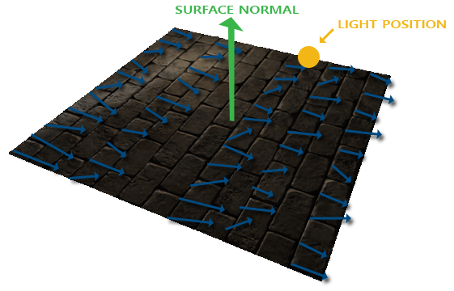

### Normal Mapping

---

法线贴图存储的值的范围在[0, 1]内，在片段着色器中，我们需要将其映射至[-1, 1]：

```glsl
uniform sampler2D normalMap;

void main()
{
	// obtain normal from normal map in range [0, 1]
	normal = texture(normal, fs_in.TexCoords).rgb;
	// transform normal vector to range [-1, 1];
	normal = noramlize(normal * 2.0 - 1.0);
	
	[...]
}
```

使用BlinnPhong模型，我们可以看到已经有了不错的法线效果：


需要注意的是，我们所使用法线贴图中的法向量，都是指向**Z+**的方向。当平面也面向**Z+**时，一切看起来都是正确的，但是我们如果用在地面上，平面本身的法向量是指向Y+的，这样一来，照明就会出现错误，如下图所示：



我们采用的解决办法是：将光照计算在另一个坐标空间中进行，在这个坐标空间中，法线贴图中存储的normal vector始终指向**Z+**，我们将该坐标空间称为切线空间。

---

