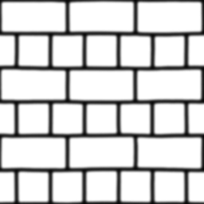
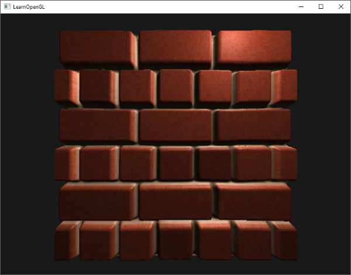
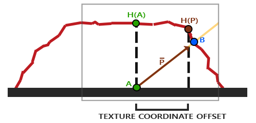
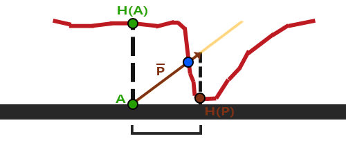
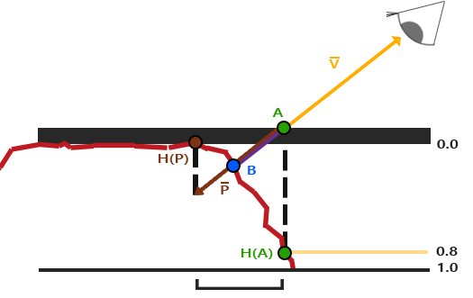
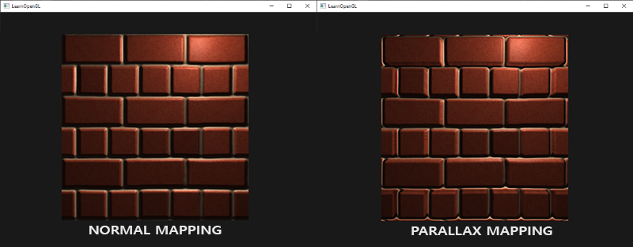
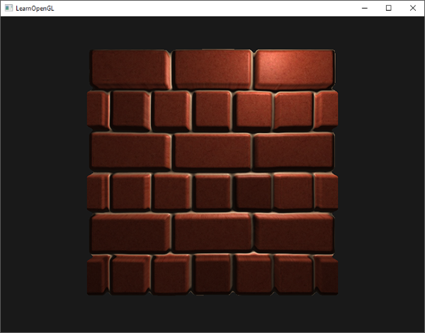
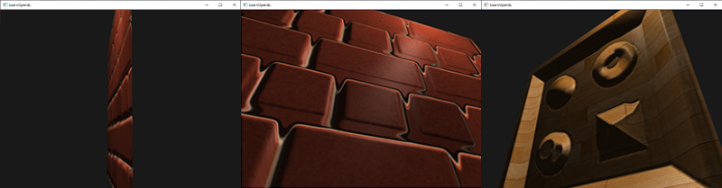

### Parallax Mapping

---

在深入视察映射之前，我们先来看看displacement mapping：我们在height map的每个texel中存储一个高度值，就像下图一样：



我们在渲染时，将每个顶点根据在height map中采样的结果偏移，就可以将一个平面变成这样凹凸的面，如下图所示：



但是displacement map有一个弊端，它需要几何体包含大量的顶点，进而会导致性能负担。所以这就是为什么我们引入了视察映射这个技术。

视差映射的基本原理是：改变纹理坐标，从而能够让片段从视觉上比真实的片段位置高或者低，我们配合下图讲解：


图片中，红色的线段表示了height map中存储的值，也是我们希望这个网格体所能呈现的几何效果。***V***代表观察向量。如果这个平面有真实的红色线段表示的凹凸不平，那我们的视线应该会落在***B***上，然而，起伏是不存在，我们的视线会落在***A***上。视差映射的核心就在于***A***和***B***的偏差值，在***A***点处的纹理坐标上应用偏差值，我们就可以得到***B***点处的纹理坐标。如果我们使用***B***点的纹理左边去完成后续的纹理采样，就会有一种观察者真的在看向***B***的效果。

所以，我们需要弄清楚怎么从***A***点的纹理坐标得到***B***点的纹理坐标。视差映射会缩放***V***的长度，使其等于片段位置***A***采样的height map的值，得到向量***P***，如下图所示：



然后我们选出***P***以及这个向量与平面对齐的坐标作为纹理坐标的偏移值。这种方式是合理的，因为***P***是通过从height map中得到的高度值计算得到的，所以一个片段的高度越高，偏移量就越大。

我们的这种做法大多数情况下是没问题的，但是***B***终究是粗略估计得到的。当高度迅速变化时，我们还是无法得到正确的B，就像下图中展示的情况：



视差映射还有一个问题是，当表面有了一个随机的旋转值后，我们很难判断从***P***中获取哪一个坐标。所以我们再次引入切线空间，将向量***V***变换到切换空间下，这样我们得到的***P***向量的x和y分量将与表面的切线和副切线平行。由于切线和副切线与纹理坐标的方向也一致，我们就可以使用***P***的x和y分量作为纹理坐标的偏移值，就无视表面的方向了。

我们已经理清了视差贴图的原理，下面让我们来动手实现一下

---

你可能已经注意到了，我们所使用的[height map](https://learnopengl.com/img/textures/bricks2_disp.jpg)与本篇博客最开始展示的[height map](https://learnopengl.com/img/advanced-lighting/parallax_mapping_height_map.png)刚好是相反的关系，因为使用反色高度贴图（也叫深度贴图）去模拟深度比模拟高度更容易。下图反映了这个轻微的改变：



这里我们还是有点***A***和点***B***，但是这次我们用向量***V***减去点***A***的纹理坐标得到***P***。在着色器中，我们通过1减去采样得到的高度值，得到深度值。

在片段着色器中，我们计算得到向量V，也就是片段到观察者的方向向量，所以我们需要切线空间下的片段位置和相机位置。在法线映射的那篇博客中，我们已经在vertex shader中实现了将这些向量变换到切线空间：

```glsl
#version 330 core
layout (location = 0) in vec3 aPos;
layout (location = 1) in vec3 aNormal;
layout (location = 2) in vec2 aTexCoords;
layout (location = 3) in vec3 aTangent;
layout (location = 4) in vec3 aBitangent;

out VS_OUT {
    vec3 FragPos;
    vec2 TexCoords;
    vec3 TangentLightPos;
    vec3 TangentViewPos;
    vec3 TangentFragPos;
} vs_out;

uniform mat4 projection;
uniform mat4 view;
uniform mat4 model;

uniform vec3 lightPos;
uniform vec3 viewPos;

void main()
{
    gl_Position      = projection * view * model * vec4(aPos, 1.0);
    vs_out.FragPos   = vec3(model * vec4(aPos, 1.0));   
    vs_out.TexCoords = aTexCoords;    
    
    vec3 T   = normalize(mat3(model) * aTangent);
    vec3 B   = normalize(mat3(model) * aBitangent);
    vec3 N   = normalize(mat3(model) * aNormal);
    mat3 TBN = transpose(mat3(T, B, N));

    vs_out.TangentLightPos = TBN * lightPos;
    vs_out.TangentViewPos  = TBN * viewPos;
    vs_out.TangentFragPos  = TBN * vs_out.FragPos;
}   
```

片段着色中，我们来执行视差映射：

```glsl
#version 330 core
out vec4 FragColor;

in VS_OUT {
    vec3 FragPos;
    vec2 TexCoords;
    vec3 TangentLightPos;
    vec3 TangentViewPos;
    vec3 TangentFragPos;
} fs_in;

uniform sampler2D diffuseMap;
uniform sampler2D normalMap;
uniform sampler2D depthMap;

uniform float height_scale;

vec2 ParallaxMapping(vec2 texCoords, vec3 viewDir)
{
	
}

void main()
{
	// offset texture coordinates with Parallax Mapping
	vec3 viewDir = normalize(fs_in.TangentViewPos - fs_in.TangentFragPos);
	vec2 texCoords = ParallaxMapping(fs_in.TexCoords, viewDir);
	
	// then sample textures with new texture coords
	vec3 diffuse = texture(diffuseMap, texCoords);
	vec3 normal = texture(normalMap, texcoords);
	normal = normalize(normal * 2.0 - 1.0);
	// proceed with lighting code
	[...]
}
```

我们定义了`ParallaxMapping`函数，它接受片段的纹理坐标和切线空间下的fragment-to-view向量***V***作为参数，返回偏移后的纹理坐标。我们用得到的纹理坐标去采样其他的其他的贴图。`ParallaxMapping`具体是这样的：

```glsl
vec2 ParallaxMapping(vec2 texCoords, vec3 viewDir)
{
	float height = texture(depthMap, texCoords).r;
	vec2 p = viewDir.xy / view.z * (height * height_scale);
	return texCoords - p;
}
```

我们来简单解释一下。假设当前的片段是***A***，我们使用片段***A***的纹理坐标去采样depth map，得到***H(A)***。再用`viewDir`除以它的z分量，乘上片段的高度值，就可以得到偏移值***P***了。

只是，为什么要除以z分量呢？我们很清楚，`viewDir`是归一化后的向量值，范围在[0, 1]之间。当`viewDir`大致与表面平行时，z分量接近于0.0，我们的除法会返回比`viewDir`垂直与表面时更大的向量***P***。所以，从本质上，相比正朝向表面，当带有角度地看向平面时，我们会更大程度地缩放***P***的大小，从而增加纹理坐标的偏移；这样做在视角上会获得更大的真实度。

当然有些人会对`view.z`的部分进行取舍，我们只需要明白它的意义即可，后续的代码中，我们将保留这个除法。

当height_scale为0.1时，我们会得到下图中右半部分的效果，左半部分为只有法线映射的效果：



可以看到，有视差映射的平面在边缘处有一些奇怪的效果，这是因为由于纹理坐标的偏移，会采样[0, 1]之外的值。我们可以选择丢弃超出范围的片段：

```glsl
texCoords = ParallaxMapping(fs_in.TexCoords, viewDir);
if (texCoords.x > 1.0 || texCoors.y > 1.0 || texCoords.x < 0.0 || texCoords.y < 0.0)
	discard;
```

虽然视差映射无法应用在所有类型的表面上，但是对于平面，我们可以得到一个不错的效果：



另外，从某些角度观察时，陡峭的高度变化会有一个看起来怪怪的效果，就像下面这样：



原因是，我们的计算方法只是一个粗略的估计值，我们在前文也提到过。但是，我们可以通过多次采样的方式来寻找一个距离点***B***最近的点，也就是Steep Parallax Mapping。

---

