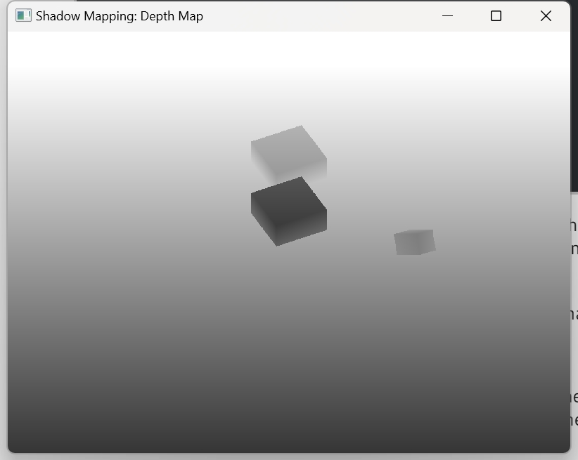
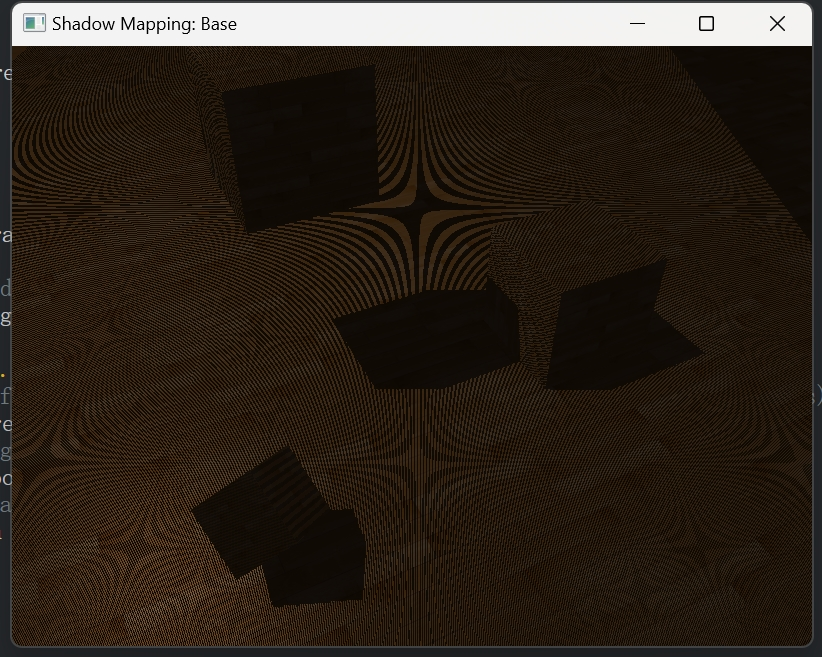
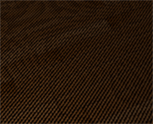
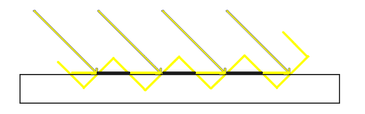
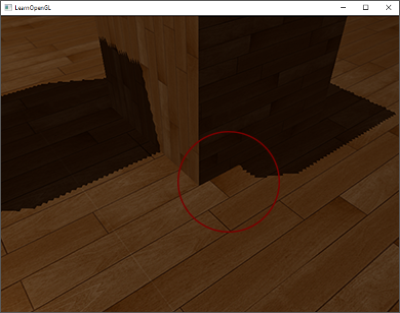
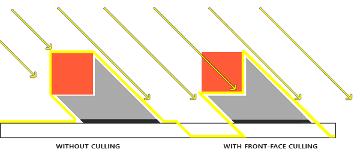
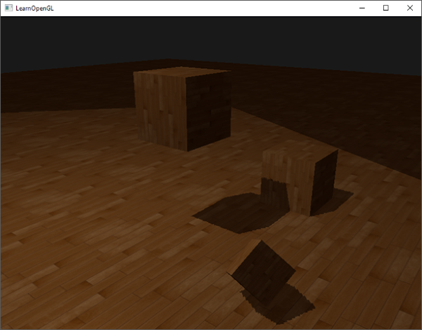
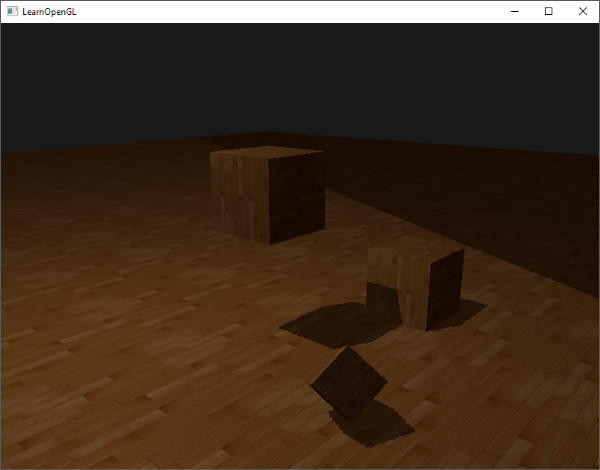
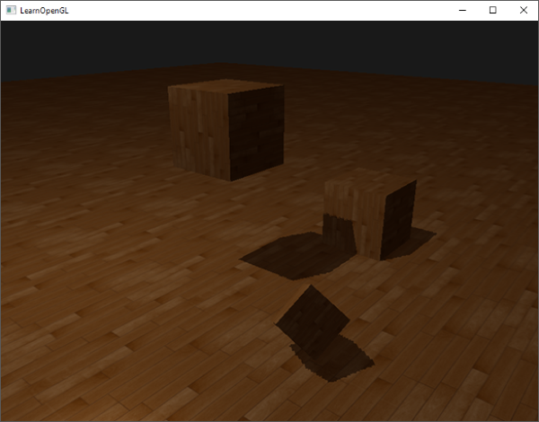
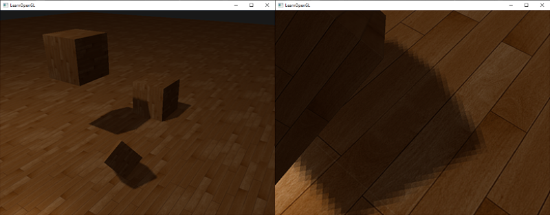

### Shadow Mapping

---

Shadowmap的出发点是这样的：我们从光源的视角观察场景，能看到的物体都是会被照亮的， 不能被看到的都会在阴影中。下图很好地展示了这个意思：


我们可以先确定某条光线上，被照亮的第一个点，我们称该点为***N***，那么同一条光线上任意一个相较于光源远于***N***的点都应该在阴影之中。我们当前可以对成千上万条光线进行这样的模拟，但是这种方法首先就无法在实时渲染中应用。基于当前的思路，我们可以借助depth buffer来实现阴影。

在此前的博客中我们提到过，depth buffer中的值对应了相机视角的片段的深度值，且深度值的范围被限定在[0, 1]。从光源的角度渲染场景，并将得到的深度值存储在一张纹理，那么这个纹理就等同于记录了从光源视角看到的最近的片段。我们将这个纹理称为**depth map**或者shadow map


左图展示了一个平行光的阴影，我们借助view matrix和projection matrix从光源视角渲染场景，得到depth map。在右图中，我们要渲染***P***点处的片段，首先我们用矩阵***T***将***P***变换到光源的坐标空间，从光源的角度看，***P***点代表片段的深度值是0.9。然后我们通过***P***采样depth/shadow map，得到的距离光源最近的深度值为0.4，这是小于***P***本身的深度值的，所以我们得到***P***被遮挡，也就是处于阴影中的结论

所以，shadow mapping的技术包含两个pass，第一个Pass我们绘制depth map，在第二个Pass中，我们正常地渲染场景，并使用得到的depth map计算当前片段是否在阴影中。

接下来，我们来看看OpenGL中实现的细节。

---

我们要将绘制结果存储在texture中，也就是depth map，我们自然可以想到要通过framebuffer实现，先把这个framebuffer创建出来：

```c++
unsigned int depthMapFBO;
glGenFramebuffers(1, depthMapFBO);
```

创建一个2D纹理，用作framebuffer的depth buffer：

```c++
const unsigned int SHADOW_WIDTH =1024， SHADOW_HEIGHT = 1024;

unsigned int depthMap;
glGenTextures(1, &depthMap);
glBindTexture(GL_TEXTURE_2D, depthMap);
glTexImage2D(GL_TEXTURE_2D, 0, GL_DEPTH_COMPONENT, SHADOW_WIDTH, SHADOW_HEIGHT, 0, GL_DEPTH_COMPONENT, GL_FLOAT, nullptr);
glTexParameteri(GL_TEXTURE_2D, GL_TEXTURE_MIN_FILTER, GL_NEAREST);
glTexParameteri(GL_TEXTURE_2D, GL_TEXTURE_MAG_FILTER, GL_NEAREST);
glTexParameteri(GL_TEXTURE_2D, GL_TEXTURE_WRAP_S, GL_REPEAT); 
glTexParameteri(GL_TEXTURE_2D, GL_TEXTURE_WRAP_T, GL_REPEAT);  
```

因为我们只需要存储depth value，所以我们将texture format设置为`GL_DEPTH_COMPONENT`。

将创建好的depth texture绑定给framebuffer，作为它的depth buffer：

```c++
glBindFramebuffer(GL_FRAMEBUFFER, depthMapFBO);
glFramebufferTexture2D(GL_FRAMEBUFFER, GL_DEPTH_ATTACHMENT, GL_TEXTURE_2D, depthMap, 0);
glDrawBuffer(GL_NONE);
glReadBuffer(GL_NONE);
glBindFramebuffer(GL_FRAMEBUFFER, 0);
```

我们只记录深度值，所以不需要将`attachment`参数设置为color buffer。但是没有color buffer，我们默认framebuffer object是不完整的，所以我们需要明确告诉OpenGL，framebuffer不会渲染任何color data，也就是通过`glDrawBuffer(GL_NONE);`和`glReadBuffer(GL_NONE);`两行代码。

现在我们可以实现shadow mapping的两个pass了，大致的代码框架如下：

```c++
// 1. first render to depth map
glViewport(0, 0, SHADOW_WIDTH, SHADOW_HEIGHT);
glBindFramebuffer(GL_FRAMEBUFFER, depthMapFBO);
glClear(GL_DEPTH_BUFFER_BIT);
ConfigureShaderAndMatrices();
RenderScene();
glBindFramebuffer(GL_FRAMEBUFFER, 0);
// 2. then render scene as normal with shadow mapping
glViewport(0, 0, SCREEN_WIDTH, SCREEN_HEIGHT);
glClear(GL_COLOR_BUFFER_BIT | GL_DEPTH_BUFFER_BIT);
ConfigureShaderAndMatrices();
glBindTexture(GL_TEXTURE_2D, depthMap);
RenderScene();
```

接下来我们来探讨一下代码中的实现细节

---

我们将某些功能封装进了`ConfigureShaderAndMatrices()`，两个pass中都调用了这个函数，在第一个pass中，我们使用`ConfigureShaderAndMatrices()`来计算从光源视角渲染场景所用到的projection-view矩阵。

本篇博客中，我们暂时假定光源是平行光，那么所有的光线都是平行的，所以我们需要构建的是一个正交投影矩阵，这是一个示例用的投影矩阵，具体的参数可能需要根据场景而调整：

```c++
float near_plane = 1.0f, far_plane = 7.5f;
glm::mat4 lightProjection = glm::ortho(-10.0f, 10.0f, -10.0f, 10.0f, near_plane, far_plane);
```

对于view矩阵，我们使用`glm::lookAt`函数，让光源看向场景的中心：

```c++
glm::mat4 lightView = glm::lookAt(glm::vec3(-2.0f, 4.0f, -1.0f), 
                                  glm::vec3( 0.0f, 0.0f,  0.0f), 
                                  glm::vec3( 0.0f, 1.0f,  0.0f));  
```

我们将灯光所用到的变换矩阵称为***lightSpaceMatrix***，也就是我们前面提到的***T***。

---

从光源视角渲染场景时，我们只关心深度值，并不需要进行复杂的着色计算， 所以shader应该很简单。顶点着色器用来将顶点变换到光源的坐标空间：

```glsl
#version 330 core
layout (location = 0) in vec3 aPos;

uniform mat4 lightSpaceMatrix;
uniform mat4 model;

void main()
{
	gl_Position = lightSpaceMatrix * model * vec4(aPos, 1.0);
}
```

对于片段着色器，因为我们没有color buffer，也关闭了buffer的draw和read，所以不需要通过片段着色器输出任何结果：

```glsl
#version 330 core

void main()
{
	
}
```

现在，shadow mapping的第一个pass的代码如下：

```c++
simpleDepthShader.use();
glUniformMatrix4fv(lightSpaceMatrixLocation, 1, GL_FALSE, glm::value_ptr(lightSpaceMatrix));

glViewport(0, 0, SHADOW_WIDTH, SHADOW_HEIGHT);
glBindFramebuffer(GL_FRAMEBUFFER, depthMapFBO);
glClear(GL_DEPTH_BUFFER_BIT);
RenderScene(simpleDepthShader);
glBindFramebuffer(GL_FRAMEBUFFER, 0);  
```

可以注意到，`RenderScene()`函数需要一个shader program作为参数，它用来调用所有绘制相关的函数，设置必要的model矩阵。

到这一步，depth buffer已经存储了我们需要的depth value了，我们可以通过一个屏幕大小的quad将depth buffer绘制到一个纹理上，从而可视化depth buffer。这需要使用下面的片段着色器，采样depth map并输出采样结果：

```glsl
#version 330 core
out vec4 FragColor;

in vec2 TexCoords;

uniform sampler2D depthMap;

void main()
{
	float depthValue = texture(depthMap, TexCoords).r;
	FragColor = vec4(vec3(depthValue), 1.0);
}
```

截至目前的进度，完整源码在[这里](https://learnopengl.com/code_viewer_gh.php?code=src/5.advanced_lighting/3.1.1.shadow_mapping_depth/shadow_mapping_depth.cpp)，效果如下：



---

现在，我们已经生成了depth map，就可以开始绘制真正的阴影了。我们需要在片段着色器中判断当前片段是否在阴影之中，但是需要在顶点着色器里提前实现好到光源空间的变换：

```glsl
// vertex shader
#version 330 core
layout (location = 0) in vec3 aPos;
layout (location = 1) in vec3 aNormal;
layout (location = 2) in vec2 aTexCoords;

out VS_OUT
{
	vec3 FragPos;
	vec2 Normal;
	vec2 TexCoords;
	vec4 FragPosLightSpace;
} vs_out;

uniform mat4 projection;
uniform mat4 view;
uniform mat4 model;
uniform mat4 lightSpaceMatrix;

void main()
{
	vs_out.FragPos = vec3(model * vec4(aPos, 1.0));
	vs_out.Normal = transpose(inverse(mat3(model))) * aNormal;
	vs_out.TexCoords = aTexCoords;
	vs_out.FragPosLightSpace = lightSpaceMatrix * vec4(vs_out.FragPos, 1.0);
	gl_Position = projection * view * vec4(vs_out.FragPos, 1.0);
}
```

对于片段着色器，我们将采用BlinnPhong模型，此外，我们还要计算一个shadow值，如果片段在阴影中，shadow为1，否则shadow为0。我们将BlinnPhong模型中的diffuse和specular值乘以shadow，但是我们也不希望阴影是全黑的，所以不把ambient考量进阴影的影响：

```glsl
// fragment shader
#version 330 core
out vec4 FragColor;

out VS_OUT
{
	vec3 FragPos;
	vec2 Normal;
	vec2 TexCoords;
	vec4 FragPosLightSpace;
} fs_in;

uniform sampler2D diffuseTexture;
uniform sampler2D shadowMap;

uniform vec3 lightPos;
uniform vec3 viewPos;

float ShadowCalculation(vec4 fragPosLightSpace)
{
    [...]
}

void main()
{           
    vec3 color = texture(diffuseTexture, fs_in.TexCoords).rgb;
    vec3 normal = normalize(fs_in.Normal);
    vec3 lightColor = vec3(1.0);
    // ambient
    vec3 ambient = 0.15 * lightColor;
    // diffuse
    vec3 lightDir = normalize(lightPos - fs_in.FragPos);
    float diff = max(dot(lightDir, normal), 0.0);
    vec3 diffuse = diff * lightColor;
    // specular
    vec3 viewDir = normalize(viewPos - fs_in.FragPos);
    float spec = 0.0;
    vec3 halfwayDir = normalize(lightDir + viewDir);  
    spec = pow(max(dot(normal, halfwayDir), 0.0), 64.0);
    vec3 specular = spec * lightColor;    
    // calculate shadow
    float shadow = ShadowCalculation(fs_in.FragPosLightSpace);       
    vec3 lighting = (ambient + (1.0 - shadow) * (diffuse + specular)) * color;    
    
    FragColor = vec4(lighting, 1.0);
}
```

上面的片段着色器代码基本上是基于之前的BlinnPhong shader的，但是添加了阴影相关的计算，被封装在`ShadowCalculation`中。同时也新增了两个变量，`FragPosLightSpace`和`shadowmap`。

想要判断一个片段是否在阴影中，是将裁剪空间中的片段的光源空间位置，变换到NDC下。在顶点着色器中，我们将裁剪空间下的顶点位置通过`gl_Position`输出，OpenGL会自动执行透视除法，用w分量除以x y z分量，从而将坐标的范围范围从[-w, w]映射到[-1, 1]内。但是同样在裁剪空间下的`FragPosLightSpace`并不是通过`gl_Position`传递给片段着色器的，所以我们需要自己来完成透视除法：

```glsl
float ShadowCalculation(vec4 fragPosLightSpace)
{
	// perform perspective divid
	vec3 projCoords = fragPosLightSapce.xyz / fragPosLightSapce.w;
	[...]
}
```

经过处理，片段的light-space位置就会在[-1, 1]的范围内了。但是，考虑到depth/shadow map中记录的深度的范围是[0, 1]，如果我们要使用projCoords去采样depth/shadow map的话，需要将NDC坐标转换到[0, 1]的范围

```glsl
projCoords = projCoords * 0.5 + 0.5;
```

采样shadow map的结果，就是光源视角下，距离最近的深度值，然后当前片段的深度值也可以通过projCoords的z分量获取，这样我们就可以判断片段是否在阴影中了：

```c++
float closestDepth = texture(shadowMap, projCoords.xy).r;
float currentDepth = projCoords.z;
float shadow = currentDepth ? 1.0 : 0.0;
```

现在我们已经可以看到shadow mapping的效果了，尽管还有很多待提升的地方：



完整源码参考[这里](https://learnopengl.com/code_viewer_gh.php?code=src/5.advanced_lighting/3.1.2.shadow_mapping_base/3.1.2.shadow_mapping.fs)

---

当前的渲染结果，最明显的问题就是这里，被称为acne的效果：



下图中，黄色的线段代表了shadow map中的一个texel，因为shadow map的分辨率是有限的，一些距离光源较远的片段，可能就会获取相同的从shadowmap中采样的值。



我们解决办法的思路也很简单，我们给表面或者shadowmap一个微小的偏移值，这样片段就不会被认为超出了表面。效果参考下图：


代码也相对简单：

```glsl
float bias = 0.005;
float shadow = currentDepth - bias > closestDepth ? 1.0 : 0.0;
```

不过，可以想象到，这种现象与光线照射的角度也有关系，也就是说，与光线方向夹角小的表面，需要的bias较小，与光线方向夹角大的表面需要的bias就会大一些。据此，我们可以调整一下bias的值：

```glsl
float bias = max(0.05 * (1.0 - dot(normal, lightDir)), 0.005);
```

---

但是使用shadow bias也有弊端，因为我们给物体实际的深度值设置了一个偏移量，当偏移量较大时，可能就会让阴影相对物体也发生了偏移，看起来就像是阴影脱离了物体。我们将这种现象称之为***peter panning***：



解决peter panning的方案时：在渲染shadow map时，使用front face culling，也就是说，我们使用物体的back face来渲染shadow map，就如下图所示：



我们将front face culling的指令添加进第一个pass中

```c++
glCullFace(GL_FRONT);
RenderSceneToDepthMap();
glCullFace(GL_BACK); // remeber to reset original culling face
```

但是这种方法只对于立方体这种实心且封闭的几何体。像地板这种本身就只有一个面的物体如果使用front face culling，就会被完全剔除。

---

你应该还记得，我们之前为了将片段变换到光源的裁剪空间，手动为光源设定了投影矩阵。然后在我们目前的效果中，光源视锥体以外的区域会被认为是有阴影覆盖的。出现这个问题的原因在于，光源视锥体之外的片段，在采样shadow map时对应的`projCoords`是大于1的，也就是采样的位置已经超出了shadow map的范围，既然采样的结果是错的，我们从shadow map中获取的`closestDepth`也必然是错误的。



我们创建shadow map时，将texture的wrapping mode设置为了GL_REPEAT，然而，我们需要让超出shadow map范围的坐标值得到深度值为1，来表示对应的片段不会处于阴影之中（因为没有物体的深度值会超过1）。所以，我们可以将wrapping mode改成GL_CLAMP_TO_BORDER，并设置texture border color为1

```c++
glTexParameteri(GL_TEXTURE_2D, GL_TEXTURE_WRAP_S, GL_CLAMP_TO_BORDER);
glTexParameteri(GL_TEXTURE_2D, GL_TEXTURE_WRAP_T, GL_CLAMP_TO_BORDER);
float borderColor[] = { 1.0f, 1.0f, 1.0f, 1.0f };
glTexParameterfv(GL_TEXTURE_2D, GL_TEXTURE_BORDER_COLOR, borderColor);  
```

经过修改，超出shadow map的坐标采样的结果都为1，从而在shader中计算得到的shadow为0，表示没有在阴影之中。修改之后，我们可以到画面有了一些改变：



画面中还有一部分是黑色的，这是因为对应片段在光源空间中的坐标，超出了光源视锥体的远平面，也就是它们`projCoords`的z分量大于1，我们前面关于wrapping mode的调整并不会影响z分量，所以我们需要在shader中进行修改：

```glsl
float ShadowCalculation (vec4 fragPosLightSpace)
{
	[...]
	if (projCoords.z > 1.0)
		shadow = 0.0;
		
	return shadow;
}
```



---

由于shadow map本身是一组离散的数据，即使提高shadow map的分辨率，也不可避免会有多个片段采样得到相同深度值的情况。并且，在我们的shader中，判断是否在阴影中的`shadow`值，是非1即0的。也会导致阴影的产生。

我们可以使用percentage-closer filtering(PCF)的技术来解决阴影的锯齿，它能够产生软阴影，让阴影看起来没有那么硬。它的思路在于，多次采样shadow map，但是每次采样的纹理坐标有微小的偏移。每次采样，我们都会判断采样点是否在阴影中，将结果求和并取均值，就能得到一个软化的阴影，代码如下：

```glsl
float shadow = 0.0;
vec2 texelSize = 1.0 / textureSize(shadowMap, 0);
for (int x = -1; x <= 1; ++x)
{
	for (int y = -1; y <= 1; ++y)
	{
		float pcfDepth = texture(shadowMap, projCoords.xy + vec2(x, y) * texelSize).r;
		shadow += currentDepth - bias > pcfDepth ? 1.0 : 0.0;
	}
} 
shadow /= 9.0;
```

其中`textureSize`函数会根据纹理以及纹理的mipmap level返回一个二维向量，表示这个纹理的宽高。用1除以这个值会返回单个texel的大小，我们使用它来偏移纹理坐标，确保每个新的样本采样的深度值都不同。最终得到的阴影质量已经得到了很大的提升。



实际上，还有很多技巧可以提高软阴影的质量，我们将在以后探讨，目前的进度的源码在[这里](https://learnopengl.com/code_viewer_gh.php?code=src/5.advanced_lighting/3.1.3.shadow_mapping/shadow_mapping.cpp)

---

在渲染shadow map时，使用正交投影矩阵和使用透视投影是有区别的


基于透视投影的shadow map更适合有真实光源位置的情况，也就是聚光灯和点光源。此外，透视投影下的shadow map所记录的深度值并不是线性的，需要我们在shader中进行处理。

```glsl
#version 330 core
out vec4 FragColor;
  
in vec2 TexCoords;

uniform sampler2D depthMap;
uniform float near_plane;
uniform float far_plane;

float LinearizeDepth(float depth)
{
    float z = depth * 2.0 - 1.0; // Back to NDC 
    return (2.0 * near_plane * far_plane) / (far_plane + near_plane - z * (far_plane - near_plane));
}

void main()
{             
    float depthValue = texture(depthMap, TexCoords).r;
    FragColor = vec4(vec3(LinearizeDepth(depthValue) / far_plane), 1.0); // perspective
    // FragColor = vec4(vec3(depthValue), 1.0); // orthographic
}  
```

