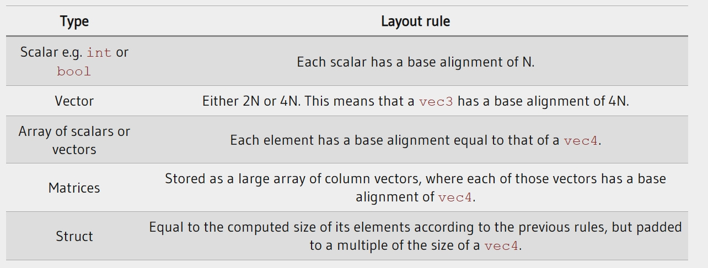
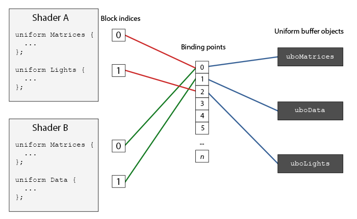

### Advanced GLSL

---

首先我们来看看GLSL还有什么比较重要的内置变量。

##### gl_PointSize

在OpenGL中，我们可以选择`GL_POINTS`作为我们的渲染图元，也就是说，每个vertex都会被视为图元，然后作为一个点被绘制出来。我们可以使用OpenGL中的`glPointSize`来调整绘制的点的大小，当然也可以在vertex shader中进行设置。

GLSL定义了一个顶点着色器的输出值gl_PointSize，它是一个浮点值，可以定义点的宽度与高度。不过，设置点的大小默认情况下是禁用的，我们需要告诉OpenGL启用这个功能：

```
glEable(GL_PROGRAM_POINT_SIZE);
```

在顶点着色器中，可以这样使用：

```glsl
void main()
{
	gl_Position = projection * view * model * vec4(aPos, 1.0);
	gl_PointSize = gl_Position.z;
}
```

---

##### gl_VertexID

`gl_VertexID`是顶点着色器的一个输入值，它本身是只读的，它记录了当前vertex的ID。换种说法，当我们使用`glDrawElements`绘制时，gl_VertexID记录了当前的verterx的index；当我们使用`glDrawArrays`绘制时，它记录从开始绘制到当前vertex的序号。

---

##### gl_FragCoord

之前我们在探讨深度测试时，已经使用到了`gl_FragCoord`，这个变量的`z`分量等于当前片段的深度值。

gl_FragCoord的x y分量表示当前片段中，屏幕空间的坐标，原点是屏幕的左下角。

---

##### gl_FrontFacing

`gl_FrontFacing`是片段着色器的一个输入值。我们在面剔除的那一篇博客中提到，OpenGL可以根据顶点的环绕顺序来判断一个面是否是正面还是反面。`gl_FrontFacing`就可以告诉在片段着色器中告诉我们这个信息。

---

##### gl_FragDepth

`gl_FragCoord`可以告诉我们当前片段的屏幕空间坐标和深度值，但是这个变量是**只读**的。虽然我们不能改变一个片段的屏幕空间坐标，但是却可以改变它的深度值，我们可以通过`gl_FragDepth`来直接设置深度值(范围在0和1之间)。

如果片段着色器中，没有通过`gl_FragDepth`来设置片段的深度值，则深度值默认是`gl_FragCoord`的`z`分量。

手动设置深度值可能会带来一些问题， 比如会让OpenGL禁用early-z，这是因为OpenGL不能在fragment shader运行之前得知深度值了。

---

目前为止，每次我们从顶点着色器向片段着色器发送数据时，我们都需要使用到命名一致的input/output变量。但是，随着shader复杂度的提高，我们可能不得不声明更多这样的变量。

为了更好的组织数据，GLSL为我们提供了**interface blocks**。它看起来和`struct`很像，只是我们需要用`in`或者`out`来声明它

```glsl
#version 330 core
layout (location = 0) in vec3 aPos;
layout (location = 1) in vec2 aTexCoords;

uniform mat4 model;
uniform mat4 view;
uniform mat4 projection;

out VS_OUT
{
	vec2 TexCoords;
} vs_out;

void main()
{
	gl_Position = projection * view * model * vec4(aPos, 1.0);
	vs_out.TexCoords = aTexCoords;
}
```

然后我们需要在片段着色器中声明一个input的interface block。**block name**在顶点着色器和片段着色器中需要保持一一致，即`VS_OUT`，但是**instance name**可以是任意的，在顶点着色器中是`vs_out`，在片段着色器中是`fs_in`：

```glsl
#version 330 core
out vec4 FragColor;

in VS_OUT
{
	vec2 TexCoords;
} fs_in;

uniform sampler2D texture1;

void main()
{
	FragColor = texture(texture1, fs_in.TexCoords);
}
```

简而言之，只要block name可以保持一直，数据就可以在顶点着色器和片段着色器中传递。

---

我们已经在OpenGL中学习到了一定深度，我们认识了OpenGL中很多酷炫的技巧，但是也有一些步骤会让我们感到繁琐。比如，当我们使用多个shader时，我们需要不断地为各个shader设置uniform values，尽管它们对每个shader的值可能都相同。

OpenGL为我们提供了一个叫做`uniform buffer objects`的工具，让我们可以定义一组global uniform variables，这组变量对任意数量的shader都是一样的值。当你使用UBO时，你可以一次性地设置所有的统一数据，所有使用这些数据的着色器都可以获取到这些值。只不过，创建并配置uniform buffer objects需要一些步骤。

我们在一个简单的顶点着色器中，将投影矩阵和观察矩阵存放在**uniform block**中。

```glsl
#version 330 core
layout (locatino = 0) in vec3 aPos;

layout (std140) uniform Matrices
{
	mat4 projection;
	mat4 view;
};

uniform mat model;

void main()
{
	gl_Position = projection * view * model * vec4(aPos, 1.0);
}
```

uniform block中变量可以直接访问，而不需要带上`Matrices`作为前缀。

那么layout (std140)是什么意思呢？它表示当前定义的uniform block使用了特定的内存layout，设定了**uniform block layout**

---

uniform block中的内容存放在一个buffer object中，也就是GPU里一个固定的内存上。因为这块内存并不知道它包含的信息是什么，我们需要在shader中明确告诉OpenGL，我们以下面这个uniform block为例：

```glsl
layout (std140) uniform ExampleBlock
{
	float value;
	vec3 vector;
	mat4 matrix;
	float values[3];
	bool boolean;
	int integer;
}
```

我们想要知道的是这些变量的大小(以字节为单位)和偏移量(从uniform block的开始处开始)，这样我们就可以按照它们各自的顺序将它们放进buffer。每个变量的大小在OpenGL中都有明确的定义，并且直接对应与C++的数据类型；向量和矩阵是浮点数的(大)数组。

但是OpenGL没有明确地告诉我们这些变量之间地间距，它能够允许硬件根据需要填充数据，比如，硬件可以让`vec3`紧邻着`float`放置。但是并非所有硬件都能处理这一点。

默认情况下，GLSL使用了一种被称为shared layout的统一内存布局。在shared layout中，硬件定义了偏移量，然后这些偏移量会在多个shader program之间共享，从而节省了一些内存空间。但是我们需要为每个uniform variable查询偏移量，这会带来大量的工作，所以我们通常的做法并不会使用shared layout的内存布局。

我们采用了所谓的std140布局，它明确的规定了每一种变量类型的内存布局方式，并约定了它们的偏移量；也就是说，每个变量都有一个基础的对齐方式，这个对齐方式等于变量在统一块中占据的空间，包括因为填充（padding）造成的额外空间。对于每一个变量，我们要计算出它的对齐偏移量：即变量从块头部开始的字节偏移量。这个字节偏移量必须是其基本对齐的倍数。

下面，我们将会列出OpenGL中关于计算偏移量的规则。GLSL中的每个变量类型，每个占用4字节的变量或者单位被记作N"。也就是说，无论你是在使用 int，float，还是 bool 类型的变量，每一个都占据了4字节的空间，我们将这样的一个单位或者说"实体"记作 N。



现在，让我们再回顾一下前面的`Example Block`

```glsl
layout (std140) uniform ExampleBlock
{
                     // base alignment  // aligned offset
    float value;     // 4               // 0 
    vec3 vector;     // 16              // 16  (offset must be multiple of 16 so 4->16)
    mat4 matrix;     // 16              // 32  (column 0)
                     // 16              // 48  (column 1)
                     // 16              // 64  (column 2)
                     // 16              // 80  (column 3)
    float values[3]; // 16              // 96  (values[0])
                     // 16              // 112 (values[1])
                     // 16              // 128 (values[2])
    bool boolean;    // 4               // 144
    int integer;     // 4               // 148
}; 
```

当然，除了std140和shared，还有一种名为packed的内存布局。

---

现在，我们已经在shader中定义了uniform blocks，也明确了它的内存布局，但是我们还没有讨论如何使用。

首先我们要创建uniform buffer  object：

```c++
unsigned int uboExampleBlock;
glGenBuffers(1, &uboExampleBlock);
glBindBuffer(GL_UNIFORM_BUFFER, uboExampleBlock);
glBufferData(GL_UNIFORM_BUFFER, 152, nullptr, GL_STATIC_DRAW);
glBindBuffer(GL_UNIFORM_BUFFER, 0);
```

现在，无论何时我们想要在buffer中更新或者插入数据，我们都需要绑定`uboExampleBlock`并调用`glBufferSubData`来更新内存。我们只需要更新uniform buffer一次，所有使用这个buffer的shader都会获取并使用更新后的数据。但是，OpenGL是如何将uniform buffer与uniform block对应起来的呢？

在OpenGL的context中，有一个名为**binding points**的数值，定义了我们将uniform buffer链接在什么地方。一旦我们创建了uniform buffer object，我们将其链接在binding point上，并且将shader中的uniform block链接在 同一个binding point上。我们可以配合下面的图示理解：



我们调用`glUniformBlockBinding`将shader的uniform block与binding point相链接，它需要一个shader program object、uniform block index、binding  point作为参数，其中uniform block index可以通过`glGetUniformBlockIndex`获取。这个过程需要对每个shader都执行。

```c++
unsigned int lights_index = glGetUniformBlockIndex(shaderA.ID, "Light");
glUniformBlockBinding(shaderA.ID, lights_index, 2);
```

我们还需要链接uniform buffer object

```
glBindBUfferBase(GL_UNIFORM_BUFFER, 2, uboExampleBlock);
// or
glBindBufferRange(GL_UNIFORM_BUFFER, 2, uboExampleBlock, 0, 152);
```

`glBindBufferRange`允许我们将多个uniform block连接到同一个uniform buffer object上。

现在，万事俱备，我们可以将数据添加进uniform buffer中了。具体的过程我们再通过下面这个例子演示一下：

---

在我们的这个例子中，我们将在场景中绘制4个立方体，它们各自使用不同的shader program，其中顶点着色器都是相同的，片段着色器互不相同，但是都是输出一个单色。

对于shader中的变换矩阵：投影、观察、模型，只有模型矩阵是需要频繁改动的，所以，如果有多个shader用到同一套矩阵，我们就可以考虑使用uniform buffer objects了。

我们把投影矩阵和观察矩阵存储在名为`Matrices`的uniform block中，顶点着色器代码如下：

```glsl
#version  330 core
layout (location = 0) in vec3 aPos;

layout (std140) uniform Matrices
{
	mat4 projection;
	mat4 view;
};
uniform mat4 model;

void main()
{
	gl_Position = projection * view * model * vec4(aPos, 1.0);
}
```

我们需要将每个顶点着色器的uniform block绑定到binding point 0上。

```c++
unsigned int uniformBlockIndexRed = glGetUniformIndex(shaderRed.ID, "Matrices");
unsigned int uniformBlockIndexGreen = glGetUniformIndex(shaderGreen.ID, "Matrices");
unsigned int uniformBlockIndexBlue = glGetUniformIndex(shaderBlue.ID, "Matrices");
unsigned int uniformBlockIndexYellow = glGetUniformIndex(shaderYellow.ID, "Matrices");

glUniformBlockingBinding(shaderRed.ID, uniformBlockIndexRed, 0);
glUniformBlockBinding(shaderGreen.ID,  uniformBlockIndexGreen, 0);
glUniformBlockBinding(shaderBlue.ID,   uniformBlockIndexBlue, 0);
glUniformBlockBinding(shaderYellow.ID, uniformBlockIndexYellow, 0);
```

然后我们创建一个uniform buffer object，也绑定给binding point 0：

```c++
unsigned int uboMatrices;
glGenBuffers(1, &uboMatrices);

glBindBuffer(GL_UNIFORM_BUFFER, uboMatrices);
glBufferData(GL_UNIFORM_BUFFER, 2 * sizeof(glm::mat4), nullptr, GL_STATIC_DRAW);
glBindBUffer(GL_UNIFORM_BUFFER, 0);

glBindBUfferRange(GL_UNIFORM_BUFFER, 0, uboMatrices, 0, 2 * sizeof(glm::mat4));
```

我们给buffer分配出足够的内存，也就是`2 * sizeof(glm::mat4)`，然后我们将buffer中的一个明确的范围(在这里是整个buffer的范围)绑定给binding point 0

现在我们还需要将数据填充给buffer。如果我们保持投影矩阵的fov不变，那就意味着我们只需要填充一次即可。因为我们分配了足够的内存空间，我们可以使用`glBufferSubData`来在render loop前填充投影矩阵

```c++
glm::mat4 projection = glm::perspective(glm::radians(45.0f), (float)width/(float)height, 0.1f, 100f);
glBindBuffer(GL_UNIFORM_BUFFER, uboMatrices);
glBufferSubData(GL_UNIFORM_BUFFER, 0, sizeof(glm::mat4), glm::value_ptr(projection));
glBindBuffer(GL_UNIFORM_BUFFER, 0);
```

然后我们会在每帧将view矩阵填充给buffer

```c++
glm::mat4 view = camera.GetViewMatrix();	       
glBindBuffer(GL_UNIFORM_BUFFER, uboMatrices);
glBufferSubData(GL_UNIFORM_BUFFER, sizeof(glm::mat4), sizeof(glm::mat4), glm::value_ptr(view));
glBindBuffer(GL_UNIFORM_BUFFER, 0);  
```

然后我们只需要为每个cube设置对应的model矩阵即可

```c++
glBindVertexArray(cubeVAO);
shaderRed.use();
glm::mat4 model = glm::mat4(1.0f);
model = glm::translate(model, glm::vec3(-0.75f, 0.75f, 0.0f));	// move top-left
shaderRed.setMat4("model", model);
glDrawArrays(GL_TRIANGLES, 0, 36);        
// ... draw Green Cube
// ... draw Blue Cube
// ... draw Yellow Cube	  
```

源码在[这里](https://learnopengl.com/code_viewer_gh.php?code=src/4.advanced_opengl/8.advanced_glsl_ubo/advanced_glsl_ubo.cpp)

---

**总结一下，在OpenGL中使用uniform buffer objects的优势在于：**

- 数据共享：UBO允许在着色器程序之间共享一组统一的变量，这对于重用常量数据非常有效。例如，如果你有一个经常在不同的着色器程序中使用的光源设置，你只需要在一个地方设置他们并告诉每个着色器去哪里找它们。
- 性能优化：UBO存储在GPU的内存中，而不是每次渲染调用时传递给着色器。这减少了CPU到GPU的数据传输，从而提高了渲染性能。
- 结构化数据管理：与单个的统一变量相比，UBO允许你以更结构化的方式组织和管理你的数据。例如，你可以将所有与光源相关的统一变量组合在一个UBO中，然后将所有与材质相关的统一变量组合在另一个UBO中。
- 更有效的内存使用：通过使用UBO，你可以更有效地利用GPU内存。你可以一次性更新UBO中的所有数据，而不是单独更新每个统一变量，这可以减少内存碎片和浪费。
