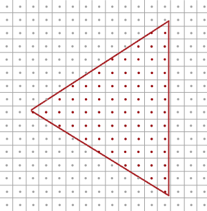
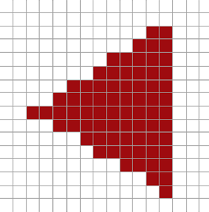
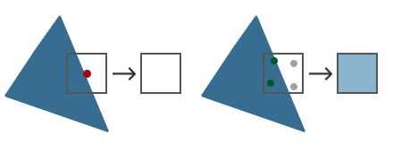

### Anti Aliasing

---

我们可以在OpenGL中采用多种技术来实现抗锯齿。

起初，开发人员使用了一种叫做Super Sample Anti Aliasing（SSAA)的技术，它的工作方法是将原本的每一个像素分为多个子像素（超过一倍的渲染分辨率），然后单独计算每一个子像素的颜色值。待所有子像素颜色值计算完毕后，将它们平均（取均值），得到最终每个像素的颜色值。由于每个像素的颜色值现在来源于其子像素的平均，因此能较真实地反映该像素范围内的颜色变化，有效地模糊了锐利边缘的锯齿。

比如，一个2x2的SSAA会创建一个分辨率是原始图像两倍的图像，并为这个大图像的每一个像素渲染颜色。然后，每一个2x2的块都会被缩小为一个像素，颜色用块内部四个像素的平均值来表示。这样，在边缘区域，原本一个像素只能有一个颜色选择染色或者不染色，现在可以有更精细的颜色选择。

不过，SSAA的缺点是其高昂的计算成本。因为多了很多子像素需要进行计算，尤其是在复杂场景，还需要进一步处理纹理、阴影和光照等细节，这无疑会对渲染性能带来很大压力。因此，尽管SSAA能提供良好的视觉效果，但经常需要权衡其与性能之间的关系。如果是在实时渲染环境下（例如游戏），可能需要考虑使用其他更轻量级的抗锯齿技术，比如MSAA（多重采样抗锯齿）。

---

为了了解什么是MSAA以及它的原理，我们要先进一步了解一下OpenGL光栅器的内部工作原理。

光栅化是一系列算法的集合，它发生在经过最终处理的顶点与片段着色器之间。光栅器会获取一个简单图元中的所有顶点，将它们处理为片段。顶点坐标在理论上可以有任意的坐标，但是片段不可以，它要受屏幕分辨率的限制。**在3D图形渲染过程中，顶点坐标和屏幕上的像素（也就是片段）之间几乎不可能有一一对应关系**。原因有以下几点：

- 你定义的顶点数量通常远远少于屏幕的像素数。特别是在你尝试绘制复杂3D模型也好，或是简单的2D素描也罢，通常都会涉及屏幕上数百万甚至更多的像素，但相应的顶点数量则远少于此。
- 不同的顶点可能会被映射到屏幕上的同一像素。比如，当你定义的顶点在3D空间中非常接近，或者视角距离远，导致这些顶点在投影到二维屏幕后在像素级别上产生重叠



如上图所示，屏幕上的像素用网格的形式表现出来，每个像素的中心都有一个**sample point**，用来确定一个像素是否会被三角形覆盖。图中红色的sample points会被三角形覆盖，那么被覆盖的像素就会形成一个片段。但是也有一些屏幕中的像素，虽然有三角形的边缘在其中，但是这些像素的采样点却没有被三角形包围，于是它就不会参与片段的形成。

由上图得到的渲染后的三角形是这样的，我们已经可以看到锯齿的形成了：



由于屏幕像素数量的限制，在三角形的边缘上，有些像素会被绘制而有些却不会，最终我们得到的结果便是：我们渲染了边缘不平滑的图元，而产生了锯齿。

MSAA所做的，是采用了多个采样点去判断三角形的边缘是否覆盖了一个像素，而非单独一个sample point。如下图所示：



在MSAA下，我们有了新的确定像素是否被覆盖的方法，我们还需要知道这个像素的颜色是如何确定的。我们最初的猜测可能是，对于每个被覆盖的子采样，我们运行片段着色器，然后对每个像素的每个子采样的颜色进行平均。在这种情况下，我们将在每个子采样的插值顶点数据上运行两次片段着色器，并将结果颜色存储在这些采样点中。但是这意味着我们需要运行比没有MSAA时更多的片段着色器，这将大大降低性能。

MSAA实际的运作方式是，无论像素中有多个sub sample point落在三角形区域内，片段着色器都只会在每个像素上运行一次：片段着色器会在每个像素的中心位置进行运算，此时使用的是对应像素位置的插值顶点数据。然后，MSAA使用更大的dept/stencil buffer来跟踪并确定每个像素中有多少个sub samples被覆盖，根据被覆盖的subsamples的数量，就可以决定该像素的颜色对于color frame buffer贡献了多少。

比如，在上图中，一个像素的4个subsamples里，仅有2个在三角形覆盖范围内，所以这个像素的最终颜色将是三角形的颜色和帧缓存中的原有颜色的混和。

通过多重采样抗锯齿，我们获得的是一个分辨率更高的缓冲区，其中包含了分辨率更高的深度/模板缓冲。在这个缓冲区中，所有渲染图形的边缘现在显得更加平滑。下图展示了使用MSAA后，光栅化的结果：


对于每个像素来说，如果被三角形所覆盖的subsamples越少，则它从三角形颜色中获取的比例就越少。我们给上图的三角形赋予一个颜色，那么我们就会得到这样的的结果：


深度和模板值都是针对每个子采样进行存储的。同时，尽管我们只对每个像素执行一次片段着色器，但是，考虑到存在多个三角形重叠在一个像素上的情况，我们仍然会对每个子采样的颜色值进行单独存储。

- 在进行深度测试时，我们会先把顶点的深度值插值到每个子采样，然后再进行深度测试。
- 对于模板测试，我们同样会对每个子采样的模板值进行单独存储。

这样做的结果就是，由于每个像素都包含了多个子采样，因此，我们现在需要的深度缓冲区和模板缓冲区的大小都会因为子采样的增加而增大。**简单来说，缓冲区的大小现在需要增加到原来的每像素子采样数量倍**。

现在，我们已经对MSAA有了一个初步的了解，现在让我们在OpenGL中动手实现MSAA吧。

---

在OpenGL中实现MSAA，我们需要一个能存储每个像素的多个采样值的buffer，我们将这个buffer称为**multi sample buffer**

GLFW为我们提供了这样的buffer，我们需要*hint* GLFW：我们不再需要常规的buffer，而是需要支持multi sample的buffer

```c++
glfwWindowHint(GLFW_SAMPLES, 4);
```

现在，我们还需要告诉OpenGL激活multi sample的功能，虽然这是OpenGL默认的：

```c++
glEnable(GL_MULTISAMPLE);
```

因为实际上的multi sampling算法是在OpenGL的光栅化阶段进行的，我们并不需要做其他的工作，就可以看到一个更加平滑的边缘了。

---

不过在上面的步骤中，是GLFW为我们创建了multisampling buffers。但是如果我们想要使用我们自己的frame buffers，我们就需要自行定义multisampled buffer。

我们可以将multisampled buffer是为framebuffer的一个attachment，这样一来，我们就有两种方式来创建multisampled buffer了，一种是texture，一种是render buffer，我们在之前的博客中有讨论过。

---

我们先来看看基于纹理的方式。想要创建一个支持存储multi sample points的纹理，我们需要调用`glTexImage2DMultisample`而不是之前的`glTexImage2D`。~使用`GL_TEXTURE_2D_MULTISAMPLE`作为它的`texture target`：

```c++
glBindTexture(GL_TEXTURE_2D_MULTISAMPLE, tex);
glTexImage2DMultiSample(GL_TEXTURE_2D_MULTISAMPLE, samples, GL_RGB, width, height, GL_TRUE);
glBindTexture(GL_TEXTURE_2D_MULTISAMPLE, 0);
```

我们注意到，`glTexImage2DMultiSample`的第二个参数不再是默认的`0`，是`samples`，实际上samples就是我们想要texture所支持的samples的数量。

如果`glTexImage2DMultiSample`的最后一个参数是`fixedsamplelocations`，用来决定这些采样点的位置是否固定的。也就是说，这个参数决定了多重采样纹理是以固定的模式进行的，还是以非固定（也就是随机或者不确定）的模式进行的

- 如果 `fixedsamplelocations` 参数设为 `GL_TRUE`，那么这意味着所有的像素都使用相同的采样点。也就是说，纹理在所有图像位置的所有样本，将有相同的位置。这种模式下，不同像素的采样点位置是一样的，可以确保一致的采样效果，但可能会出现一些模式性的噪声或者其他的图像问题
- 相反，如果 `fixedsamplelocations` 参数设为 `GL_FALSE`，那么不同的像素可能会使用不同的采样点。或者换一种说法，纹理在所有图像位置的所有样本，将有不同的位置。由于采样点位置不固定，这可以避免一些模式性的噪声，得到更自然的图像效果，但可能会增加GPU的计算复杂性和负担

我们还需要使用glFrameBufferTexture2D将我们创建的multisampled texture绑定给framebuffer，但是texture type还是需要改为GL_TEXTURE_2D_MULTISAMPLE：

```c++
glFrameBufferTexture2D(GL_FRAMEBUFFER, GL_COLOR_ATTACHMENT0, GL_TEXTURE_2D_MULTISAMPLE, tex, 0);
```

现在，我们当前绑定的framebuffer就有了一个纹理形式的multisampled color buffer

---

我们来看看framebuffer的另一种attachment: render buffer

这个过程其实也不复杂，我们需要改变的只是将`glRenderbufferStorage`改为`glRenderbufferStorageMultisample`

```c++
glRenderbufferStorageMultisample(GL_RENDERBUFFER, 4, GL_DEPTH24_STENCIL8, width, height);
```

这个函数多了一个参数，也就是我们需要的multi samples的数量 `4`

---

首先我们回顾一下，使用framebuffer绘制时，光栅化器会帮我们处理multi sample的操作。但是multisampled buffer有些特殊，我们不能直接使用这个buffer来完成一些类似在shader中采样的操作。

multisampled image包含了比一个普通纹理更多的信息，所有我们需要做的是降采样/resolve这个image。Resolving multi sampled framebuffer基本上是通过`glBlitFramebuffer`来实现的。

函数`glBlitFramebuffer`在OpenGL中一般用于帧缓冲对象之间的复制操作，也就是将一个帧缓冲对象的像素数据复制到另一个帧缓冲对象中。这个函数是帧缓冲对象（FBO）功能的一部分。函数签名如下：

```c++
void glBlitFramebuffer(GLint srcX0,
                       GLint srcY0,
                       GLint srcX1,
                       GLint srcY1,
                       GLint dstX0,
                       GLint dstY0,
                       GLint dstX1,
                       GLint dstY1,
                       GLbitfield mask,
                       GLenum filter);
```

我们来说明一下函数的各个参数：

- `srcX0`, `srcY0`, `srcX1`, `srcY1` 指定原帧缓冲的矩形区域
- `dstX0`, `dstY0`, `dstX1`, `dstY1` 指定目标帧缓冲的矩形区域
- `mask` 参数用于指定需要复制的缓冲类型，可以是`GL_COLOR_BUFFER_BIT`、`GL_DEPTH_BUFFER_BIT`和`GL_STENCIL_BUFFER_BIT`的各种组合
- `filter` 参数指定在源矩形区域和目标矩形区域大小不一致的情况下，用于对像素值进行插值的过滤方式，可选的值为`GL_NEAREST`、`GL_LINEAR`

注意，为了使用`glBlitFramebuffer`函数，必须先把源framebuffer和目标framebuffer绑定到`GL_READ_FRAMEBUFFER`和`GL_DRAW_FRAMEBUFFER`目标上。

在MSAA中，我们会先将场景绘制到一个multisampled buffer object上，然后用`glBlitFramebuffer`把multisampled buffer object的内容复制到一个普通的frame buffer object上，最近再显示到窗口上。

```c++
glBindFramebuffer(GL_READ_FRAMEBUFFER, multisampledFBO);
glBindFramebuffer(GL_DRAW_FRAMEBUFFER, 0);
glBlitFramebuffer(0, 0, width, height, 0, 0, width, height, GL_COLOR_BUFFER_BIT, GL_NEAREST); 
```

完整源码在[这里](https://learnopengl.com/code_viewer_gh.php?code=src/4.advanced_opengl/11.2.anti_aliasing_offscreen/anti_aliasing_offscreen.cpp)

---

