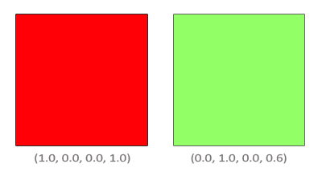
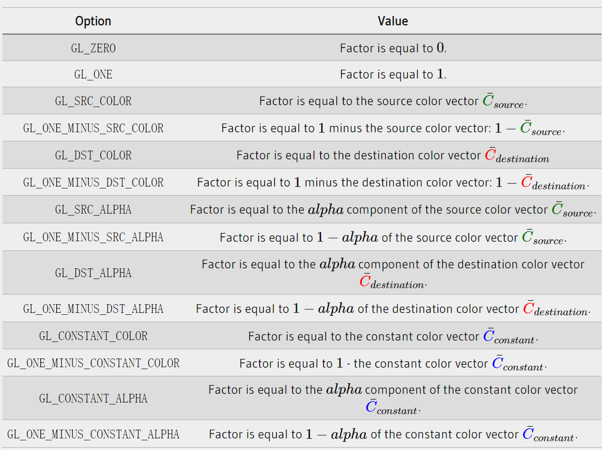

### Blending

---

GLSL为我们提供了内置函数`discard`，可以帮助我们手动丢弃一些片段。借助它，我们可以实现透贴等效果。用法如下

```glsl
#version 330 core
out vec4 FragColor;

in vec2 TexCoords;

uniform sampler2D texture1;

void main()
{             
    vec4 texColor = texture(texture1, TexCoords);
    if(texColor.a < 0.1)
        discard;
    FragColor = texColor;
}
```

---

但是想要实现半透明的效果，我们就需要借助`Blend`这个操作，首相我们需要在OpenGL中开启`Blend`

```c++
glEnable(GL_BLEND);
```

开启混和模式之后，我们需要告诉OpenGL如何混合。OpenGL的混合遵循下面这个公式
$$
C_{result}=C_{source}∗F_{source}+C_{destination}∗F_{destination}
$$
其中

- C<sub>source</sub>是片段着色器的输出颜色
- C<sub>destination</sub>是当前color buffer中存储的颜色
- F<sub>source</sub>是source的factor value，用来设置source color的alpha值
- F<sub>destination</sub>是缓冲区颜色的factor value，用来设置color buffer's color的alpha值

在片段着色器运行并且所有测试都通过后，该混合方程式将包含片段的颜色输出和颜色缓冲区当前的内容。源颜色和目标颜色将由OpenGL自动设置，但是源因子和目标因子可以设定为我们选择的值。让我们从一个简单的例子开始



我们有两个方块，现在我们向红色方块的前面绘制一个半透明的绿色方块，红色的方块可以视为destination color，绿色方块设置为source color

那么现在的问题就是，我们应该如何设置混合方程中的两个Factor。首先，我们可以肯定的是，我们想要将绿色方块的颜色值与它的alpha相乘，所以我们将F<sub>source</sub>设置为source color的alpha，也就是0.6。接下来我们考虑，最终输出颜色的alpha必定为1，也就是说，F<sub>destination</sub>应该等于1 - F<sub>source</sub>

在OpenGL中，我们使用`glBlendFunc`来配置混合公式的factors，函数原型如下

```c++
glBlendFunc(GLenum sfactor, GLenum dfactor)
```

函数所使用的参数也由OpenGL为我们提供了一些可选项，其中C<sub>constant</sub>需要使用`glBendColor`来设置



最常用的半透明混合的需要下面这行代码实现

```c++
glBlendFunc(GL_SRC_ALPHA, GL_ONE_MINUS_SRC_ALPHA);  
```

当然，我们还可以通过`glBlendFuncSeparate`来分别控制RGB和Alpha：

```
glBlendFuncSeparate(GL_SRC_ALPHA, GL_ONE_MINUS_SRC_ALPHA, GL_ONE, GL_ZERO);
```

 此外，混合公式中我们不仅仅可以用加法运算，通过`glBlendEquation(GLenum mode)`，我们可以切换不同的运算模式，默认情况下，参数都是`GL_FUNC_ADD`

---

让我们在OpenGL中操作起来，绘制出一些半透明的窗户

首先，我们需要开启混合操作，并且指定正确混合公式

```
glEnable(GL_BLEND);
glBlendFunc(GL_SRC_ALPHA, GL_ONE_MINUS_SRC_ALPHA);
```

片段着色器中，我们也不需要discard片段了，直接输出纹理采样的结果就可以。

但是我们所得到的渲染结果可能会有一些问题，这是因为深度测试与半透明混合会带来一些矛盾。

我们将片段的深度值写入depth buffer时，深度测试并不关心片段是否有透明度，所有透明的部分也会被写入深度缓冲区，与其他不透明的片段并无区别。这样带来的结果便是，一些后面的窗户无法通过深度测试，片段便会被抛弃。

所以，我们不能简单地渲染这些半透明的窗户，我们必须先绘制出后面的窗户，也就是说，我们必须手动地按照从后向前的顺序排列窗户，并相应地完成绘制。

我们可以得出这样的结论，当场景中既存在不透明物体，也存在半透明物体时，我们应该按照如下步骤处理：

- 首先绘制所有不透明物体
- 为所有半透明物体排序
- 按照我们排好的顺序绘制半透明物体

一种为半透明物体排序的方式是：获取以相机视角的物体的远近，我们将这个距离与物体的位置一同存储在map这个数据结构中，它会自动根据key来完成对value的排序，所以我们只需要添加所有半透明物体的位置和距离，就可以自动地得到想要的排序结果：

```c++
std::map<float, glm::vec3> sorted;
for (unsigned int i = 0; i < window.size(); i++)
{
	float distance = glm::length(camera.Position - windows[i]);
    sorted[distance] = windows[i];
}
```

我们得到了一个排序后的map对象，根据每个窗户的位置与距离键值的距离，从最小到最大的距离进行存储。然后，在渲染时，我们以倒序（从最远到最近）取出 map 的每个值，然后按正确的顺序绘制相应的窗口：

```c++
for (std::map<float, glm::vec3>::reverse_iterator it = sorted.rbegin(); it != sorted.rend(); it++)
{
    model = glm::mat4(1.0f);
    model = glm::translate(model, it->second);
    shader.setMat4("model", model);
    glDrawArrays(GL_TRIANGLES, 0, 6);
}
```

虽然根据距离对对象进行排序的这种方法对于这个特定场景来说效果很好，但是它没有考虑到旋转、缩放或任何其他的变换，而且奇形怪状的对象需要的是一个不同于简单位移向量的度量。
在你的场景中排序对象是一项困难的任务，这在很大程度上取决于你的场景类型，更不用说它需要额外的处理能力。完全渲染一个包含实体和透明对象的场景并非易事。有更高级的技术，如顺序无关的透明度，但这些已经超出了本章的范围。现在，你必须继续使用正常的混合对象，但如果你小心并了解这些限制，你可以得到相当不错的混合实现