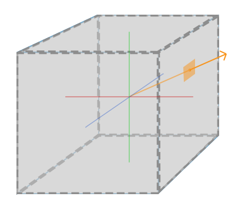
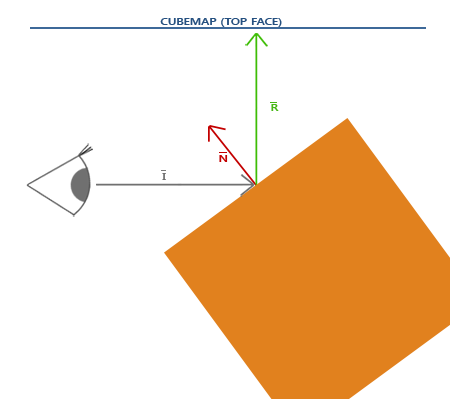
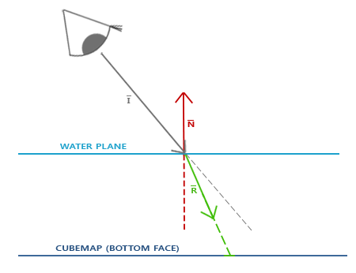

### Cubemaps

---

这篇博客，我们来讨论另一种texture type：cubemaps

一个cubemap会包含六了独立的2D纹理，每个2D纹理组成了立方体的一个面。这个立方体有什么意义呢？为什么要将6个单独的纹理合并成一个整体，而不是直接使用6个单独的纹理呢？这是因为，cubemap有一个特性，就是它可以被方向向量索引/采样。想象我们有一个1x1x1的立方体，方向向量的起点在立方体中心，使用下图中橙色的向量在cubemap中采样的效果大概是这样的：



> 方向向量的大小无所谓，只要存在一个方向向量，OpenGL就会根据方向向量所击中的立方体上的坐标来采样。

试想一个cubemap覆盖的立方体，方向向量就类似于立方体的局部顶点位置。这样一来，只要立方体的中心与原点重合，我们就可以用立方体实际的位置向量来采样cubemap。我们将立方体所有的顶点位置作为cubemap的纹理坐标。

---

创建cubemap的过程与创建2D纹理的过程类似，只是cubemap所对应的object type是`GL_TEXTURE_CUBE_MAP`。

```c++
unsigned int textureID;
glGenTextures(1, &textureID);
glBindTexture(GL_TEXTURE_CUBE_MAP, textureID);
```

因为cubemap包含了六个纹理，分别对应立方体的六个面，我们需要调用6次glTexImage2D，而且与之前不同的时，我们还需要声明纹理对应的是哪个面

```c++
int width, height, nrChannels;
unsigned char *data;
for (unsigned int i = 0; i < textures_faces.size(); i++)
{
    data = stbi_load(textures_faces[i].c_str(), &width, &height, &nrChannels, 0);
    glTexImage2D(GL_TEXTURE_CUBE_MAP_POSITIVE_X + i, 0, GL_RGB, width, height, 0, GL_RGB, GL_UNSIGNED_BYTEm data);
}
```

这里，我们有一个vector变量`textures_faces`，它包含了cubemap需要的所有2D纹理的位置。

我们同样需要为cubemap设置wrapping mode和filtering mode

```c++
glTexParameteri(GL_TEXTURE_CUBE_MAP, GL_TEXTURE_MAG_FILTER, GL_LINEAR);
glTexParameteri(GL_TEXTURE_CUBE_MAP, GL_TEXTURE_MIN_FILTER, GL_LINEAR);
glTexParameteri(GL_TEXTURE_CUBE_MAP, GL_TEXTURE_WRAP_S, GL_CLAMP_TO_EDGE);
glTexParameteri(GL_TEXTURE_CUBE_MAP, GL_TEXTURE_WRAP_T, GL_CLAMP_TO_EDGE);
glTexParameteri(GL_TEXTURE_CUBE_MAP, GL_TEXTURE_WRAP_R, GL_CLAMP_TO_EDGE);  
```

`GL_TEXTURE_WRAP_R`对cubemap来说用于确定采样哪一面的纹理。


---

天空盒是一个（大）立方体，包围整个场景，并包含周围环境的6张图片，给玩家一种他所处的环境实际上远大于实际大小的错觉。

我们将载入cubemap的相关代码封装成一个函数：

```c++
unsigned int loadCubemap(vector<std::string> faces)
{
    unsigned int textureID;
    glGenTextures(1, &textureID);
    glBindTexture(GL_TEXTURE_CUBE_MAP, textureID);

    int width, height, nrChannels;
    for (unsigned int i = 0; i < faces.size(); i++)
    {
        unsigned char *data = stbi_load(faces[i].c_str(), &width, &height, &nrChannels, 0);
        if (data)
        {
            glTexImage2D(GL_TEXTURE_CUBE_MAP_POSITIVE_X + i, 
                         0, GL_RGB, width, height, 0, GL_RGB, GL_UNSIGNED_BYTE, data
            );
            stbi_image_free(data);
        }
        else
        {
            std::cout << "Cubemap tex failed to load at path: " << faces[i] << std::endl;
            stbi_image_free(data);
        }
    }
    glTexParameteri(GL_TEXTURE_CUBE_MAP, GL_TEXTURE_MIN_FILTER, GL_LINEAR);
    glTexParameteri(GL_TEXTURE_CUBE_MAP, GL_TEXTURE_MAG_FILTER, GL_LINEAR);
    glTexParameteri(GL_TEXTURE_CUBE_MAP, GL_TEXTURE_WRAP_S, GL_CLAMP_TO_EDGE);
    glTexParameteri(GL_TEXTURE_CUBE_MAP, GL_TEXTURE_WRAP_T, GL_CLAMP_TO_EDGE);
    glTexParameteri(GL_TEXTURE_CUBE_MAP, GL_TEXTURE_WRAP_R, GL_CLAMP_TO_EDGE);

    return textureID;
}  
```

调用这个函数之前，我们需要将对应的路径填充进`faces`

```c++
vector<std::string> faces;
{
    "right.jpg",
    "left.jpg",
    "top.jpg",
    "bottom.jpg",
    "front.jpg",
    "back.jpg"
};
unsigned int cubemapTexture = loadCubemap(faces);  
```

---

天空盒被绘制在一个立方体上，我们需要一组新的VAO，VBO和天空盒对应的vertex data。对于天空盒来说，我们可以直接将顶点位置作为纹理坐标，所以vertex data只包含顶点位置就行了。

绘制天空盒的着色器也不复杂，顶点着色器并不需要model矩阵，或者说model矩阵默认是单位矩阵，因为天空盒的中心与世界原点重合。片段着色器则需要将纹理的类型声明为`samplerCube`，同时声明一个`vec3`的方向向量。

```glsl
#version 330 core
layout (location = 0) in vec3 aPos;

out vec3 TexCoords;

uniform mat4 projection;
uniform mat4 view;

void main()
{
    TexCoords = aPos;
    gl_Position = projection * view * vec4(aPos, 1.0);
}  
```

```glsl
#version 330 core
out vec4 FragColor;

in vec3 TexCoords;

uniform samplerCube skybox;

void main()
{    
    FragColor = texture(skybox, TexCoords);
}
```

绘制天空盒时，为了能够让天空盒作为场景的背景，我们将天空盒作为场景中的第一个物体渲染，并且关闭深度写入

```c++
glDepthMask(GL_FALSE);
skyboxShader.use();
// ... set view and projection matrix
glBindVertexArray(skyboxVAO);
glBindTexture(GL_TEXTURE_CUBE_MAP, cubemapTexture);
glDrawArrays(GL_TRIANGLES, 0, 36);
glDepthMask(GL_TRUE);
// ... draw rest of the scene
```

但是，天空盒作为背景，不应该随着玩家视角的移动而移动，所以我们还应该移除view矩阵的平移部分，保留旋转部分，从而可以用来更改采样的位置。

```c++
glm::mat4 view = glm::mat4(glm::mat3(camera.GetViewMatrix()));
```

---

目前我们的做法是先绘制天空盒，再绘制场景中的其他物体，但是这样其实并不高效，我们应该使用early-z的技术来丢弃被遮挡的片段，从而节省带宽。

所以，我们应该先绘制场景中的物体，将场景中物体的深度信息存储在depth buffer中。这样，当绘制天空盒时，我们仅仅绘制可以通过early深度测试的片段。

问题是，天空盒很可能会覆盖在所有其他物体的上面，因为它只是一个1x1x1的立方体，可以通过了大部分深度测试。简单地在没有深度测试的情况下渲染它并不是解决方案，因为天空盒仍然会在最后渲染时覆盖场景中的所有其他对象。我们需要欺骗深度缓冲区，让它认为天空盒具有最大深度值1.0，以便它在有其他对象在其前面的地方无法通过深度测试。

在前面的博客中我们提到过，顶点着色器运行后，透视除法就会被执行，`gl_Position`的`xyz`分量都会被除以`w`分量。我们还知道除法得到的z值就代表深度值，所以，如果我们将`gl_Position`的z值改为`w`值，那透视除法得到的深度值就是w/w = 1.0，完美地符合我们的要求。

```glsl
void main()
{
    TexCoords = aPos;
    vec4 pos = projection * view * vec4(aPos, 1.0);
    gl_Position = pos.xyww;
}  
```

因为我们将天空盒的深度值设置为了1，所有我们还需要将通过深度测试的条件，从`GL_LESS`改为`GL_LEQUAL` 

经过我们的优化，天空盒在渲染时，只会渲染不被场景中物体遮挡的片段，减少了overdraw。具体的源码在[这里](https://learnopengl.com/code_viewer_gh.php?code=src/4.advanced_opengl/6.1.cubemaps_skybox/cubemaps_skybox.cpp)

---

本篇博客的剩余部分，我们将讨论如何让场景中的物体反射或折射我们设置好的天空盒。

首先来看一下反射。最基本的反射并不难理解，下图就展示了如何计算反射向量，并根据反射向量来采样cubemap：



我们修改一下场景中的木箱所使用的fragment shader

```glsl
#version 330 core
out vec4 FragColor;

in vec3 Normal;
in vec3 Position;

uniform vec3 cameraPos;
uniform samplerCube skybox;

void main()
{
    vec3 I = normalize(Position - cameraPos);
    vec3 R = reflect(I, normalize(Normal));
    FragColor = vec4(texture(skybox, R).rgb, 1.0);
}
```

顶点着色器也需要对应地调整

```glsl
#version 330 core
layout (location = 0) in vec3 aPos;
layout (location = 1) in vec3 aNormal;

out vec3 Normal;
out vec3 Position;

uniform mat4 model;
uniform mat4 view;
uniform mat4 projection;

void main() 
{
    Normal = mat3(transpose(inverse(model))) * aNormal;
    Position = vec3(model * vec4(aPos, 1.0));
    gl_Position = projection * view * vec4(Position, 1.0);
}
```

在C++中，我们还需要提前将cubemap传递给箱子的片段着色器，才能正确的采样。

```c++
glBindVertexArray(cubeVAO);
glBindTexture(GL_TEXTURE_CUBE_MAP, skyboxTexture);
glDrawArrays(GL_TRIANGLES, 0, 36);
```

源码可以参考[这里](https://learnopengl.com/code_viewer_gh.php?code=src/4.advanced_opengl/6.2.cubemaps_environment_mapping/cubemaps_environment_mapping.cpp)

---

折射是另一种现象，如下图所示：



GLSL也为我们提供了折射的函数，只需要我们提供折射比率。

我们仅仅需要片段着色器即可

```glsl
void main()
{             
    float ratio = 1.00 / 1.52;
    vec3 I = normalize(Position - cameraPos);
    vec3 R = refract(I, normalize(Normal), ratio);
    FragColor = vec4(texture(skybox, R).rgb, 1.0);
}  
```

