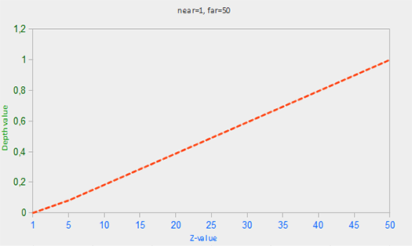
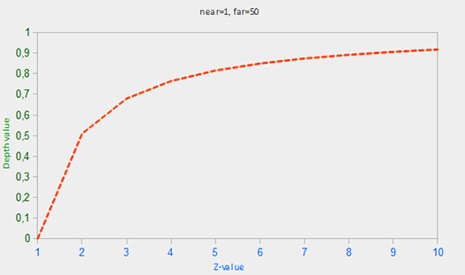
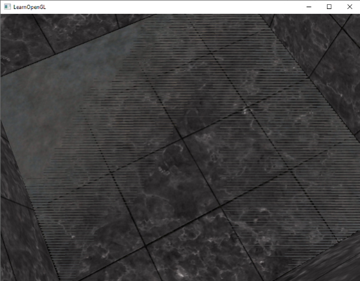

### Depth Testing

---

在之前关于坐标系的那篇博客中，我们渲染了一个立方体，并且使用了**depth buffer**来避免本应该被遮挡的三角形出现在其他三角形前面的错误。在这篇博客中，我们会进一步讨论depth buffer和它所存储的depth value，以及depth buffer是如何判断一个片段是否在前面的。

就像color buffer用来存储片段的颜色那样，depth buffer也用来存储每个片段的信息，且与color buffer 的宽高一直。depth buffer由OpenGL的窗口系统自动创建，并且以16/24/32位的浮点数存储深度值。在大多数系统中，depth buffer采用的精度是24位。

当深度测试开启时，OpenGL会将当前片段的深度值与depth buffer中存储的深度值作比较，这就是深度测试的含义。如果测试通过，则当前片段会被渲染，depth buffer中的值会被当前片段的深度值替代，如果深度测试未通过，则这个片段就会被丢弃。

深度测试是在fragment shader之后，以及模板测试之后，在屏幕空间上完成的。屏幕空间坐标与OpenGL通过glViewport定义的视口有关，可以通过GLSL内置的gl_FragCoord从片段着色器中获取。gl_FragCoord的x y坐标代表了代表了片段在屏幕空间的位置，z则代表了片段的深度值，在深度测试中，与depth buffer比较的值的就是这个Z值。

> 现代GPU支持了Early Depth Testing的技术。它允许在片段着色器之前执行深度测试，如果一个片段很明确地是不可见的，那我们就可及早地丢弃它。片段着色器通常是比较耗费性能的，所以我们应该尽可能地避免片段着色器的执行。
>
> Early Depth Testing也有一个限制，那就是我们不应该写入片段的深度值。也就是，如果我们在片段着色器中写入了深度，OpenGL就无法执行Early Z了

OpenGL一般是默认关闭深度测试的，所以我们需要明确告诉OpenGL开启

```c++
glEnable(GL_DEPTH_TEST);
```

如果开启了深度测试，我们还必须在每帧绘制之前，使用`GL_DEPTH_BUFFER_BIT`指令来清除depth buffer，否则我们就会在当前帧得到上一帧的depth value

```c++
glClear(GL_COLOR_BUFFER_BIT | GL_DEPTH_BUFFER_BIT);
```

不过也有一些特定情形，是你想要为所有片段执行深度测试并丢弃一些未通过测试的片段，但是并不更新深度值。我们可以说，我们需要一个只读的depth buffer，我们可以设置depth buffer的depth mask为 `GL_FALSE`来实现这个只读的深度缓冲区。（前提是开启了深度测试）

```c++
glDepthMask(GL_FALSE);
```

---

OpenGL为深度测试提供了多个比较运算符，我们可以调用`glDepthFunc`来配置使用哪种运算。运算符如下所举：`GL_ALWAYS`、`GL_NEVER`、`GL_LESS`、`GL_EQUAL`、`GL_LEQUAL`、`GL_GREATER`、`GL_NOTEQUAL`、`GL_GEQUAL`

```c++
glDepthFunc(GL_LESS);
```

---

Depth buffer记录了范围在0，1之间的深度值，它会与观察者所能看到的场景中的所有物体的深度值进行比较。view space中的深度值可以是视锥体远近平面之间的任意值。为了方便比较，我们应该将view space中的深度值转换为范围也在0，1之间的值。

我们可以使用线性的转换
$$
F_{depth} = \frac{z - near}{far - near}
$$
公式中的***near***与***far***是我们提供给投影矩阵、用来设置视锥体远近平面的值。这个公式将视锥体内的z值映射到0到1的范围内。用图来表示的话，如下所示



但在大多数实际应用中，这种方法效果并不理想。这是因为投影的特性使得深度信息与1/z密切相关，为了利用这种投影特性，开发者使用了非线性的深度方程。这种非线性的深度方程使得当物体距离观察者(z值)较小时，所得到的深度信息更加精确，而当物体距离观察者较远时，则得到的深度信息较少。这符合人类的视觉习惯，即观察者更容易区分近处物体的深度，而远处物体的深度则不易区分。所以，我们可以采用下面这个公式：
$$
F_{depth} = \frac{\frac{1}{z} - \frac{1}{near}}{\frac{1}{far} - \frac{1}{near}}
$$
简单总结一下，我们需要知道深度值在view space是线性的，但是由于投影矩阵的计算方式，我们在clip space中得到的经过转换的深度值并不是线性的，对应关系大致可以从图中看出



---

接下来，我们来看看如果在shader中可视化depth buffer。

我们已经知道，深度值被存储在gl_FragCoord中，我们不妨试下直接将它作为片段着色器的输出结果。

```glsl
void main()
{
	FragColor = vec4(vec3(gl_FragColor.z), 1.0);
}
```

但是运行程序，场景中的一切都是白色的，给我们一种“所有片段的深度值都为1”的错觉，那问题出在哪里呢？之前我们已经分析过了，屏幕空间中的深度值并非线性的，它们对于数值较小的深度值的精度很高，数值接近于1的精度很低。那我们需要做的就是，将非线性的深度值，再转换为线性的。

简单来说，我们需要逆转投影对深度值所作的处理，也就说，我们需要首先将[0, 1]的深度值转换到NDC中[-1, 1]的范围。然后我们再逆转前面所提到的非线性的公式的操作，最终得到一个线性深度值。这两步分别如下

```glsl
float ndc = depth * 2.0 - 1.0;
```

```
float linearDepth = (2.0 * near * far) / (far + near - ndc * (far -near));
```

更详尽的解释我们可以在[这里](https://www.songho.ca/opengl/gl_projectionmatrix.html)看到

---

一种常见的视觉异常可能会发生在两个平面或三角形非常接近对齐时，深度缓冲区没有足够的精度来确定哪一个形状在另一个形状的前面。结果是，这两种形状不断地看似更换顺序，导致怪异的故障模式。这就叫做z-fighting（深度抖动），因为这看起来就像形状们在争夺谁在上面。
在迄今为止我们一直在使用的场景中，有些地方可以注意到z-fighting。集装箱被放置在与地板平齐的高度，这意味着集装箱的底部与地板是共面的。然后两个平面的深度值是相同的，所以深度测试无法确定哪一个是正确的。
如果你将摄像机移到其中一个集装箱内部，效果就非常明显，集装箱的底部不断在集装箱的平面和地板的平面之间按照锯齿形状切换。



有一些技巧可以帮助我们避免z-fighting的出现

首要并最重要的技巧是，永远不要将物体放得太靠近，以至于它们的一些三角形紧密重叠。通过在两个对象之间创建一个小的偏移，你可以完全消除两个对象之间的z-fighting。在集装箱和平面的情况下，我们可以轻松地将集装箱稍微向正y方向上移动。集装箱位置的小变化可能根本无法察觉，但可以完全减少z-fighting。然而，这需要每个对象的手动干预，并通过彻底的测试来确保场景中没有物体产生z-fighting

第二个技巧是将近平面尽可能地放远。在前面的几节中，我们已经讨论过，当靠近近平面时，精度非常高，因此如果我们将近平面从观察者移开，我们将获得整个视锥范围内显著增大的精度。然而，将近平面设置得过远可能会导致近处物体的剪裁，因此，通常需要调整和试验来确定您的场景的最佳近距离

另一个非常好的技巧，尽管会以一些性能为代价，就是使用高精度的深度缓冲区。大多数深度缓冲区的精度为24位，但是现在的大多数GPU支持32位深度缓冲区，大幅增加了精度。所以，以一些性能为代价，你会通过深度测试获得更高的精度，减少z-fighting。

我们讨论的这3种技术是最常见和最容易实现的防抗z-fighting的技术。还有一些其他技术需要付出更多的工作，而且仍然不能完全禁用z-fighting。Z-fighting是一个常见的问题，但是如果你使用合适的技术组合，你可能不需要太多地处理z-fighting。
