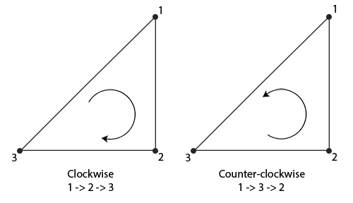
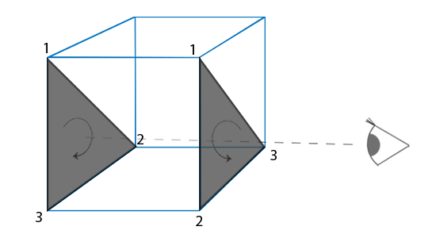

### Face Culling

---

如果我们可以实现不渲染那些看不到的面，就可以减少性能开支。这就是所谓的face culling。OpenGL 检查所有面向观察者的前向面，并渲染它们，同时丢弃所有的背向面，这为我们节省了大量的片段着色器调用。我们需要告诉 OpenGL，我们使用的哪些面实际上是前向面，哪些面是背向面。OpenGL 通过分析顶点数据的绕序来实现这个巧妙的技巧

---

当我们定义一组三角形顶点时，是按照特定的环绕顺序定义的，要么是顺时针，要么是逆时针。



在代码中这样表示：

```c++
float vertices[] = {
    // clockwise
    vertices[0], // vertex 1
    vertices[1], // vertex 2
    vertices[2], // vertex 3
    // counter-clockwise
    vertices[0], // vertex 1
    vertices[2], // vertex 3
    vertices[1]  // vertex 2  
};
```

因此，形成三角形图元的每组3个顶点都包含一个绕序。OpenGL 在渲染你的图元时，使用这些信息来确定一个三角形是前向还是背向。**默认情况下，以逆时针定义的顶点的三角形被认为是前向三角形。**


如上图所示，我们将两个三角形都以逆时针顺序定义（正面的三角形是1、2、3，背面的三角形也是1、2、3（如果我们从正面看这个三角形的话））。然而，如果从观察者当前视角使用1、2、3的顺序来绘制的话，从观察者的方向来看，背面的三角形将会是以顺时针顺序渲染的。虽然背面的三角形是以逆时针定义的，它现在是以顺时针顺序渲染的了。这正是我们想要剔除（Cull，丢弃）的不可见面了！

在顶点数据中，我们定义的是两个逆时针顺序的三角形。然而，从观察者的方面看，后面的三角形是顺时针的，如果我们仍以1、2、3的顺序以观察者当面的视野看的话。即使我们以逆时针顺序定义后面的三角形，它现在还是变为顺时针。它正是我们打算剔除（丢弃）的不可见的面！

---

在OpenGL中，我们需要手动开启面剔除

```c++
glEnable(GL_CULL_FACE);
```

开启之后，所有不面向观察者的面都会被丢弃，但是我们要留意那些非闭合的几何体是否要开启面剔除。

OpenGL还允许我们使用`glCullFace`自行决定哪些面需要提出，并给出了一些可选项：`GL_BACK`、`GL_FRONT`、`GL_FRONT_AND_BACK`，其中`GL_BACK`为默认值

我们当然也可以让OpenGL把顺时针环绕的面作为正面，使用`glFrontGFace(GL_CW)`就可以做到了

