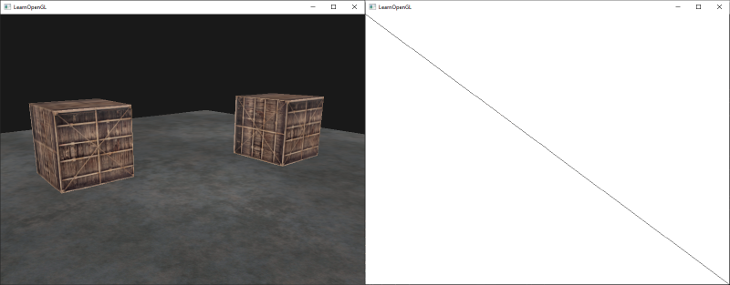
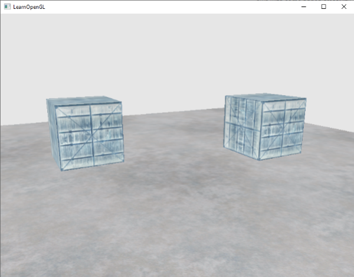
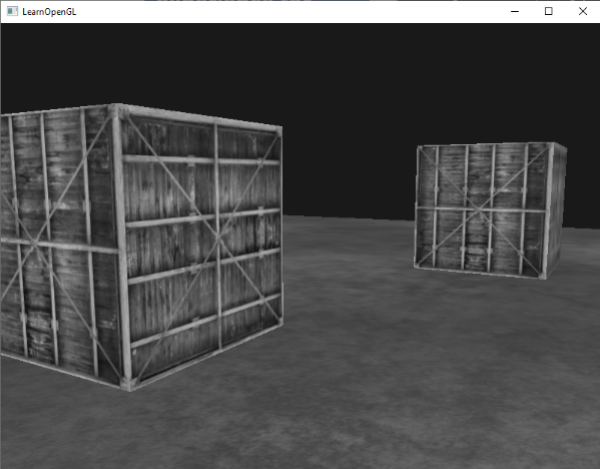
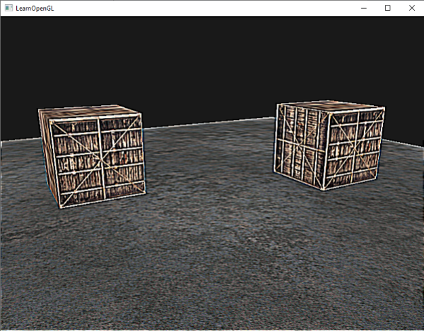
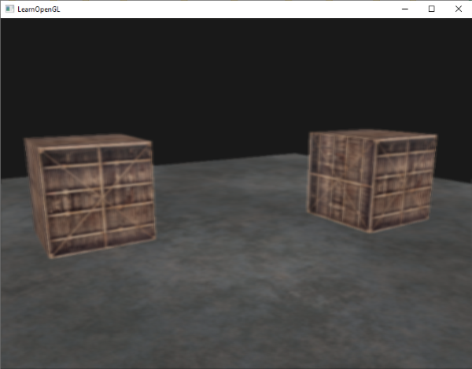
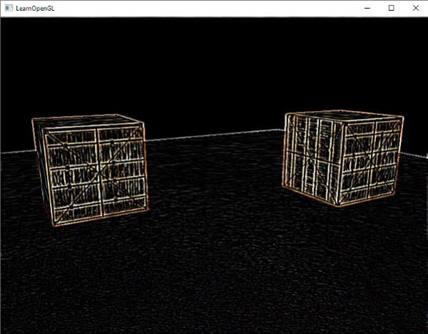

### Frame Buffers

---

目前，我们已经认识了几个OpenGL的屏幕缓冲区，包括color buffer、depth buffer、stencil buffer。这些缓冲区的组合存放在显存中被称作*framebuffer*的地方。OpenGL允许我们定义自己的framebuffer，也就是说，我们可以自行定义color、depth、stencil buffer

在OpenGL中，GLFW会在我们创建一个窗口时，自动为很么创建一个默认frame buffer。但是，除了默认的frame buffer以外，OpenGL也允许我们创建自己的framebuffer，这样我们就有了一个额外的渲染目标，它可以帮助我们实现一些高级的图形效果，比如后处理。

例如，我们可以先将场景绘制到我们自己的frame buffer中，然后使用framebuffer中的color buffer作为一个纹理，执行一些后处理操作，再将最终结果渲染到默认的framebuffer中。

---

与OpenGL中的其他object类似，我们使用`glGenFramebuffers`来创建一个framebuffer object

```c++
unsigned int fbo; // fbo as frame-buffer-object
glGenFramebuffers(1, &fbo);
```

接下来的操作我们应该很熟悉，将创建的framebuffer绑定给它所对应的object type，也就是`GL_FRAMEBUFFER`，从而将创建的framebuffer作为当前激活的framebuffer

```c++
glBindFramebuffer(GL_FRAMEBUFFER, fbo);
```

通过`GL_FRAMEBUFFER`函数的调用，接下来所有的*read*和*write* framebuffer的操作都会针对当前绑定的framebuffer。当然，我们也可以特定地为了read或者write去绑定一个framebuffer，对应的函数分别是`GL_READ_FRAMEBUFFER`和`GL_DRAW_FRAMEBUFFER`。

被`GL_READ_FRAMEBUFFER`绑定的framebuffer会被用来执行所有与read相关的函数，例如`glReadPixels`。被`GL_DRAW_FRAMEBUFFER`绑定的framebuffer则会作为渲染、clear或者其他写入操作的对象。

只是，我们当前的framebuffer还不是完整的，我们需要进一步满足以下条件，才可以使用framebuffer

- 必须给framebuffer附加至少一个buffer（color、depth、stencil）。因为我们至少需要一个buffer来存储渲染操作的结果
- 至少需要一个color buffer。因为我们至少需要一个地方来存储渲染的颜色信息
- 所有的附件都应该是完整的（保留了内存）。这条要求的本质是，每一个附件（即颜色、深度、和模板缓冲）必须在内存中分配了足够的空间来存储其数据。如果一个附件还没有分配内存，或者分配的内存不足以存储其数据，那么这个附件就被认为是不完整的。
- 所有的缓冲都需要有同样的数量的样本。在多重采样的上下文中，所有的缓冲都需要有同样的采样率，来保证最后合成的图像的质量。

OpenGL提供了一个函数`glCheckFramebufferStatus`来帮助我们确定一个framebuffer是否是完整有效的。具体的使用方法如下：

```c++
if(glCheckFramebufferStatus(GL_FRAMEBUFFER) == GL_FRAMEBUFFER_COMPLETE)
{
	// execute victory dance
}
```

此后所有的渲染操作都会将结果渲染到当前绑定的framebuffer中。并且因为我们自己定义的framebuffer并非默认的framebuffer，渲染相关的操作并不会影响窗口的视觉输出结果。我们将渲染到其他framebuffer的这一概念称为**off-screen rendering**。如果我们希望渲染相关的操作能够显示到屏幕上，我们需要将默认的framebuffer绑定回来：

```c++
glBindFramebuffer(GL_FRAMEBUFFER, 0);
```

记得删除我们自己定义的framebuffer object

```
glDeleteFramebuffers(1, &fbo);
```

在执行完整性检查之前，我们需要将一个或多个附件绑定到帧缓冲上。附件就是一个可作为帧缓冲器缓冲的内存位置，可以将它想象成一张图像。在创建附件时，我们有两种选择：纹理(texture)或渲染缓冲对象(render buffer object)

---

当把一个纹理attach给framebuffer中时，所有的渲染指令都会被写入这个texture，只要它是一个正常的color/depth/stencil buffer。使用纹理作为framebuffer的attachment有一个优点，那就是渲染结果都会被存储进纹理中，我们可以在shader里轻松被使用

创建附加给framebuffer的纹理与创建普通的纹理的过程类似：

```c++
unsigned int texture;
glGenTextures(1, &texture);
glBindTexture(GL_TEXTURE_2D, texture);

glTexImage2D(GL_TEXTURE_2D, 0, GL_RGB, 800, 600, 0, GL_RGB, GL_UNSIGNED_BYTE, nullptr);

glTexParameteri(GL_TEXTURE_2D, GL_TEXTURE_MIN_FILTER, GL_LINEAR);
glTexParameteri(GL_TEXTURE_2D, GL_TEXTURE_MAG_FILTER, GL_LINEAR); 
```

我们可以注意到，与普通纹理的创建不同的是，我们将GL_TEXTURE_2D的宽高设置为与屏幕宽高相同(并不是必须的)，并且`glTexImage2D`的`data`参数设置为`nullptr`。对于这个纹理而言，我们只是分配了内存，并没有填充它，我们会在渲染进framebuffer时填充它。另外，我们也并不会在意mipmap或者wrapping，因为我们不会使用到这两个概念。

完成了纹理的创建，我们需要将它实际上绑定给framebuffer，使用以下代码：

```c++
glFramebufferTexture2D(GL_FRAMEBUFFER. GL_COLOR_ATTACHMENT0, GL_TEXTURE_2D, texture, 0);
```

glFramebufferTexture2D这个函数用于将纹理绑定到framebuffer对象，从而作为framebuffer的附件，原型如下，我们依次分析它的参数

```c++
void glFramebufferTexture2D(GLenum target, GLenum attachment, GLenum textarget, GLuint texture, GLint level);
```

- `target`：指定帧缓冲的目标（`GL_FRAMEBUFFER`, `GL_READ_FRAMEBUFFER`, `GL_DRAW_FRAMEBUFFER`）。一般情况下，我们使用`GL_FRAMEBUFFER`
- `attachment`: 指定我们要附加的纹理类型。可以是颜色附件(`GL_COLOR_ATTACHMENTi`), 深度附件(`GL_DEPTH_ATTACHMENT`), 或者模板附件(`GL_STENCIL_ATTACHMENT`)。
- `textarget`: 指定纹理目标。对于2D纹理，这里就填`GL_TEXTURE_2D`
- `texture`: 要附加的纹理对象的ID
- `level`: 如果使用多级渐远纹理，则需要指定纹理的级别。通常情况下，我们填0，也就是使用基础级别的纹理

当然，除了color以外，我们还可以将depth texture和stencil texture绑定给framebuffer object。

如果要绑定depth，`attachment`需要改成`GL_DEPTH_ATTACHMENT`，这时，`glTexImage2D`中纹理的`format`和`internalformat` 也需要修改为相对应的`GL_DEPTH_COMPONENT`。

如果要绑定stencil，`attachment`需要改成`GL_STENCIL_ATTACHMENT `，这时，`glTexImage2D`中纹理的`format`和`internalformat` 也需要修改为相对应的`GL_STENCIL_INDEX`。

我们是否可以将depth和stencil作为一个texture绑定给framebuffer呢？当然可以！纹理中32位的值可以包含24位的深度值以及8位的模板值。我们可以将`glFramebufferTexture2D`的`attachment`写为`GL_DEPTH_STENCIL_ATTACHMENT` ，并修改对应的texture的格式。示例代码如下：

```c++
glTexture2D(GL_TEXTURE_2D, 0, GL_DEPTH24_STENCIL8, 800, 600, 0, GL_DEPTH_STENCIL, GL_UNSIGNED_INT_24_8, nullptr);

glFramebufferTexture2D(GL_FRAMEBUFFER, GL_DEPTH_STENCIL_ATTACHMENT, GL_TEXTURE_2D, texture, 0);
```

---

除了纹理，renderbuffer object也是OpenGL中可以用作frame buffer object的一种类型。与纹理不同的是，renderbuffer不能被直接读取，它将所有渲染信息存储在buffer中，能够以更快的速度写入。如果想要读取renderbuffer object，需要借助`glReadPixels`，这个函数会从当前绑定的framebuffer中返回一个特定区域的像素集合，并非从attachment本身返回结果。

renderbuffer的存储形式意味着它可以通过调用`glfwSwapBuffers()`被快速地写入数据、将数据写入其他buffer。

创建render buffer object的方法我们应该比较熟悉了：

```c++
Unsigned int rbo;
glGenRenderBuffers(1, &rbo);
```

同样需要绑定给render buffer object对应的OpenGL类型`GL_RENDERBUFFER`

```c++
glBindRenderbuffer(GL_RENDERBUFFER, rbo);
```

因为renderbuffer是write-only的，我们通常将它作为depth和stencil attachment，因为大多情况下，我们并不需要读取depth和stencil，但是我们需要depth value和stencil value来实现深度测试和模板测试。

我们可以使用glRenderbufferStorage函数来创建一个深度与模板renderbuffer object：

```c++
glRenderbufferStorage(GL_RENDERBUFFER, GL_DEPTH24_STENCIL8, 800, 600);
```

最后，我们还需要将renderbuffer真正地绑定给framebuffer：

```c++
glFramebufferRenderbuffer(GL_FRAMEBUFFER, GL_DEPTH_STENCIL_ATTACHMENT, GL_RENDERBUFFER, rbo);
```

---

现在我们应该对framebuffer有了一定的了解了，让我们来上手实操一下。我们将要把场景绘制到一个绑定在framebuffer的color texture中，然后再将color texture绘制到一个与屏幕相同宽高的四边形中。也就说，虽然我们使用了framebuffer，但是最后的视觉输出是没有任何变化的，我们将在后面的博客中解释这种做法的用途。

首先，让我们将framebuffer创建出来：

```c++
unsigned int framebuffer;
glGenFramebuffers(1, &framebuffer);
glBindFramebuffer(GL_FRAMEBUFFER, framebuffer);
```

然后我们要创建一个texture，并将它作为color attachment绑定给framebuffer。纹理的分辨率设置为屏幕一样，并且我们暂时不对它进行初始化：

```c++
// generate texture
unsigned int textureColorbuffer;
glGenTextures(1, &textureColorBuffer);
glBindTexture(GL_TEXTURE_2D, textureColorBuffer);
glTexImage2D(GL_TEXTURE_2D, 0, GL_RGB, 800, 600, 0, GL_RGB, GL_UNSIGNED_BYTE, nullptr);
glTexParameteri(GL_TEXTURE_2D, GL_TEXTURE_MIN_FILTER, GL_LINEAR );
glTexParameteri(GL_TEXTURE_2D, GL_TEXTURE_MAG_FILTER, GL_LINEAR);
glBindTexture(GL_TEXTURE_2D, 0);

// attach it to currently bound framebuffer object
glFramebufferTexture2D(GL_FRAMEBUFFER, GL_COLOR_ATTACHMENT0, GL_TEXTURE_2D, textureColorbuffer, 0);
```

我们还需要让OpenGL支持深度测试与模板测试，也就是说，我们需要将一个renderbuffer绑定给framebuffer：

```c++
unsigned int rbo;
glGenRenderbuffers(1, &rbo);
glBindRenderbuffer(GL_RENDERBUFFER, rbo);
glRenderbuffersStorage(GL_RENDERBUFFER, GL_DEPTH24_STENCIL8, 800, 600);
glBindRenderbuffer(GL_RENDERBUFFER, 0);
```

我们还需要将创建好的renderbuffer绑定为framebuffer的depth/stencil attachment：

```c++
glFramebufferRenderbuffer(GL_FRAMEBUFFER, GL_DEPTH_STENCIL_ATTACHMENT, GL_RENDERBUFFER, rbo);
```

最后，我们检查framebuffer是否complete，如果没有，我们最好输出报错信息：

```c++
if(glCheckFramebufferStatus(GL_FRAMEBUFFER) != GL_FRAMEBUFFER_COMPLETE)
{
	cout << "ERROR::FRAMEBUFFER::Framebuffer is not complete!\n";
}
glBindFramebuffer(GL_FRAMEBUFFER, 0);
```

现在，我们需要确认一下将场景绘制到一个texture中所需要的步骤：

- 绑定framebuffer，从而将其激活为当前的framebuffer
- 绘制场景
- 绑定回默认framebuffer
- 绘制一个全屏幕的quad，用自定义的framebbuffer的color buffer作为quad的纹理

绘制一个全屏幕的quad，我们需要实现一套新的shader，我们不再需要使用复杂的矩阵变化吗，因为我们可以直接使用NDC作为顶点着色器的输出，而不做任何变换：

```glsl
#version 330 core
layout (location = 0) in vec2 aPos;
layout (location = 1) in vec2 aTexCoord;

out vec2 TexCoords;

void main()
{
    gl_Position = vec4(aPos.x, aPos.y, 0.0, 1.0);
    TexCoords = aTexCoords;
}
```

片段着色器也相对比较简单，只需要采样纹理并输出即可：

```glsl
#version 330 core
out vec4 FragColor;

in vec2 TexCoords;

uniform sampler2D screenTexture;

void main()
{
    FragColor = texture(sreenTexture, TexCoords);
}
```

我们的博客就暂时忽略screen quad VAO的创建，直接看看大致的后续代码：

```c++
// first pass
glBindFramebuffer(GL_FRAMEBUFFER,framebuffer);
glClearColor(0.1f, 0.1f, 0.1f, 1.0f);
glClear(GL_COLOR_BUFFER_BIT | GL_DEPTH_BUFFER_BIT); // we are not using stencil buffer now
glEnable(GL_DEPTH_TEST);
DrawScene();

// second pass
glBindFramebuffer(GL_FRAMEBUFFER, 0); // back to default frame buffer
glClearColor(0.1f, 0.1f, 0.1f, 1.0f);
glClear(GL_COLOR_BUFFER_BIT);

screenShader.use();
glBindVertexArray(quadVAO);
glDisable(GL_DEPTH_TEST);
glBindTexture(GL_TEXTURE_2D, textureColorBuffer);
glDrawArrays(GL_TRIANGLES, 0, 6);
```

我们来简单地回顾一下上面的代码。当我们绘制screen quad时，需要关闭深度测试，因为我们需要这个quad绘制在所有东西的最上面，当正常绘制时，我们需要再次开启深度测试。

得到的结果是这样的

源码可以在[这里](https://learnopengl.com/code_viewer_gh.php?code=src/4.advanced_opengl/5.1.framebuffers/framebuffers.cpp)查阅

---

现在，我们就可以动手实现各种后处理效果了。

**反相**

```glsl
void main()
{
    vec4 color = texture(screenTexture, TexCoords);

    // inversion
    FragColor = vec4(vec3(1 - color.rgb), 1.0);
}
```



**GrayScale**

```glsl
void main()
{
    FragColor = texture(screenTexture, TexCoords);
    float average = 0.2126 * FragColor.r + 0.7152 * FragColor.g + 0.0722 * FragColor.b;
    FragColor = vec4(average, average, average, 1.0);
}   
```



**Kernel Effects**

对单个纹理图像进行后处理的另一优点是，我们可以从纹理的其他部分采样颜色值，而不仅仅是该片段特定的颜色。例如，我们可以选择当前纹理坐标周围的一小块区域，并在当前纹理值周围采样多个纹理值。然后，我们可以以创造性的方式组合它们，从而创建出有趣的效果

kernel（或卷积矩阵）是一个以当前像素为中心的小矩阵形式的值数组，它将周围像素值乘以其kernel值，然后将它们全部加在一起形成单一的值。我们在当前像素周围的方向上给纹理坐标添加了一个小的偏移，并根据kernel组合结果。下面给出了一个kernel的例子：
$$
\left\{
\begin{matrix}
    2 & 2 & 2 \\
    2 & -15 & 2 \\
    2 & 2 & 2
\end{matrix}
\right\}
$$
这个kernel取8个周围的像素值，将它们乘以2，然后将当前像素乘以-15。这个示例中，kernel通过在内核中确定的几个权重将周围的像素乘以这些权重，然后通过将当前像素乘以一个大的负权重来平衡结果

我们看看在shader中怎样实现kernel：

```glsl
const float offset = 1.0 / 300.0;

void main()
{
    vec2 offsets[9] = vec2[](
        vec2(-offset,  offset), // top-left
        vec2( 0.0f,    offset), // top-center
        vec2( offset,  offset), // top-right
        vec2(-offset,  0.0f),   // center-left
        vec2( 0.0f,    0.0f),   // center-center
        vec2( offset,  0.0f),   // center-right
        vec2(-offset, -offset), // bottom-left
        vec2( 0.0f,   -offset), // bottom-center
        vec2( offset, -offset)  // bottom-right    
    );

    float kernel[9] = float[](
        -1, -1, -1,
        -1,  9, -1,
        -1, -1, -1
    );
    
    vec3 sampleTex[9];
    for(int i = 0; i < 9; i++)
    {
        sampleTex[i] = vec3(texture(screenTexture, TexCoords.st + offsets[i]));
    }
    vec3 col = vec3(0.0);
    for(int i = 0; i < 9; i++)
        col += sampleTex[i] * kernel[i];
    
    FragColor = vec4(col, 1.0);
}  
```

这个kernel的效果是这样的：



**Blur**

模糊使用了一个不同的kernel

```glsl
float blurKernel[9] = float[]
(
    1.0 / 16, 2.0 / 16, 1.0 / 16,
    2.0 / 16, 4.0 / 16, 2.0 / 16,
    1.0 / 16, 2.0 / 16, 1.0 / 16
);
col = vec3(0.0);
for(int i = 0; i < 9; i++)
    col += sampleTex[i] * blurKernel[i];

FragColor = vec4(col, 1.0);
```



**边缘检测**

```glsl
float edgeDetactionKernel[9] = float[]
(
    1.0, 1.0, 1.0,
    1.0, -8.0, 1.0,
    1.0, 1.0, 1.0
);
col = vec3(0.0);
for(int i = 0; i < 9; i++)
col += sampleTex[i] * edgeDetactionKernel[i];

FragColor = vec4(col, 1.0);
```


