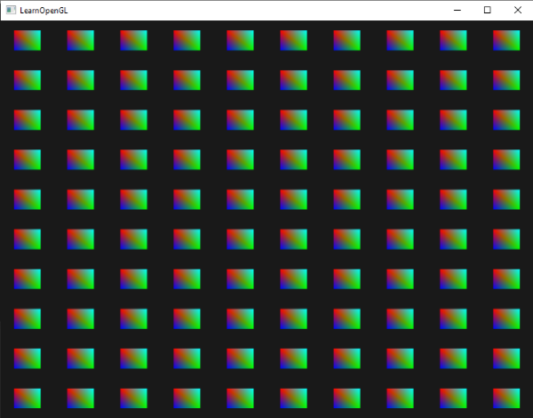

### Instancing

---

概括而言，instancing是一种通过一次draw call一次性绘制大量物体(相同的网格数据)、降低CPU -> GPU的通信的技术。想要使用实例化，我们就不能再使用`glDrawArrays`或者`glDrawElements`作为绘制指令，而是应该使用`glDrawArraysInstanced`和`glDrawElementsInstanced`。这两个函数需要一个额外的参数**instance count**，它指定了我们想要通过实例化绘制的物体的数量。 

但是仅仅通过`glDrawArraysInstanced`和`glDrawElementsInstanced`还不能完成实例化绘制，我们还需要借助GLSL提供的顶点着色器中的内置变量`gl_InstanceID`。这个变量起始值为0，每通过instanced rendering call完成一次绘制，`gl_IntanceID`就会自增1。比方说，我们将要绘制第34个实例物体，那么顶点着色器中，`gl_InstanceID`当前的值为33。

为了能有一个更好的理解，我们将使用实例化通过一次render call绘制一百个2Dquad。我们将创建一个uniform的数组，它包含了一百个代表位置偏移值的向量，最终得到的效果是这样的：



每个quad包含两个三角形，共6个顶点。每个顶点包含一个2D的NDC位置向量和一个颜色向量。下面将会是我们所用到的vertex data。我们的三角形足够小，所以屏幕中可以容纳下100个实例化的三角形。

```c++
float quadVertices[] = {
    // positions     // colors
    -0.05f,  0.05f,  1.0f, 0.0f, 0.0f,
     0.05f, -0.05f,  0.0f, 1.0f, 0.0f,
    -0.05f, -0.05f,  0.0f, 0.0f, 1.0f,

    -0.05f,  0.05f,  1.0f, 0.0f, 0.0f,
     0.05f, -0.05f,  0.0f, 1.0f, 0.0f,   
     0.05f,  0.05f,  0.0f, 1.0f, 1.0f		    		
};  
```

在三角形的片段着色器中，我们将输出经过插值的顶点颜色

```glsl
#version 330 core
out vec4 FragColor;
  
in vec3 fColor;

void main()
{
    FragColor = vec4(fColor, 1.0);
}
```

在我们的例子中，实例化的重点在顶点着色器中

```glsl
#version 330 core
layout (location = 0) in vec2 aPos;
layout (location = 1) in vec3 aColor;

out vec3 fColor;

uniform vec2 offsets[100];

void main()
{
	vec2 offset = offsets[gl_InstaneID];
	gl_Position = vec4(aPos + offset, 0.0, 1.0);
	fColor = aColor;
}
```

我们定义了一个uniform的vec2数组，它定义了所有quad的偏移量，我们使用自增的`gl_InstancedID`作为数组的索引，从而确定quad的`gl_Position`

我们需要在render loop前就定义好这个位置偏移量的数组

```c++
glm::vec2 translations[100];
int index = 0;
float offset = 0.1f;
for (int y = -10; y < 10; y += 2)
{
	for (int x = -10; x < 10; x += 2)
	{
		glm::vec2 translation;
        translation.x = (float)x / 10.0f + offset;
        translation.y = (float)y / 10.0f + offset;
        translations[index++] = translation;
	}
}
```

我们还需要传递给vertex shader

```glsl
shader.use();
for(unsigned int i = 0; i < 100; i++)
{
    shader.setVec2(("offsets[" + std::to_string(i) + "]")), translations[i]);
}  
```

现在，准备工作已就绪，我们可以通过`glDrawArraysInstanced`来实现实例化绘制了

```c++
glBindVertexArray(quadVAO);
glDrawArraysInstanced(GL_TRIANGLES, 0, 6, 100);
```

---

当前我们已经可以绘制大量的实例化物体了，但是使用这种方法依然会收到我们向shader中传递uniform data的限制。我们还有另一种方法：**instanced arrays**。Instanced array被定义为一个顶点属性（允许我们存储更多数据），且这个顶点数据是根据每个实例更新而非每个顶点。

让我们看一下例子吧。我们将上一个例子中的offset uniform array改成instanced array，调整后的顶点着色器如下所示：

```glsl
#version 330 core
layout (location = 0) in vec2 aPos;
layout (location = 1) in vec3 aColor;
layout (loaction = 2) in vec2 aOffset;

out vec3 fColor;

void main()
{
	gl_Position = vec4(aPos + aOffset, 0,0, 1.0);
	fColor = aColor;
}
```

在修改后的顶点着色器中，我们不再需要使用`gl_InstancID`了，而是直接使用offset这一属性。

因为instanced array是一个顶点属性，就像position和color变量一样，我们需要将它的数据存放在vertex buffer object中，然后配置它的顶点属性。我们将前文所生成的`translations`放进一个新的buffer object中：

```c++
unsigned int intanceVBO;
glGenBuffers(1, &instanceVBO);
glBindBuffer(GL_ARRAY_BUFFER, instanceVBO);
glBufferData(GL_ARRAY_BUFFER, sizeof(glm::vec2) * 100, &translations[0], GL_STATIC_DRAW);
glBindBuffer(GL_ARRAY_BUFFER, 0);
```

我们还需要设置它的vertex attribute pointer，并告诉OpenGL激活顶点属性：

```c++
glEnabelVerterAttribArray(2);
glBindBuffer(GL_ARRAY_BUFFER, instanceVBO);
glVertexAtttribPointer(2, 2, GL_FLOAT, GL_FALSE, 2 * sizeof(float), (void*)nullptr);
glBindBuffer(GL_ARRAY_BUFFER, 0);
glVertexAttribDivisor(2, 1);
```

这段代码中，出现了一个我们不熟悉的函数`glVertexAttribDivisor`。它用于改变顶点属性数组在实例化绘制中的步进频率，这对于控制OpenGL如何从instanced array（也就是实例化数组）中提取数据特别重要。函数原型如下

```c++
void glVertexAttribDivisor(GLuint index, GLuint divisor);
```

- `index`：指定要修改的顶点属性的索引，这个索引值需要和我们先前通过`glVertexAttribPointer`函数定义的顶点属性匹配
- `divisor`：步进的频率

这个函数会改变instancing渲染中属性更新的频率，具体的解释需要根据`divisor`展开

- 如果divisor为0，那么每个实例都会读取所有的顶点数据。这是默认的行为，也就是说，在每次实例化渲染中，所有顶点属性都会被读取一遍
- 如果divisor为1，表示顶点属性会在每次实例化绘制时更新一次。也就是说，如果我们要通过实例化渲染100个实例，在这一百个实例中，第i个实例（从0开始）将会使用属性数组中的第i个元素作为其值

---

当然这只是一个很简单的例子，但是已经足够阐明instancing的概念和用法了。
