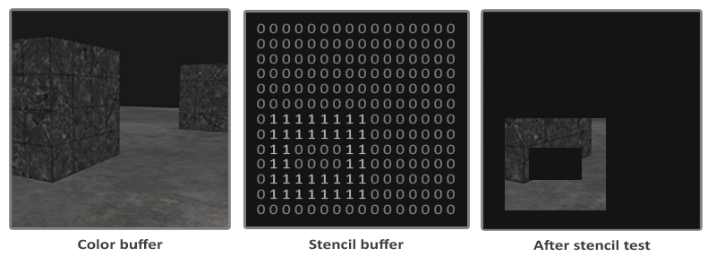

### Stencil Testing

---

当片段着色器处理完一个片段后，下一步就是stencil test。经过模板测试的片段再进行深度测试。

就像深度测试基于深度缓冲区一样，模板测试基于模板缓冲区。模板缓冲区的每个模板值包含8位，也就是说，每个像素有256个不同的模板值，我们可以自行定义这些值，并且当某个片段具备特定的模板值时，我们可以保留或丢弃片段。一个简单的例子如下：



使用模板缓冲区的一般步骤如下：

- 允许写入模板缓冲
- 渲染物体，更新模板缓冲区中的值
- 关闭写入模板缓冲
- 渲染其他物体，这次就可以根据模板值来判断是否要丢弃片段了

你可以通过启用`GL_STENCIL_TEST`来开启模板测试。模板测试一旦开启，所有的渲染调用都会以某种方式影响stencil buffer

```c++
glEnable(GL_STENCIL_TEST);
```

和颜色缓冲与深度缓冲一样，我们也需要在帧与帧之间清楚模板缓冲

```c++
glClear(GL_COLOR_BUFFER_BIT | GL_DEPTH_BUFFER_BIT | GL_STENCIL_BUFFER_BIT);
```

与深度测试的`glDepthMask`类似，模板测试也有一个等效的函数，`glStencilMask`允许我们设置一个位掩码，该位掩码与即将写入缓冲区的模板值进行 `AND` 运算。默认情况下，这被设置为所有 1 的位掩码，不影响输出，但如果我们将其设置为 `0x00`，那么所有写入缓冲区的模板值最终会变为 0。这等于深度测试的 `glDepthMask(GL_FALSE)`

```c++
glStencilMask(0xFF); // each bit is written to the stencil buffer as it is
glStencilMask(0x00); // each bit ends up as 0 in the stencil buffer (disable writes)
```

绝大多数情况下，你只会用到0xFF和0x00作为stencil mask，但是OpenGL还为我们提供了别的方法来自定义蒙版

---

对于模板测试，我们有两个方法来配置：`glStencilFunc`和`glStencilOp`

首先我们来看一下`glStencilFunc`的参数分别代表什么

- `func`：设置模板测试函数，用于确定片段是否通过或被丢弃。这个函数将应用在存储的模板值以及`ref`参数上。可选的`func`包括 `GL_NEVER`, `GL_LESS`, `GL_LEQUAL`, `GL_GREATER`, `GL_GEQUAL`, `GL_EQUAL`, `GL_NOTEQUAL` and `GL_ALWAYS`.
- ref：在模板测试中，stencil buffer中所存储的值将和`ref`比较
- `mask`：指定一个掩码，在测试比较他们前，该掩码会与参考值和存储的模板值进行 AND 运算。初始设定为1

但是`glStencilFunc`只能描述OpenGL是否通过或者丢弃片段，并不能更新我们的缓存，这需要`glStencilOp`函数，我们来以下`glStencilOp`的参数

- sfail：当模板测试失败时执行的操作。
- dpfail：当模板测试通过，但深度测试失败时执行的操作。
- dppass：当模板测试和深度测试都通过时执行的操作。

每个操作都可以使用以下选项

- GL_KEEP：保留当前的模板值。
- GL_ZERO：设置模板值为0。
- GL_REPLACE：设置模板值为glStencilFunc函数设置的参考值。
- GL_INCR：增加当前的模板值，但最高不能超过最大值。
- GL_DECR：减小当前的模板值，但最低不能低于0。
- GL_INVERT：按位取反当前的模板值
- GL_INCR_WRAP: 增加当前的模板值，如果超过最大值则环绕至最小值
- GL_DECR_WRAP: 减小当前的模板值，如果低于最小值则环绕至最大值。

默认情况下，`glStencilOp`会被设置为 `(GL_KEEP, GL_KEEP, GL_KEEP)`

---

下面，我们就可以试着用OpenGL实现一个描边效果了，步骤大致如下

- 启用模板写入
- 在绘制需要描边的物体之前，将`stencil op`设置为`GL_ALWAYS`，把需要描边的物体所在的地方的stencil buffer设置为1
- 绘制物体
- 关闭深度测试和模板写入
- 将物体放大一点
- 用另一个fragment shader，这个shader只输出一个单色，作为边缘颜色
- 再次绘制这个物体，但是只绘制片段模板值不为1的片段
- 开启深度测试，并将stencil op重新设置为默认值`GL_KEEP`
