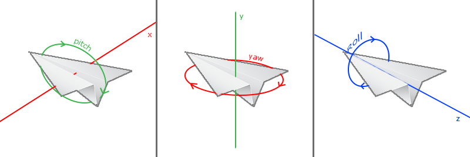

### Camera

---

这篇博客会讨论如何在OpenGL中创建一个相机。

当我们谈论相机/视图空间时，我们是在谈论从相机的视角（作为场景的原点）看到的所有顶点坐标：**视图矩阵将所有世界坐标转换为相对于相机位置和方向的视图坐标**。**定义一个相机，我们需要它在世界空间中的位置，它看向哪个方向，一个指向右边的向量和一个从相机向上的向量。**细心的读者可能会注意到，**我们实际上将会创建一个带有3个垂直单位轴的坐标系统，相机的位置作为原点。**

定义相机的位置很简单，它是在world space中的一个三维向量，注意，相机看向的是-z轴

```c++
glm::vec3 cameraPos = glm::vec3(0.0f, 0.0f, 3.0f);
```

然后定义相机的朝向（实际上指向与target相反的方向）

```c++
glm::vec3 cameraTarget = glm::vec3(0.0f, 0.0f, 0.0f);
glm::vec3 cameraDirection = glm::normalized(cameraPos - cameraTarget);
```

我们需要的下一个向量是代表相机空间正x轴的右向量。为了得到右向量，我们使用了一个小技巧，首先指定一个指向上方（在世界空间中）的向量。然后我们对up向量和方向向量进行叉积运算。由于叉积的结果是一个与两个向量都垂直的向量，我们将得到一个指向正x轴方向的向量（如果我们换一下叉积的顺序，就会得到一个指向负x轴的向量）

```c++
glm::vec3 up = glm::vec3(0.0f, 1.0f, 0.0f);
glm::vec3 cameraRight = glm::normalize(glm::cross(up, cameraDirection));
```

同理，我们计算得到相机的up向量

```c++
glm::vec3 cameraUp = glm::cross(cameraDirection, cameraRight);
```

通过叉乘和一些技巧，我们能够创建出所有构成视图/相机空间的向量。对于偏爱数学的读者来说，这个过程在线性代数中被称为Gram-Schmidt过程。使用这些相机向量，我们现在可以创建一个`LookAt`矩阵，这对于创建相机非常有用。

---

矩阵的一个巨大优点是，如果你使用3个垂直（或非线性）轴定义一个坐标空间，那么你可以用这3个轴加上一个平移向量来创建一个矩阵，然后通过将任何向量与这个矩阵相乘，你可以将该向量转换到该坐标空间。这正是LookAt矩阵所做的，现在我们有了3个垂直轴和一个位置向量来定义相机空间，我们可以创建我们自己的LookAt矩阵.

不过GLM已经为我们实现了一些工作，我们现在只需要指定一个相机位置、一个目标位置，一个world space中的向上的向量，GLM会为我们计算出LookAt矩阵

```c++
glm::mat4 view;
view = glm::lookAt(glm::vec3(0.0f, 0.0f, 3.0f), 
  		   glm::vec3(0.0f, 0.0f, 0.0f), 
  		   glm::vec3(0.0f, 1.0f, 0.0f));
```

在深入用户输入之前，让我们通过旋转相机来环绕场景，从而探索场景的不同视角。具体来说，保持场景的焦点在坐标(0,0,0)，然后使用一些三角函数(如正弦和余弦)在每一帧中计算一个代表圆上点的x和z坐标，这个点就是相机的位置。

通过随时间变化重新计算x和y坐标，相机在一个圆形路径上移动，从而产生了围绕场景旋转的效果。这个圆的大小可以通过一个预定义的半径来控制，从而调整相机离场景的距离。

然后在每一帧中，使用GLFW库的 `glfwGetTime` 函数，基于这个时间变量和刚才计算出的x,y坐标，生成一个新的视图矩阵。视图矩阵是一个4x4的矩阵，它的作用是变换场景中的所有顶点坐标，使得从相机的视角看，场景中的物体位置、形状和方向都得到正确的表示。

```c++
const float radius = 10.0f;
float camX = sin(glfwGetTime() * radius);
float camZ = cos(glfwGetTime() * radius);
glm::mat4 view;
view = glm::lookAt(glm::vec3(camx, 0.0, camZ), glm::vec3(0.0f, 0.0f, 0.0f), glm::vec3(0.0f, 1.0f, 0.0f));
```

得到的效果[是这样的](https://learnopengl.com/video/getting-started/camera_circle.mp4)

---

将摄像机绕场景旋转很有趣，但自己完成所有运动更有趣！首先我们需要设置一个相机系统，所以在程序顶部定义一些相机变量是很有用的：

```c++
glm::vec3 cameraPos   = glm::vec3(0.0f, 0.0f,  3.0f);
glm::vec3 cameraFront = glm::vec3(0.0f, 0.0f, -1.0f);
glm::vec3 cameraUp    = glm::vec3(0.0f, 1.0f,  0.0f);
```

然后修改`glm::lookAt`，其中`cameraFront`代表相机的朝向

```c++
view = glm::lookAt(cameraPos, cameraPos + cameraFront, cameraUp);
```

我们已经定义了`prcessInput`函数，现在我们可以添加更多的输入检测了：

```c++
void processInput(GLFWwindow *window)
{
    ...
    const float cameraSpeed = 0.05f; // adjust accordingly
    if (glfwGetKey(window, GLFW_KEY_W) == GLFW_PRESS)
        cameraPos += cameraSpeed * cameraFront;
    if (glfwGetKey(window, GLFW_KEY_S) == GLFW_PRESS)
        cameraPos -= cameraSpeed * cameraFront;
    if (glfwGetKey(window, GLFW_KEY_A) == GLFW_PRESS)
        cameraPos -= glm::normalize(glm::cross(cameraFront, cameraUp)) * cameraSpeed;
    if (glfwGetKey(window, GLFW_KEY_D) == GLFW_PRESS)
        cameraPos += glm::normalize(glm::cross(cameraFront, cameraUp)) * cameraSpeed;
}
```

---

目前我们使用恒定值来表示行走时的移动速度。从理论上讲，这似乎没有问题，但在实践中，不同的设备具有不同的处理能力，其结果是有些人每秒渲染的帧数比其他人多得多。每当一个用户渲染的帧数多于另一个用户时，他也会更频繁地调用`processInput`函数。结果就是根据用户的设置不同，有些人的动作会很快，而有些则很慢。 当你运送你的应用程序时，你要确保它在各种硬件上都能运行。

图形应用程序和游戏通常会跟踪一个**deltatime**变量，该变量存储了渲染上一帧所花费的时间。然后，我们将所有的速度与这个deltatime值相乘。结果是，当我们在一帧中有一个很大的deltatime，意味着上一帧的渲染时间比平均时间长，那么这一帧的速度也会相应的增加一点以便平衡出来。当使用这种方法时，无论你的电脑是非常快还是非常慢，相机的速度都会相应地平衡出来，这样每个用户都会有相同的体验。

为了计算delta time，我们需要追踪两个全局变量

```c++
float deltaTime = 0.0f;	// Time between current frame and last frame
float lastFrame = 0.0f; // Time of last frame
```

在每一帧中，我们然后计算新的deltatime值以供后续使用

```c++
float currentFrame = glfwGetTime();
deltaTime = currentFrame - lastFrame;
lastFrame = currentFrame;  
```

修改`processInput`

```c++
void processInput(GLFWwindow *window)
{
    float cameraSpeed = 2.5f * deltaTime;
    [...]
}
```

---

我们实现了通过WASD控制相机的基本移动，但是相机还不能转向，我们将结合鼠标的输入来实现这一点。

为了实现转向，我们需要根据鼠标的输入俩修改`cameraFront`这个值，在此之前，我们最好复习一下欧拉角的相关知识。欧拉角是一组在齐次旋转序列中定义的旋转角。它们使用三个角度来描述物体在三维空间中的定向。一般来说，欧拉角被定义为三次旋转的组合，每次旋转都围绕一个单独的坐标轴：

- 俯仰角(Pitch)：是围绕X轴的旋转，对应于把头向上或向下倾斜的动作。
- 偏航角(Yaw)：是围绕Y轴的旋转，对应于把头向左或向右转的动作。
- 翻滚角(Roll)：是围绕Z轴的旋转，对应于使头部做顺时针或逆时针旋转的动作。



对于我们的相机而言，暂时只考虑pitch和yaw。给定pitch和yaw，我们可以将它们变换为一个代表一个方向的3维向量，变换的过程需要一点三角学的知识。

```c++
direction.x = cos(glm::radians(yaw)) * cos(glm::radians(pitch));
direction.y = sin(glm::radians(pitch));
direction.z = sin(glm::radians(yaw)) * cos(glm::radians(pitch));
```

通常而言，偏航角是关于Y轴的旋转，它决定了物体的左右转向。如果我们画出与X轴和Z轴相关的偏航角三角形，会发现当偏航角θ为0时，相机的方向向量实际上在指向X轴的正方向。为了让相机默认指向负Z轴，我们需要把默认的偏航角设置为一个顺时针旋转90度的值，因为在这个坐标系统中，正角度值代表逆时针旋转，所以这个偏航角的值需要设定为逆时针方向的90度。这就是为什么需要设置一个默认的偏航角值来确保相机正确指向世界中的物体。

```c++
yaw = -90.0f;
```

那么现在的疑问就是：如何设置和修改pitch和yaw呢

---

偏航角和俯仰角的值是从鼠标（或控制器/操纵杆）的移动中获取的，其中鼠标的水平移动影响偏航角，而鼠标的垂直移动影响俯仰角。想法是存储上一帧的鼠标位置，并在当前帧中计算鼠标值改变了多少。水平或垂直差异越大，我们更新偏航角或俯仰角的值就越多，因此相机应该移动得更多。
首先，我们将告诉GLFW它应该隐藏并捕获鼠标光标。捕获光标意味着，一旦应用程序获得焦点，鼠标光标会停留在窗口的中心（除非应用程序失去焦点或退出）。我们可以通过一个简单的配置调用来实现这个功能：

```c++
glfwSetInputMode(window, GLFW_CURSOR, GLFW_CURSOR_DISABLED);  
```

有了这行代码以后，鼠标便不会被显示出来，也不会离开窗口。

我们需要告诉GLFW，让它鉴定鼠标移动的事件，也是利用一个回调函数来完成这个功能。

```c++
void mouse_callback(GLFWWindow* window, double xpos, double ypos);
```

在这个函数中，`xpos`和`ypos`代表当前鼠标的位置，当我们注册了这个回调函数之后，每次鼠标移动GLFW都会被`glfwSetCursorPosCallback(window, mouse_ballback)`调用。

---

根据鼠标的输入计算pitch和yaw遵循以下的步骤

1. 计算自上一帧以来鼠标的偏移量
2. 将偏移量添加到相机的pitch和yaw的值中
3. 添加一些对最小/最大pitch的约束
4. 计算方向向量

实现步骤一，我们首先要记录在程序中上一次鼠标的位置，我们将位置初始化在屏幕的中间

```c++
float lastX = SCREEN_WIDTH / 2;
float lastY = SCREEN_HEIGHT / 2;
```

然后我们在回调函数中，计算上一帧与当前帧之间的偏移量。

```c++
float xoffset = xpos - lastX;
float yoffset = lastY - ypos; // revsersed since y-coordinates range from bottom to top
lastX = xpos;
lastY = ypos;

const float sensitivity = 0.1f;
xoffset *= sensitivity;
yoffset *= sensitivity;
```

偏移值加给pitch和yaw

```c++
yaw   += xoffset;
pitch += yoffset;  
```

给pitch限定在一个既定范围内

```c++
if(pitch > 89.0f)
  pitch =  89.0f;
if(pitch < -89.0f)
  pitch = -89.0f;
```

最后一步是计算方向

```c++
glm::vec3 direction;
direction.x = cos(glm::radians(yaw)) * cos(glm::radians(pitch));
direction.y = sin(glm::radians(pitch));
direction.z = sin(glm::radians(yaw)) * cos(glm::radians(pitch));
cameraFront = glm::normalize(direction);
```

然后，计算出的这个方向向量包含了从鼠标移动计算得出的所有旋转。由于cameraFront向量已经包含在glm的lookAt函数中，我们就可以开始了。
如果你现在运行代码，你会注意到，当窗口首次接收到你的鼠标光标的焦点时，相机会突然跳动一大段距离。这个突然跳动的原因是，一旦你的光标进入窗口，鼠标回调函数会被调用，并且xpos和ypos位置等于你的鼠标从哪个位置进入屏幕。这通常是一个离屏幕中心相当远的位置，导致了大的偏移量，因此造成了大的移动跳跃。我们可以通过定义一个全局的布尔变量来检查这是否是我们首次接收鼠标输入。如果是第一次，我们就更新初始鼠标位置为新的xpos和ypos值。然后，结果的鼠标移动会使用新输入的鼠标位置坐标来计算偏移量：

```c++
if (firstMouse) // initially set to true
{
    lastX = xpos;
    lastY = ypos;
    firstMouse = false;
}
```

---

作为相机系统的一个小额外功能，我们还将实现一个缩放接口。在上一章中，我们说过视场或fov主要定义了我们能看到场景的多少。当视场变小时，场景的投影空间也变小。这个较小的空间在同样的NDC上进行投影，产生了缩放的错觉。为了放大，我们将使用鼠标的滚轮。和鼠标移动和键盘输入类似，我们有一个鼠标滚动的回调函数：

```c++
void scroll_callback(GLFWwindow* window, double xoffset, double yoffset)
{
    fov -= (float)yoffset;
    if (fov < 1.0f)
        fov = 1.0f;
    if (fov > 45.0f)
        fov = 45.0f; 
}
```

当滚动时，yoffset值告诉我们我们垂直滚动的量。当调用scroll_callback函数时，我们改变全局声明的fov变量的内容。由于45.0是默认的fov值，我们希望将缩放级别限制在1.0和45.0之间。
现在，我们每帧都需要将透视投影矩阵上传到GPU

```c++
projection = glm::perspective(glm::radians(fov), 800.0f / 600.0f, 0.1f, 100.0f);  
```

我们还需要将回调函数注册上

```c++
glfwSetScrollCallback(window, scroll_callback); 
```

