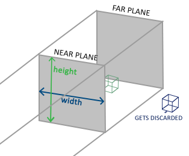
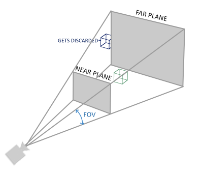

### Coordinate Systems

---

之前在图形管线那里提到过，在vertex shader结束后，OpenGL期望所有可见的顶点都应该在NDC中，超出NDC范围的顶点都是不可见的。将坐标转换到NDC中是一个逐步的过程，物体的顶点经过多次转换为多个坐标系，最终转换为NDC，为什么不一次性转换完成呢？因为在某些坐标系下，运算会更简单。总的来说，有五个相对重要的坐标系：

- Object Space
- World Space
- View Space (Camera Space)
- Clip Space
- Screen Space

将坐标从一个空间转换到另一个空间，我们会使用数个矩阵变换，其中最重要的矩阵是model、view、projection。下图展示了顶点坐标从object space变换到screen space的过程。


---

首先我们来讨论一下前三个较为简单的坐标系

**Local Space**是指物体所在的坐标空间，模型的所有顶点都是在local space中的

**World Space**中的坐标正如其名，是顶点相对于游戏世界原点的坐标。从local space转换到world space是由**model matrix**实现的。

**View Space**可以理解为OpenGL的摄像机，它是world space转换到玩家视野前方的坐标而产生的结果，说种说法就是，view space就是从摄像机视角所观察到的空间

---

**Clip Space**可以这样理解，OpenGL期望所有的坐标都可以落在一个特定的范围内，且任何在这个范围以外的点都会被clip掉，范围内的点就会变成屏幕上可见的fragment，这就是clip space命名的由来。为了把顶点坐标从view space变换到clip space，我们需要定义一个projection matrix，它在xyz每个维度上都指定了坐标范围，然后projection matrix会将范围内的坐标变换为NDC，范围以外的坐标则不会参与到映射至NDC的过程，所以会被裁剪掉。如果只是primitive的一部分超出了裁剪体积(clipping volume)，那么OpenGL会重构这个三角形为一个或者多个三角形，从而使其适合这个裁剪范围。

由投影矩阵所创建的viewing box被称为平截头体(Frustum)，所有在Frustum中的坐标最终都会出现在屏幕上。将特定范围的坐标变换到NDC的过程被称为**投影(Projection)**。

一旦所有的顶点都被变换到Clip Space中，OpenGL就会自行执行一个名为**透视除法(Perspective Division)**的操作。这个操作是将位置向量的x y z分量分别除以位置向量的齐次w分量，它能够让4D clip space中的坐标转换为3D的NDC。**透视除法会在vertex shader运行的最后被自动执行**。

这一阶段后，坐标会被`glViewport`映射到屏幕空间，并被转换为片段。

需要注意的是，projection matrix可以分为两种不同的形式，每种形式都定义了不同的frustum

---

**orthographic projection matrix**对应了一个类似正方体的平截头体。创建正交投影矩阵时，我们需要定义这个平截头体的宽、高、远近平面。正交视锥体直接将视锥体内的所有坐标映射到规范化设备坐标，没有任何特殊的副作用，因为它不会触及变换向量的w分量；如果w分量保持等于1.0，透视除法不会改变坐标。



我们可以用GLM的内置函数`glm::ortho`来创建一个正交投影矩阵

```c++
glm::ortho(0.0f, 800.0f, 0.0f, 600.0f, 0.1f, 100.0f);
```

前两个参数规定了视锥体的宽度(从左至右)，第三个第四个参数规定了视锥体的高度(从下至上)，最后两个参数定义了近平面和远平面。

正交投影会直接将坐标映射至屏幕，但是由于没有透视，会让画面少了一些真实感。

---

透视投影矩阵将一个给定的视锥体范围映射到clip space，同时也会操作每个顶点坐标的 w 值，使得一个顶点坐标离观察者越远，这个 w 组件就越大。一旦坐标被转换到裁剪空间，它们就在 -w 到 w 的范围内（任何超出此范围的部分都会被裁剪）。OpenGL要求可视坐标落在 -1.0 和 1.0 的范围内作为最终的顶点着色器输出，因此一旦坐标在裁剪空间内，透视除法就会应用于裁剪空间坐标：

简单来说，透视投影矩阵会将3D场景中的物体映射到2D空间，同时保留深度信息。这是通过修改物体的w坐标实现的，物体离观察者越远，w坐标就越大。最后，通过透视除法将裁剪空间中的坐标映射到设定的视口范围。这就让远离观察者的物体看起来更小，从而实现了3D的视觉效果。

我们可以用GLM的内置函数`glm::perspective`来创建一个正交投影矩阵

```c++
glm::mat4 proj = glm::perspective(glm::radians(45.0f), (float)width/(float)height, 0.1f, 100.0f);
```

`glm::perspective`创建了一个视锥体，第一个参数定了fov值，接下来我们计算viewport的宽高，从而定义了aspect ration，最后的两个参数与正交投影矩阵的创建一样，定义了近平面和远平面。



---

我们依次创建出model、view、projection矩阵后，将一个顶点变换进clip space的步骤就是如下所示了
$$
Vclip=Mprojection⋅Mview⋅Mmodel⋅Vlocal
$$
在vertex shader中，我们将运算后的顶点位置传递给`gl_Position`，OpenGL会对clip space内的坐标执行透视除法，将其变换为NDC，其中每个坐标对应屏幕上的一个像素，这一过程被称为viewport transformation

---

想绘制3D物体，我们首先要创建一个model matirx，这个矩阵包含了平移、缩放、旋转。让我们将我们的平面绕着x轴旋转一定角度，看起来像是躺在地面上，model matrix可以这么写

```c++
glm::mat4 model = glm::mat4(1.0f);
model = glm::rotate(model, glm::radians(-55.0f), glm::vec3(1.0f, 0.0f, 0.0f));
```

因为这个矩阵可以让我们的平面呈现出躺在地面上的效果，我们就姑且认为变换进world space里了，然后就可以研究怎么创建view matrix了。假定物体当前在world space的原点上，我们需要将摄像机稍稍向后移动，这样才能让平面出现在镜头前。**将摄像机向后移动 = 将整个场景向前移动**。这也是实际上view matric所做的工作，将场景向摄像机想要移动的反方向移动。

OpenGL采用右手坐标系，也就说，摄像机朝向的是-z，这也是整个场景要移动的方向。view matrix的创建代码如下：

```c++
glm::mat4 view = glm::mat4(1.0f);
view = glm::translate(view, glm::vec3(0.0f, 0.0f, -3.0f));
```

下一个是projection matrix，我们采用透视投影。

```c++
glm::mat4 projection;
projection = glm::perspective(glm::radians(45.0f), 800.0f / 600.0f, 0.1f, 100.0f);
```

这三个矩阵还需要在vertex shader中使用，让我们声明出来，并与顶点位置相乘。

```glsl
#version 330 core
layout (location = 0) in vec3 aPos;

uniform mat4 model;
uniform mat4 view;
uniform mat4 projection;

void main()
{
    gl_Position = projection * view * model * vec4(aPos, 1.0f);
}
```

同样的，这三个值需要我们在C++中传递给shader，这里只以model matrix为例

```c++
int modelLoc = glGetUniformLocation(ourShader.ID, "model");
glUniformMatrix4fv(modelLoc, 1, GL_FALSE, glm::value_ptr(model));
```

---

截至目前，我们还是在操作一个2D平面，现在让我们试着操作一下一个3D立方体，总共有36个顶点。

我们可以试着让立方体随时间而旋转

```c++
model = glm::rotate(model, (float)glfwGetTime() * glm::radians(50.0f), glm::vec3(0.5f, 1.0f, 0.0f));
```

因为我们没有指定索引，所以需要用`glDrawArrays`绘制

```c++
glDrawArrays(GL_TRIANGLES, 0, 36);
```

不过这样所绘制的[立方体效果是很奇怪的](https://learnopengl.com/video/getting-started/coordinate_system_no_depth.mp4)。立方体的一些面正被其他面覆盖着。这是因为当OpenGL逐个三角形、逐个片段地绘制你的立方体时，会覆盖已经绘制在那里的任何像素颜色。由于在同一绘制调用中，OpenGL并不保证三角形渲染的顺序，所以有些三角形即使明显应该在另一个前面，也可能被绘制在另一个三角形的上方。
幸运的是，OpenGL在称为z缓冲区的缓冲区中存储深度信息，允许OpenGL决定何时覆盖一个像素，何时不覆盖。使用z缓冲区，我们可以配置OpenGL进行深度测试。
在计算机图形学中，z缓冲是一种实现深度测试的技术，可以解决部分叠加问题。简而言之，OpenGL不一定按照三维空间中的前后顺序来绘制物体。有时候，可能会先绘制远处的物体，再绘制近处的物体，这就造成了深度错误，导致近处的物体被远处的物体覆盖。使用z缓冲区，可以给每个像素分配一个深度值，新的图形在绘制时会检查这个深度值，如果新的图形更靠近观察者，那么它就可以覆盖原来的像素，否则，就放弃绘制，以此解决物体的正确覆盖问题。

---

OpenGL将所有的深度信息存放在Z-buffer中。GLFW会自动为我们创建这个depth buffer，深度值被存储在每个片段的z值中。**当一个片段想要输出颜色时，OpenGL会将当前fragment的深度值与z-buffer中的深度值作比较，如果当前fragment在其他fragment后面，这个fragment就会被丢弃，否则就会覆写。这也是OpenGL自动完成的，称为深度测试。**不过深度测试默认时关闭的，我们需要激活它

```c++
glEnable(GL_DEPTH_TEST);
```

由于我们使用的是深度缓冲区，因此我们还希望在每次渲染迭代之前清除深度缓冲区（否则，上一帧的深度信息将保留在缓冲区中）。就像清除颜色缓冲区一样，我们可以通过在 `glClear` 函数中指定`DEPTH_BUFFER_BIT`位来清除深度缓冲区：

```
glClear(GL_COLOR_BUFFER_BIT | GL_DEPTH_BUFFER_BIT);
```

---

假设我们想在屏幕上显示 10 个立方体。每个立方体看起来都一样，但只是在世界上的位置不同，每个立方体的旋转方式都不同。立方体的graphicla layout已经定义好了，因此在渲染更多对象时，我们不必更改缓冲区或属性数组。对于每个对象，我们唯一需要改变的是它的model矩阵

首先，我们为每个方块定义出它们在世界空间中的位置

```c++
glm::vec3 cubePositions[] = {
    glm::vec3( 0.0f,  0.0f,  0.0f), 
    glm::vec3( 2.0f,  5.0f, -15.0f), 
    glm::vec3(-1.5f, -2.2f, -2.5f),  
    glm::vec3(-3.8f, -2.0f, -12.3f),  
    glm::vec3( 2.4f, -0.4f, -3.5f),  
    glm::vec3(-1.7f,  3.0f, -7.5f),  
    glm::vec3( 1.3f, -2.0f, -2.5f),  
    glm::vec3( 1.5f,  2.0f, -2.5f), 
    glm::vec3( 1.5f,  0.2f, -1.5f), 
    glm::vec3(-1.3f,  1.0f, -1.5f)  
};
```

然后，我们需要调用十次glDrawArrays，只不过这次我们需要在每次绘制时修改model矩阵

```c++
glBindVertexArray(VAO);
for (unsigned int i = 0; i < 10; i++)
{
	glm::mat4 model = glm::mat4(1.0f);
	float angle = 20.0f * i;
	model = glm::rotate(model, glm::radians(angle), glm::vec3(1.0f, 0.3f, 0.5f));
	ourShader.setMat4("model", model);
	
	glDrawArrays(GL_TRIANGLES, 0, 36);
}
```

