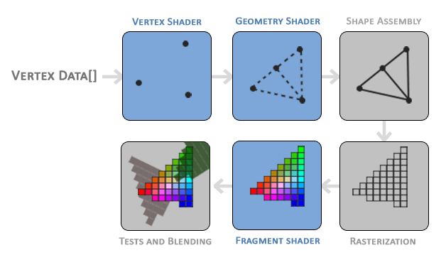

### Hello Triangle

---

在OpenGL中，所有的物体都在3D空间，但是屏幕却是由二维数组的像素组成的，所以OpenGL中很大一部分工作都是在将3D坐标转换为适配屏幕的2D像素。这个过程是由OpenGL中的图形管线控制的。图形管线可以分为两个部分，首先是将3D坐标转换为2D坐标，其次是将2D坐标转换为被着色的像素。

图形管线可以被分为多个阶段，其中每个阶段的输出结果都会作为下个阶段的输入。每个阶段所执行的任务都是高度特定化的，可以轻松地进行并行运算。在显卡中，处理核心会运行程序来完成图形管线上的各个阶段，我们将这些程序成为Shader。

其中一些Shader是可以有开发人员编写的，从而可以对图形管线中的特定部分实现更精细的控制。下图展示了图形管线上抽象出来的各个阶段，其中蓝色的可以由开发人员自行编写Shader。我们将逐一解释每个阶段的作用。



在图形管线中，我们传入一个由三个3D坐标组成的列表，这些坐标应该形成一个三角形，这个数组在这里被称为Vertex Data，这个顶点数据是一系列顶点的集。一个顶点是一个3D坐标的数据集。这个顶点的数据是通过顶点属性来表示的，它可以包含我们想要的任何数据，但为了简单起见，我们假设每个顶点仅由一个3D位置和一些颜色值组成。 

图形管线的第一个阶段是顶点着色器，它将单个顶点作为输入。顶点着色器的主要目的是将3D坐标转换为另一种3D坐标，同时我们也可以在顶点着色器中对顶点属性进行一些基本处理。

顶点着色器的输出结果，可以选择性地传递给几何着色器，它将构成图元地顶点集合作为输入，并且可以通过创建新的顶点来生成新的图元。如上图所示，几何着色器从给定地形状中生成了第二个三角形。

基元装配阶段将顶点（或几何图形）着色器中构成一个或多个基元的所有顶点（或顶点，如果选择了 GL_POINTS）作为输入，并将所有点装配到所给的基元形状中。

然后，基元组装阶段的输出会传递到光栅化阶段，光栅化阶段会将生成的基元映射到最终屏幕上的相应像素上，形成片段着色器使用的片段。在片段着色器运行之前，会进行剪切。剪切会丢弃视图外的所有片段，从而提高性能。

片段着色器的主要用途是计算像素的最终颜色，这通常也是所有高级 OpenGL 特效出现的阶段。通常，片段着色器包含三维场景的数据，可用于计算最终像素的颜色（如照明、阴影、光线颜色等）。

在确定了所有相应的颜色值后，最终对象将再经过一个阶段，我们称之为 alpha 测试和混合阶段。该阶段会检查片段的相应深度（和模板）值（我们稍后会讨论这些值），并使用这些值来检查生成的片段是位于其他对象的前面还是后面，从而相应地将其丢弃。该阶段还会检查 alpha 值（alpha 值定义了对象的不透明度），并相应地混合对象。因此，即使在片段着色器中计算了像素的输出颜色，在渲染多个三角形时，最终的像素颜色仍可能完全不同。

以上就是图形管线的基本概念。接下来我们来绘制OpenGL中的第一个三角形。

---

为了能够绘制一些图形，我们首先需要给OpenGL提供一些vertex data作为输入。不过OpenGL并不会将所有3D坐标都转换为2D屏幕上的像素，它只会处理在三个坐标轴上范围为[-1, 1]的3D坐标，符合这个标准的3D坐标被称为**normalized device coordinates**。顶点着色器处理完顶点坐标后，会将其转换在NDC中，所有超出这个范围的坐标都会被丢弃。

我们为我们想要绘制的三角形提供一个坐标数组，并且将它们定义在NDC中。

```c++
float vertices[] =
{
    -0.5f, -0.5f, 0.0f,
    0.5f, -0.5f, 0.0f,
    0.0f, 0.5f, 0.0f
};
```

定义完vertex data中，我们就可以将其作为输入传进管线的第一个阶段了。为此，我们需要在GPU上创建存储vertex data的内存、配置OpenGL如何解释该内存、并指定如何将vertex data传进GPU。完成了这些工作，顶点着色器就可以按照我们的要求来处理内存中的定点了。
