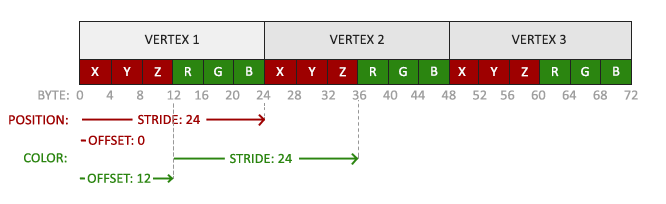

### Shaders

---

在上一章中，我们看到了如何填充 VBO、配置顶点属性并将其全部存储在 VAO 中。这次，我们还要为顶点数据添加颜色数据。我们将在顶点数组中添加 3 个浮点的颜色数据。我们为三角形的每个角分别指定红、绿、蓝三种颜色

```c++
float vertices[] =
{
    // positions        colors
    0.5f, -0.5f, 0.0f,  1.0f, 0.0f, 0.0f,
    -0.5f, -0.5f, 0.0f, 0.0f, 1.0f, 0.0f,
    0.0f, 0.5f, 0.0f,   0.0f, 0.0f, 1.0f
};
```

由于我们现在有更多数据要发送给顶点着色器，因此有必要调整顶点着色器，使其也接收颜色值作为顶点属性输入。请注意，我们使用布局指定器将 aColor 属性的位置设置为 1：

```glsl
#version 330 core
layout (location = 0) in vec3 aPos;   // the position variable has attribute position 0
layout (location = 1) in vec3 aColor; // the color variable has attribute position 1
  
out vec3 ourColor; // output a color to the fragment shader

void main()
{
    gl_Position = vec4(aPos, 1.0);
    ourColor = aColor; // set ourColor to the input color we got from the vertex data
}  
```

同样调整片段着色器

```glsl
#version 330 core
out vec4 FragColor;  
in vec3 ourColor;
  
void main()
{
    FragColor = vec4(ourColor, 1.0);
```

因为我们添加了另一个顶点属性并更新了 VBO 的内存，所以我们必须重新配置顶点属性。VBO 内存中更新后的数据现在看起来有点像这样：



现在，我们需要使用`glVertexAttribPointer`来更新vertex format

```c++
// position attribute
glVertexAttribPointer(0, 3, GL_FLOAT, GL_FALSE, 6 * sizeof(float), (void*)nullptr);
glEnableVertexAttribArray(0);
// color attribute
glVertexAttribPointer(1, 3, GL_FLOAT, GL_FALSE, 6 * sizeof(float), (void*) (3 * sizeof(float)));
glEnableVertexAttribArray(1);
```

---

编写、编译和管理着色器可能相当繁琐。为此，我们将创建一个着色器类，它可以从磁盘读取着色器、编译和链接着色器、检查错误并易于使用。

我们将完全在头文件中创建着色器类，这主要是为了便于学习和移植。首先，让我们添加所需的包含项并定义类的结构：

```c++
#ifndef SHADER_H
#define SHADER_H

#include <glad/glad.h>

#include <string>
#include <fstream>
#include <sstream>
#include <iostream>

class Shader
{
public:
    // program ID
    unsigned int ID;

    // constructor reads and builds the shader
    Shader(const char* vertexPath, const char* fragmentPath);

    // active the shader
    void use();

    // utility uniform functions
    void setBool(const std::string &name, bool value) const;
    void setInt(const std::string &name, int value) const;
    void setFloat(const std::string &name, float value) const;
};

#endif SHADER_H
```

Shader类保存着shader program的 ID。它的构造函数需要顶点着色器和片段着色器源代码的文件路径，我们可以将其作为简单的文本文件存储在磁盘上。为了增加一些额外的功能，我们还添加了几个实用功能，以方便我们的工作：`use` 会激活着色器程序，所有 `set`... 功能都会查询uniform location并设置其值。

---

我们使用 C++ 文件流将文件内容读入多个字符串对象：

```c++
Shader(const char* vertexPath, const char* fragmentPath)
{
    // retrieve the vertex/fragment source code from filePath
    std::string vertexCode;
    std::string fragmentCode;
    std::ifstream vertexShaderFile;
    std::ifstream fragmentShaderFile;
    // ensure ifstream objects can throw exceptions:
    vertexShaderFile.exceptions(std::ifstream::failbit | std::ifstream::badbit);
    fragmentShaderFile.exceptions(std::ifstream::failbit | std::ifstream::badbit);
    try
    {
        // open files
        vertexShaderFile.open(vertexPath);
        fragmentShaderFile.open(fragmentPath);
        std::stringstream vertexShaderStream, fragmentShaderStream;
        // read file's buffer contents into streams
        vertexShaderStream << vertexShaderFile.rdbuf();
        fragmentShaderStream << fragmentShaderFile.rdbuf();
        // close file handlers
        vertexShaderFile.close();
        fragmentShaderFile.close();
        // convert stream into string
        vertexCode = vertexShaderStream.str();
        fragmentCode = fragmentShaderStream.str();
    }
    catch (std::ifstream::failure e)
    {
        std::cout << "ERROR: Shader File Read Failed\n";
    }
    const char* vertexShaderCode = vertexCode.c_str();
    const char* fragmentShaderCode = fragmentCode.c_str();
    [---]
```

接下来，我们需要编译和链接着色器。请注意，我们还要检查编译/链接是否失败，如果失败，则打印编译时的错误。这在调试时非常有用（你最终会需要这些错误日志）：

```c++
// 2. compile shaders
unsigned int vertex, fragment;
int success;
char infoLog[512];
// vertex shader
vertex = glCreateShader(GL_VERTEX_SHADER);
glShaderSource(vertex, 1, &vertexShaderCode, nullptr);
glCompileShader(vertex);
glGetShaderiv(vertex, GL_COMPILE_STATUS, &success);
if (!success)
{
    glGetShaderInfoLog(vertex, 512, nullptr, infoLog);
    std::cout << "ERROR: Vertex Shader Failed to Compile\n" << infoLog << "\n";
}
// fragment shader
fragment = glCreateShader(GL_FRAGMENT_SHADER);
glShaderSource(fragment, 1, &fragmentShaderCode, nullptr);
glCompileShader(fragment);
glGetShaderiv(fragment, GL_COMPILE_STATUS, &success);
if (!success)
{
    glGetShaderInfoLog(fragment, 512, nullptr, infoLog);
    std::cout << "ERROR: Fragment Shader Failed to Compile\n" << infoLog << "\n";
}
// shader program
ID = glCreateProgram();
glAttachShader(ID, vertex);
glAttachShader(ID, fragment);
glLinkProgram(ID);
glGetProgramiv(ID, GL_LINK_STATUS, &success);
if (!success)
{
    glGetProgramInfoLog(ID, 512, nullptr, infoLog);
    std::cout << "ERROR: Shader Program Failed to Link\n" << infoLog << "\n";
}
glDeleteShader(vertex);
glDeleteShader(fragment);
```

完成剩余的部分：

```c++
// active the shader
void use()
{
    glUseProgram(ID);
}

// utility uniform functions
void setBool(const std::string &name, bool value) const
{
    glUniform1i(glGetUniformLocation(ID, name.c_str()), (int)value);
}
void setInt(const std::string &name, int value) const;
{
    glUniform1i(glGetUniformLocation(ID, name.c_str()), value);
}
void setFloat(const std::string &name, float value) const
{
    glUniform1f(glGetUniformLocation(ID, name.c_str()), value);
}
```

这样，一个完整的`shader`类就完成了，它的使用也非常简单，只需要创建一个`shader`对象，然后就可以使用了
