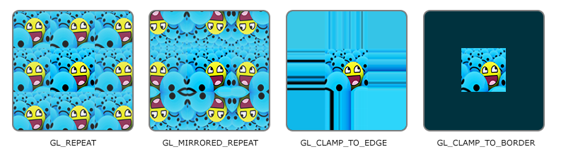
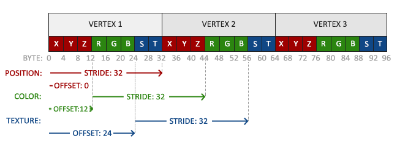

### Textures

---

这篇博客我们来讨论纹理。

为了实现纹理映射，我们需要告诉每个顶点它所对应的是纹理的哪一部分。因为，每个顶点都应该有一个纹理坐标，用来指定从纹理的哪个部分采样，然后由片段插值完成剩余的工作。

对于2D纹理来说，纹理坐标由x轴和y轴构成，范围是[0, 1]。使用纹理坐标检索纹理中的颜色被称为采样，纹理坐标的左下角是[0, 0]，右上角是[1, 1]。下图展示了我们如何将纹理坐标映射到三角形上。


我们为三角形指定三个纹理坐标，就像上图所示。我们只需要将三个纹理坐标传给vertex shader，经过插值，fragment shader中就会得到每个fragment所对应的纹理坐标。

我们将三个纹理坐标定义出来:

```c++
float texCoords[] =
{
    0.0f, 0.0f,  // lower-left corner
    1.0f, 0.0f,  // lower-right corner
    0.5f, 1.0f   // top-center corner
};
```

纹理采样的的解释比较宽泛，可以有多种方式，因为，我们的工作就是告诉OpenGL如何对纹理进行采样。

---

纹理坐标的范围是确定的，就在0和1之间，那超出这个范围的坐标应该如何采样呢，OpenGL提供了多种方式。

- `GL_REPEAT`：默认选项，会重复纹理
- `GL_MIRRORED_REPEAT`：与`GL_REPEAT`相同，但是在重复时会镜像处理
- `GL_CLAMP_TO_EDGE`：将坐标钳制在 0 和 1 之间，结果是较高的坐标被钳制在边缘上，导致边缘图案拉伸
- `GL_CLAMP_TO_BORDER`：超出范围的坐标会显示用户指定的边框颜色



上述的每个选项可以通过`glTexParameter*`对每个坐标轴单独设置。

```c++
glTexParameteri(GL_TEXTURE_2D, GL_TEXTURE_WRAP_S, GL_MIRRORED_REPEAT);
glTexParameteri(GL_TEXTURE_2D, GL_TEXTURE_WRAP_T, GL_MIRRORED_REPEAT);
```

如果我们想使用GL_CLAMP_TO_BORDER，还需要指定边框的颜色。

```c++
float borderColor[] = {1, 1, 0, 1};
glTexParameterfv(GL_TEXTURE_2D,  GL_CLAMP_TO_BORDER, borderColor);
```

---

虽然纹理坐标并不依赖分辨率，但是就可以是浮点值，这样OpenGL就必须明确纹理坐标要映射到哪一个texel。试想有一个很大的物体和一个分辨率很低的纹理，这就是为什么我们需要texture filtering。OpenGL中，我们通常会使用这两个filtering mode

- GL_NEAREST：也被称为point filtering，这是OpenGL的默认选项。在这个模式下，OpenGL会选择距离纹理坐标最近的texel
- GL_LINEAR：也被称为bilinear filtering，这个模式下，会从纹理坐标的相邻texel中提取一个内插值，近似于texel之间的颜色。从纹理坐标到texel中心的距离越小，该texel的颜色对采样颜色的贡献就越大texel

GL_NEAREST 会产生像素状图案，我们可以清楚地看到构成纹理的像素，而 GL_LINEAR 则会产生更平滑的图案，单个像素不太明显。GL_LINEAR 会产生更逼真的输出效果，但有些开发人员更喜欢 8 位效果，因此会选择 GL_NEAREST。


filtering mode也是通过调用`glTexParameter*`实现的，同时，我们也要指定出是在放大还是缩小纹理时所使用的filtering mode

```c++
glTexParameteri(GL_TEXTURE_2D, GL_TEXTURE_MIN_FILTER, GL_NEAREST);
glTexParameteri(GL_TEXTURE_2D, GL_TEXTURE_MAG_FILTER, GL_LINEAR);
```

---

想象这样一个场景，我们有一个很大的房间，其中有上千个物体，每个物体都有贴图。这样的话，即使距离观察者很远的物体也会使用与较近物体相同分辨率的贴图，但是较远的物体可能只会占据很少数量的片段，OpenGL就很难从高分辨率的贴图中获取对应的颜色，因为它必须要为跨度很大的纹理片段选择颜色，就会带来小物体上的artifacts。此外，小物体上使用高分辨率的贴图也会占用不必要的内存带宽。

为了解决这个问题，OpenGL使用了Mipmaps这一概念，它是一个纹理图像集合，其中每个后续纹理都比前一个小两倍。Mipmap的原理很好理解，当与观察者的距离达到了一个明确距离时，OpenGL 将使用与当前距离最匹配的mipmap 纹理。由于物体距离较远，用户不会注意到较小的分辨率。这样，OpenGL 就能对正确的纹理进行采样，而且在对 mipmap 的这一部分进行采样时，涉及的缓存内存也会更少。让我们仔细看看 mipmap 纹理的外观：


OpenGL提供了`glGenerateMipmap`为我们创建的贴图生成mipmaps。

在渲染过程中切换mipmap层级时，可能会带来一些失真的视觉效果，比如在两个层级之间会出现一个清晰的边缘。就像普通的纹理贴图一样，纹理filtering在切换mipmap曾几时也可以使用。OpenGL为我们提供了四个选项：

- `GL_NEAREST_MIPMAP_NEAREST`
- `GL_LINEAR_MIPMAP_NEAREST`
- `GL_NEAREST_MIPMAP_LINEAR`
- `GL_LINEAR_MIPMAP_LINEAR`

---

我们要研究一下贴图要如何加载进我们的项目，为了方便，我们可以直接引入图片载入的库，如`stb_image.h`。我们将这个头文件加入项目中后，还需要创建一个C++文件，它包含了以下代码。

```c++
#define STB_IMAGE_IMPLEMENTATION
#include "stb_image.h"
```

通过定义 `STB_IMAGE_IMPLEMENTATION`，预处理器修改头文件，使其只包含相关的定义源代码，有效地将头文件转变为 .cpp 文件，就是这么简单。现在只需在你的程序中某处包含 `stb_image.h` 并编译即可。

载入图片是通过`stbi_load`实现的

```c++
int width, height, nrChannels;
unsigned char *data = stbi_load("container.jpg", &width, &height, &nrChannels, 0);
```

这个函数的第一个参数是图片文件的存放位置，接下来的三个参数是图片的宽、高、通道的数量。

---

就像OpenGL的其他Object一样，纹理也是通过ID来引用的，也同样需要与它的object type绑定起来，这样后面的纹理相关的调用都是针对我们绑定过的纹理object的。

```c++
unsigned int texture;
glGenTextures(1, &texture);
glBindTexture(GL_TEXTURE_2D, texture);
```

当创建的纹理对象绑定好以后，我们就可以使用之前载入的图片信息来生成纹理了，使用的函数是`glTexImage2D`

```c++
glTexImage2D(GL_TEXTURE_2D, 0, GL_RGB, width, height, 0, GL_RGB, GL_UNSIGNED_BYTE, data);
glGenerateMipmap(GL_TEXTURE_2D);
```

`glTexImage2D`的参数很多，我们来逐一探讨一下：

- `target`:代表我们将载入的图片信息生成的texture object type
- `level`:纹理mipmap的层级，level 0表示我们要创建的是base level
- `internalFormat`：这个参数告诉OpenGL我们要用哪种格式存储纹理
- `width`：纹理宽度
- `height`：纹理高度
- `border`：一定为0（历史遗留问题）
- `format`：图片信息的格式
- `type`：图片信息中像素的data type，因为我们是载入图片后将其存储在chars中，所以格式我们使用`GL_UNSIGNED_BYTE`
- `data`：内存中图片信息的指针

一旦`glTexImage2D`调用完成，当前绑定的texture object就读取上了我们载入的图片。然后再调用`glGenerateMipmap`来自动生成mipmap。另外，记得释放掉载入图片所分配的内存。

总而言之，读取图片、加载纹理的过程大致如下：

```c++
unsigned int texture;
glGenTextures(1, &texture);
glBindTexture(GL_TEXTRUE_2D, texture);
glTextureParamteri(GL_TEXTURE_2D, GL_TEXTURE_WRAP_S, GL_REPEAT);
glTextureParamteri(GL_TEXTURE_2D, GL_TEXTURE_WRAP_t, GL_REPEAT);
glTextureParamteri(GL_TEXTURE_2D, GL_TEXTURE_MIN_FILTER, GL_LINEAREST_MIPMAP_LINEAR);
glTextureParamteri(GL_TEXTURE_2D, GL_TEXTURE_MAG_FILTER, GL_LINEAR);
int width, height, nrChannels;
unsigned char *data = stbi_load("container.jpg", &width, &height, &nrChannels, 0);
if (data)
{
    glTexImage2D(GL_TEXTURE_2D, 0, GL_RGB, width, height, 0, GL_RGB, GL_UNSIGNED_BYTE, data);
}
else
{
    std::cout << "Failed to load texture\n";
}
stbi_image_free(data);
```

---

让我们将纹理绘制进一个矩形中，首先更新我们的vertex data，除了顶点位置与顶点颜色之外，还需要加入顶点坐标。

```c++
float vertices[] = {
    // positions          // colors           // texture coords
     0.5f,  0.5f, 0.0f,   1.0f, 0.0f, 0.0f,   1.0f, 1.0f,   // top right
     0.5f, -0.5f, 0.0f,   0.0f, 1.0f, 0.0f,   1.0f, 0.0f,   // bottom right
    -0.5f, -0.5f, 0.0f,   0.0f, 0.0f, 1.0f,   0.0f, 0.0f,   // bottom left
    -0.5f,  0.5f, 0.0f,   1.0f, 1.0f, 0.0f,   0.0f, 1.0f    // top left 
};
```

因为新增了一个顶点属性，我们需要告诉OpenGL新的vertex format



```
glVertexAttribPointer(2, 2, GL_FLOAT, GL_FALSE, 8 * sizeof(float), (void*)(6 * sizeof(float)));
glEnableVertexAttribArray(2);
```

然后，vertex shader需要将纹理坐标作为顶点属性声明，同时也要输出给fragment shader

```glsl
#version 330 core
layout(location = 0) in vec3 aPos;
layout(location = 1) in vec3 aColor;
layout(location = 2) in vec2 aTexCoord;

out vec3 ourColor;
out vec2 texCoord;

void main()
{
    gl_Position = vec4(aPos, 1.0);
    ourColor = aColor;
    texCoord = aTexCoord;
}

```

fragment shader同样需要调整。除了要接收来自vertex shader输出的`texCoord`，fragment shader还需要可以访问texture object，但是我们要如何将texture object传给fragment shader呢？GLSL内置了一个针对texture object的数据类型`sampler`，也就说，我们声明一个`uniform sampler2D`就可以实现texture object的传入了。为了采样纹理，GLSL提供了一个内置函数`texture`，它将一个`sampler`作为第一个参数，将对应的纹理坐标作为第二个参数。

```glsl
#version 330 core
out vec4 FragColor;

in vec3 ourColor;
in vec2 texCoord;

uniform sampler2D ourTexture;

void main()
{
    FragColor = texture(ourTexture, texCoord);
}
```

现在，只需要在调用绘制指令`glDrawElements`之前，将纹理绑定好，就会自动地将纹理传给fragment shader中的`sampler`

```c++
glBindTexture(GL_TEXTURE_2D, texture);
glBindVertexArray(VAO);
glDrawElements(GL_TRAIGNLES, 6, GL_UNSIGNED_INT, 0);
```

---

在OpenGL中，Texture Unit（纹理单元）是一个非常重要的概念。纹理单元是在GPU上的特定硬件，用于处理纹理从GPU内存到最终渲染的流程。OpenGL支持同时的多个纹理，其实就是同时开启了多个纹理单元。这样可以为同一个顶点或者片段设置多个纹理（例如漫射纹理、镜面纹理等）。
每个纹理单元有一个编号来标识它，OpenGL保证有至少16个纹理单元可供你使用（可能更多，取决于显卡）。这些纹理单元从`GL_TEXTURE0`开始定义，然后一直到`GL_TEXTURE15`。例如，使用如下代码设置纹理单元：

```c++
glActiveTexture(GL_TEXTURE0);
glBindTexture(GL_TEXTURE_2D, texture);
```

这里的 `glActiveTexture(GL_TEXTURE0)` 是激活了*texture unit 0*。之后所有的`GL_TEXTURE_2D`操作也会在这个单元上执行。**也就是说，我们绑定的纹理会绑定到当前激活的纹理单元上。**
如果我们有多个纹理，可以激活不同的纹理单元，然后绑定相应的纹理到对应的单元上。在设定Uniform之前，你必须首先激活相应的纹理单元。
最后，请注意，预期纹理单元数量的限制因硬件而异，一些老的硬件可能只支持两个纹理单元，而新的硬件（例如现代显卡）可能支持数十甚至数百个纹理单元。你可以使用 `glGetIntegerv(GL_MAX_TEXTURE_UNITS, &maxTextureUnits);` 检查你的硬件支持的最大纹理单元数量。

---

当我们给shader设置纹理时，一定要先激活shader program。设置纹理有两种方式：

- `glUniform1i(glGetUniformLocation(ourShader.ID, "texture1"), 0);`
- `customShader.setInt("texture1", 0);`(这个方法是我们自己定义的，不具备通用性)

在绘制时，也需要以此激活texture unit，然后再绑定，OpenGL会自动将texture传值给shader中的`uniform sampler2D`
