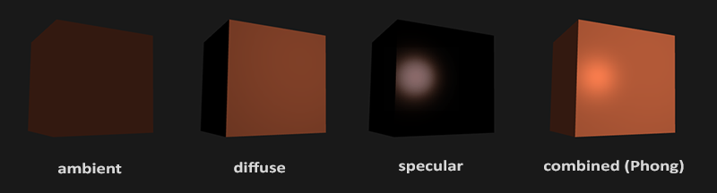
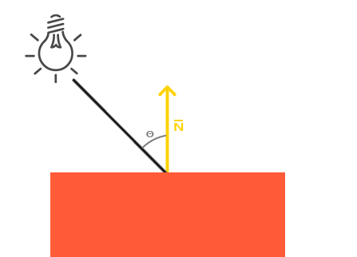
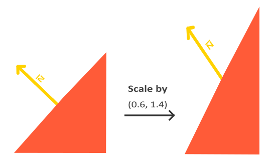
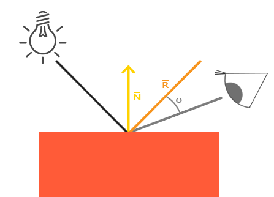

### Basic Lighting

---

我们将在本篇博客中探讨OpenGL中Phong模型的实现。

Phong模型主要包含三个部分：Ambient、Diffuse、Specular。下图是一个实例：



- Ambient：即使在黑夜中，世界环境下还是会存在一些光源，比如说月亮，所以物体并不会完全变成纯黑色。为了模拟这种情况下的照明，我们用一个ambient lighting constant来给物体一个颜色。
- Diffuse：漫反射模拟光对与物体的直接影响，这是Phong光照模型下最明显的一部分。物体面向光源的部分越多，物体就会变得越亮
- Specular：高光反射模拟光照射在一些较为光滑的物体上时在物体表面出现的亮斑。镜面高光更倾向于光的颜色而非物体的颜色

---

光通常并非来自于一个单一的光源，而是来自于我们周围分散的许多光源，即使它们并不立即可见。光的一个属性是它可以散射和反弹到许多方向，达到直接看不见的地方；光因此可以反射到其他表面，并对物体的照明产生间接影响。考虑到这一点的算法被称为全局照明算法，但这些算法复杂且计算成本高。

我们先不考虑复杂的计算方法，而是使用一个非常简单的全局照明模型，即Ambient环境光照。我们将使用一个数值较小的constant颜色，将其添加到物体的fragment shader的最终结果颜色中，让它看起来像是总有一些扩散光，即使没有直接的光源。

```glsl
void main()
{
	float ambientStrength = 0.1f;
	vec3 ambient = ambientStrength * lightColor;
	
	vec3 result = ambient * objectColor;
	FragColor = vec4(result, 1.0);
}
```

---

下图的左边显示一个光源，有一束光瞄准了我们物体的一个片段。我们需要计算光线射中片段的角度。如果光线垂直于物体的表面，光的影响最大。为了测量光线和片元之间的角度，我们使用了一个叫做法向量的东西，即垂直于片元表面的向量（这里用黄色箭头表示。两个向量之间的角度可以通过dot product轻松计算出来。请注意，为了得到向量之间的角度的余弦值，我们将使用单位向量，因此我们需要确保所有向量都是归一化的。




也就是说，计算漫反射，我们需要获取以下两个值：

- 法向量：一个垂直与片段表面、向上的向量
- 光线方向：也就是表示从光源位置到当前片段位置的向量

---

法向量是一个（单位）向量，它垂直于顶点的表面。因为顶点本身没有表面（它只是空间中的一个点），我们通过使用它周围的顶点来找出顶点的表面，从而获得一个法向量。我们可以用一个小技巧来计算立方体所有顶点的法向量，即使用cross product，但是因为3D立方体不是一个复杂的形状，我们可以简单地手动将它们添加到顶点数据中。尝试想象一下，法线确实是垂直于每个平面表面的向量（一个立方体由6个平面组成）。

因为我们在vertex array中添加了法向量，我们需要在vertex shader中添加对法向量的支持

```glsl
#version 330 core
layout (location = 0) in vec3 aPos;
layout (location = 1) in vec3 aNormal;
...
```

现在我们已经为每个顶点添加了一个法向量，并更新了vertex shader，我们也应该更新vertex attribute pointer。请注意，作为光源的立方体使用与普通立方体相同的顶点数组，但它的着色器不需要新添加的法向量，我们也无需更新光源立方体的着色器和属性配置，但我们至少需要修改顶点属性指针以反映新顶点数组的大小：

```c++
glVertexAttribPointer(0, 3, GL_FLOAT, GL_FALSE, 6 * sizeof(float), (void*)0);
glEnableVertexAttribArray(0);
```

所有光照计算都在fragment shader中执行，所以我们接收从vertex shader中输出的法向量

```glsl
// vertex shader
out vec3 Normal;

void main()
{
    gl_Position = projection * view * model * vec4(aPos, 1.0);
    Normal = aNormal;
} 
```

```c++
// fragment shader
in vec3 Normal;
```

---

我们已经获取了每个顶点的法向量，此时我们还需要知道光源位置和当前片段的位置。因为光源位置是我们在C++中所定义的全局静态变量，我们可以在片段着色器中用`uniform`声明出来，同时在C++中传给shader

现在考虑如何获取当前片段的位置。首先要明确的是，我们将光照运算放在world space下，那么所需要的片段位置也应该是world space下的，也就说，只需要在vertex shader中将顶点位置进行object space到world space的变换就ok了

```c++
out vec3 FragPos;  
out vec3 Normal;
  
void main()
{
    gl_Position = projection * view * model * vec4(aPos, 1.0);
    FragPos = vec3(model * vec4(aPos, 1.0));
    Normal = aNormal;
}
```

现在所有需要的变量都已设定，我们终于可以进行光照计算了。
首先，我们需要计算的是光源和片段位置之间的方向向量。从前面的部分我们知道，光源的方向向量是光源的位置向量和片段的位置向量之间的差向量。你可能还记得，在变换章节中，我们可以通过两个向量相减来轻松计算这个差异。我们还想确保所有相关的向量都变成单位向量，所以我们将法线和结果的方向向量进行规范化：

```glsl
vec3 norm = normalize(Normal);
vec3 lightDir = normalize(lightPos - FragPos);  
```

接下来，我们需要通过取`norm`和`lightDir`向量之间的点积来计算光线对当前片段的散射影响。然后将结果与光源的颜色相乘，得到散射分量，这样，两个向量之间的角度越大，散射分量就越暗

```glsl
float diff = max(dot(norm, lightDir), 0.0);
vec3 diffuse = diffuse * lightColor;
```

如果光线方向与法向量的夹角大于90度，那么dot product的结果实际上会变成负数，我们最终会得到一个负的散射分量。因此，我们使用max函数返回其参数的最大值，以确保散射分量（和颜色）永远不会变成负数。

现在，我们可以将ambient和diffuse加在一起输出了

```glsl
vec3 result = (ambient + diffuse) * objectColor;
FragColor = vec4(result, 1.0);
```

---

在前面的代码中，我们直接将vertex shader中的法向量传递到了fragment shader中。fragment shader中的计算实在世界空间下完成的，难道我们不应该也把法向量变换到世界空间下吗？答案基本是肯定的，但是转换并不是简单的乘以model matrix就可以完成的。

首先，法线向量仅仅是一个方向向量，并不代表空间中具体的位置，法向量并没有齐次坐标，这意味着矩阵变换中的平移translate不应该对法向量造成任何影响。如果我们将法向量与model matrix相乘，我们希望移除掉平移的部分，或者可以将法向量扩展为4维向量，w分量为0。

其次，如果model matrix会带来一个不均匀的缩放，那么顶点移动后所形成的新平面就可能不再与之前的法向量垂直了，可以参考下面这个图的演示：



修复这个问题的方法是，创建一个专门针对法向量的model matrix，也可以称为normal matrix，它可以消除缩放给法向量带来的影响。

"法线矩阵"被定义为"模型矩阵左上角3x3部分的逆的转置"。请注意，大多数教程或者资源将法线矩阵定义为由model-view矩阵派生而来，但由于我们在世界空间而不是在视图空间工作，我们将从模型矩阵中派生出法线矩阵。

在vertex shader中，我们可以通过`inverse`和`transpose`函数来计算得到normal matrix，同时也要将model matrix变成3x3矩阵，这样才能与normal vector相乘。

```glsl
Normal = mat3(transpose(inverse(model))) * aNormal;
```

> 在Shader中进行矩阵的逆运算会带来一些性能消耗，我们可以在CPU上完成这一步，然后在传递给Shader

---

与漫反射类似，高光反射也同样基于光线的入射方向和片段的法线向量。但是与漫反射不同的时，高光反射还需要考虑观察者的角度。如下图所示



我们通过围绕法线向量反射光线方向来计算一个反射向量。然后我们计算这个反射向量和视图方向之间的角度距离。它们之间的角度越小，镜面光的影响越大。结果的效果是当我们看向通过表面反射的光线方向时，会看到一些高光。
视图向量是镜面照明需要的额外变量，我们可以使用观察者的世界空间位置和片段的位置来计算它。然后我们计算镜面的强度，将这个强度与光线颜色相乘，然后将其加到ambient和diffuse上

我们将世界空间下摄像机的位置传递给shader

```glsl
uniform vec3 viewPos;
```

```c++
lightingShader.setVec3("viewPos", camera.Position);
```

现在我们可以计算specular了，首先我们定义一个specular的强度值

```glsl
float specularStrenght = 0.5;
```

然后我们计算观察方向以及光线的反射方向

```glsl
vec3 viewDir = normalize(viewPos - FragPos);
vec3 reflectDir = reflect(-lightDir, norm);
```

我们将`lightDir`做了取反处理，因为`reflect`函数需要一个从光源位置指向片段位置的向量，`lightDir`实际上是相反的。

然后我们就可以计算实际的specular了，

```glsl
float spec = pow(max(dot(viewDir, reflectDir), 0.0), 32);
vec3 specular = specularStrength * spec * lightColor;
```

