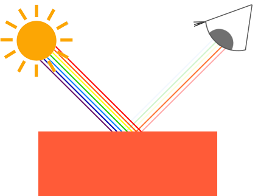

### Colors

---

在图形学中，我们用三个范围为[0, 1]的值作为R、G、B通道，组成一个颜色值。我们可以使用这样的代码来定义一个颜色向量

```c++
glm::vec3 coral(1.0f, 0.5f, 0.31f);
```

我们在现实世界中所看到的一个物体的颜色，并不是它本身所具有的颜色，而是由该物体没有吸收的色彩组成的。举个例子，我们通常认为太阳光是白色的，其实它是由许多不同的颜色组合而成的（如你可以在图片中所见）。如果我们把这种白光照射在一个蓝色的玩具上，玩具会吸收所有白色光的子色彩，除了蓝色。因为玩具没有吸收蓝色部分，所以它被反射出来。这种反射光进入我们的眼睛，使玩具看起来呈蓝色。下面这张图片展示了这种情况下一个珊瑚色的玩具，它以不同的强度反射了几种颜色



这些颜色反射规则直接应用于图形学领域。当我们在OpenGL中定义一个光源时，我们希望给这个光源一个颜色。在前面的段落中，我们使用了白色，所以我们也给光源一个白色。然后，如果我们将光源的颜色与物体的颜色值相乘，得出的颜色就是物体的反射颜色（也就是我们感知到的颜色）。让我们重新考虑我们的玩具（这次是珊瑚色），看看我们如何在图形学领域计算它的感知色。通过对光和物体颜色向量进行分量间的乘法，我们得到了结果颜色向量：

```c++
glm::vec3 lightColor(1.0f, 1.0f, 1.0f);
glm::vec3 toyColor(1.0f, 0.5f, 0.31f);
glm::vec3 result = lightColor * toyColor; // = (1.0f, 0.5f, 0.31f);
```

我们可以看到，玩具的颜色吸收了大部分的白光，但是根据其自身的颜色值，反射了几个红色、绿色和蓝色的值。这是现实中颜色工作方式的一种表现。**因此，我们可以将一个物体的颜色定义为它从光源反射的每种颜色成分的量**。那么，如果我们使用绿光会发生什么呢？

```c++
glm::vec3 lightColor(0.0f, 1.0f, 0.0f);
glm::vec3 toyColor(1.0f, 0.5f, 0.31f);
glm::vec3 result = lightColor * toyColor; // = (0.0f, 0.5f, 0.0f);
```

我们可以看到，玩具没有红色和蓝色的光线可供吸收和/或反射。玩具还吸收了一半的绿光，但也反射了一半的绿光。我们所感知的玩具颜色将会是一种暗绿色。**我们可以看到，如果我们使用绿色的光，只有绿色的颜色成分可以被反射，也就是可以被感知到；没有红色和蓝色的颜色被感知到。**因此，珊瑚色的物体突然变成了暗绿色的物体。

---

我们将要创建的场景需要物体和光源。物体是我们要照亮的对象，而光源则是照亮物体的元素。首先，我们需要一个物体，可以在其上投射光线。为此，我们将使用前几章中那个大家都熟悉的容器立方体。接下来，我们需要一个光源，这是3D场景中的一个元素，光线就是从这里发射出去的。为了简单，我们也将用一个立方体来代表这个光源。现在我们已经有了顶点数据，所以使用立方体是合理的。

我们为立方体创建vertex shader，处于简单性考虑，我们尽可能简化这个shader

```glsl
#version 330 core
layout (location = 0) in vec3 aPos;

uniform mat4 model;
uniform mat4 view;
uniform mat4 projection;

void main()
{
    gl_Position = projection * view * model * vec4(aPos, 1.0);
}
```

因为我们要渲染一个作为光源的立方体，我们想为它生成一个新的VAO。

当然，我们可以用同一个VAO渲染光源，然后在model matrix上做一些关于光源位置的变换，但在即将到来的章节中，我们将经常改变场景中物体的vertex data，我们不希望这些改变影响到到光源对象上（我们只关心光源立方体的顶点位置），所以我们将创建一个新的VAO：

```c++
unsigned int lightVAO;
glGenVertexArrays(1, &lightVAO);
glBindVertexArray(lightVAO);
// we only need to bind to the VBO, the contaier's VBO's data already contains the data
glBindBuffer(GL_ARRAY_BUFFER, VBO);
glVertexAttribPointer(0, 3, GL_FLOAT, GL_FALSE, 3 * sizeof(float), (void*)nullptr);
glEnableVertexAttribArray(0);
```

现在我们还需要分别为物体和光源创建fragment shader。先来看看物体的，这个fragment shader同时接受物体颜色和光源颜色：

```c++
#version 330 core
out vec4 FragColor;
  
uniform vec3 objectColor;
uniform vec3 lightColor;

void main()
{
    FragColor = vec4(lightColor * objectColor, 1.0);
}
```

我们需要在C++中向Shader传递颜色值，其中光线的颜色应该是白色

```c++
// to set the uniform, be sure to use the corresponding shader program
lightingShader.use();
lightingShader.setVec3("objectColor", 1.0f, 0.5f, 0.31f);
lightingShader.setVec3("lightColor", 1.0f, 1.0f, 1.0f);
```

我们需要代表光源的立方体也被光照影响，也就说，光源立方体的颜色应该是一个固定的颜色值。

```glsl
#version 330 core

out vec4 FragColor;

void main()
{
    FragColor = vec4(1.0);
}
```

光源立方体的作用主要是告诉我们光从哪里射出，我们将场景中的某处设置为光源位置，它的意义也仅仅是位置，并没有视觉上的意义，所以让我们将光源在world space中的位置定义为一个全局变量

```c++
glm::vec3 lightPos(1.2f, 1.0f, 2.0f);
```

这个值只是光源的位置，我们需要将光源立方体放置在这个地方，同时将其缩小一定程度

```c++
model = glm::mat4(1.0f);
model = glm::translate(model, lightPos);
model = glm::scale(model, glm::vec3(0.2f));
```

余下的渲染光源立方体的代码大致如下：

```c++
lightCubeShader.use();
// set mvp matrices
[...]
// draw the light cube object
glBindVertexArray(lightCubeVAO);
glDrawArrays(GL_TRIANGLES, 0, 36);
```

---

目前，我们完成了两个立方体的绘制，但是也仅此而已，后续我们将着色实现光照的计算与着色。
