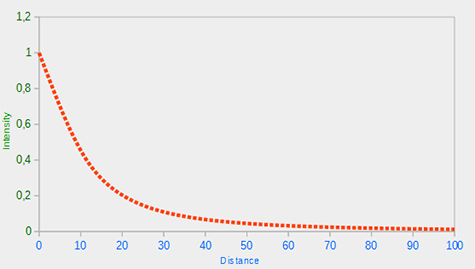
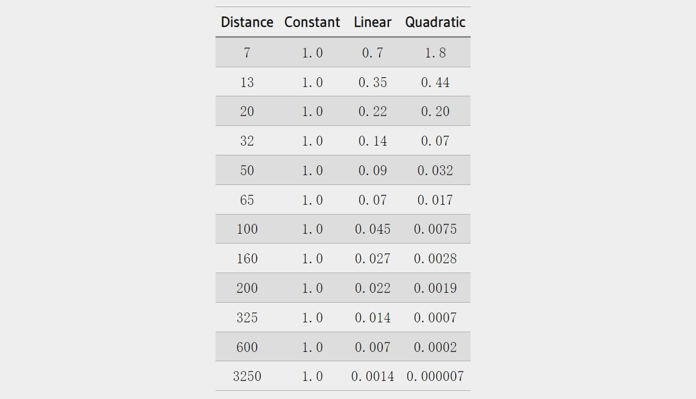
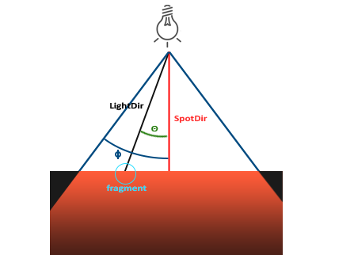
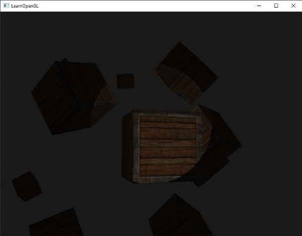

### Light Casters

---

本篇博客我们来讨论三种光源：平行光、点光源、聚光灯

---

当光源处于远离观察者的位置时，从光源发出的光线近乎平行。无论物体和/或观察者在哪里，所有的光线看起来都似乎来自同一个方向。太阳是一个很好的例子。


因为所有光线都是平行的，场景的物体与光源的相对位置关系就没有意义了。对于平行光来说，我们就不需要再根据光源位置和片段位置来计算光线的方向了，直接设置一个即可。

```glsl
struct Light {
    // vec3 position; // no longer necessary when using directional lights.
    vec3 direction;
  
    vec3 ambient;
    vec3 diffuse;
    vec3 specular;
};
[...]
void main()
{
  vec3 lightDir = normalize(-light.direction);
  [...]
}
```

在C++中将我们自行定义的平行光方向传给Shader

```c++
lightingShader.setVec3("light.direction", -0.2f, -1.0f, -0.3f);
```

> 此前，我们一直用`vec3`这个数据类型来表示光源的位置，但是也有人更倾向于用`vec4`表示所有向量。如果向量是位置相关的话，`vec4`的`w`分量需要设置为1，这样平移和投影的变换不会受影响。但是，用`vec4`表示方向时，要确保`w`分量为0

---

点光源向所有方向投射光线，且光照强度随着与光源的距离变大而衰减


我们将通过这个公式来计算点光源的衰减
$$
F_{att}=\frac{1.0}{K_{c}+K_{l}*d+K_{q}*d^{2}}
$$
让我们分析以下这个公式：

- ***d***表示光源与当前片段的距离
- ***Kc***是我们定义的一个常数，通常为1，用来确保衰减计算公式不会小于1，不然点光源就太亮了，不符合现实逻辑
- ***K<sub>l</sub>***是一个线性值，线性项与距离值相乘，以线性方式降低强度
- ***K<sub>q</sub>***与***d***的平方相乘，为光源设置了二次强度减小。当距离较小时，二次项与线性项相比将变得不太重要，但随着距离的增大，二次项将变得更大

由于二次项的存在，光线会以大致线性的方式减弱，直到距离变得足够大，二次项超过线性项，然后光强会快速减小。结果效果是，光线在近距离时非常强烈，但随着距离的增加，光线的亮度迅速降低，直到最终以较慢的速度失去其亮度。下图显示了在100的距离上这种衰减的效果：



但是我们要如何确定公式中三个参数的值呢？有很多影响因素：环境、灯光照明范围的需求。下面这个表提供了不同点光源的照明范围所对应的三个参数的值，可以给我们一些参考



为了实现这个衰减公式，我们需要修改fragment shader，将三个参数也定义在`Light`结构体中，并且还需要为点光源手动计算`lightDir`

```glsl
struct Light {
    vec3 position;  
  
    vec3 ambient;
    vec3 diffuse;
    vec3 specular;
	
    float constant;
    float linear;
    float quadratic;
}; 
```

然后在C++中传值

```c++
lightingShader.setFloat("light.constant",  1.0f);
lightingShader.setFloat("light.linear",    0.09f);
lightingShader.setFloat("light.quadratic", 0.032f);	   
```

我们在fragment shader中完成对公式的实现

```glsl
float distance    = length(light.position - FragPos);
float attenuation = 1.0 / (light.constant + light.linear * distance + 
    		    light.quadratic * (distance * distance));    
```

得到的衰减值需要分别乘以灯光的ambient, diffuse, specular

```glsl
ambient  *= attenuation; 
diffuse  *= attenuation;
specular *= attenuation;   
```

---

在OpenGL中，确定一个spot light需要三个数据：聚光灯位置、方向、照射角度。我们会为在spot light照射范围内的片段进行光照计算。我们来详细讨论下图中所出现的参数



- **LightDir**：从光源指向当前片段的方向向量
- **SpotDir**：聚光灯所指向的方向
- **Phiϕ**：截止角度，指定了聚光灯的半径。在此角度之外的一切都不会被聚光灯照亮
- **Thetaθ**：**LightDir**向量和**SpotDir**向量之间的角度。θ值应小于Φ，才能在聚光灯内部

现在我们来在OpenGL中实现聚光灯，在fragment中我们需要聚光灯的位置向量（用于计算从片元到光源的方向向量）、聚光灯的方向向量和截止角度。我们可以将这些值存储在`Light`结构中

```glsl
struct Light {
    vec3  position;
    vec3  direction;
    float cutOff;
    ...
};    
```

同样的，在C++中传值

```c++
lightingShader.setVec3("light.position",  camera.Position);
lightingShader.setVec3("light.direction", camera.Front);
lightingShader.setFloat("light.cutOff",   glm::cos(glm::radians(12.5f)));
```

如你所见，我们没有为cutoff值设置角度，而是根据cutoff的角度计算余弦值，并将余弦结果传递给片元着色器。我们要比较LightDir和SpotDir之间的角度与设定的截止角度ϕ的大小。为了解决这个问题，我们通常会使用点积运算，因为点积能返回两个单位向量之间角度的余弦值。
然而，这就产生了一个问题，我们不能直接比较角度和余弦值。因此，一个可能的解决方案是在着色器中再计算点积余弦值的反余弦来得到角度，然后再进行比较。但是这样的操作很耗费性能。
为了避免这种情况，我们使用一个小技巧：不在着色器中计算反余弦，而是在计算截止角度ϕ的余弦值时，就预先将其计算出来，并将其传递给片元着色器。**因此，这样就把同一个问题的角度比较，转变成了余弦值的比较，从而避免了在着色器中进行昂贵的反余弦计算，提高了性能**

现在我们就可以计算LightDir和SpotDir之间的角度的余弦值了，并判断当前fragment是否在聚光灯所形成的锥体的范围内

```glsl
float theta = dot(lightDir, normalize(-light.direction));
    
if(theta > light.cutOff) 
{       
  // do lighting calculations
}
else  // else, use ambient light so scene isn't completely dark outside the spotlight.
  color = vec4(light.ambient * vec3(texture(material.diffuse, TexCoords)), 1.0);
```

不过，当前算法所得到的聚光灯会有一个明显的边缘，如下图所示。实际上，聚光灯在cutoff的边缘应该逐渐降低照射亮度，从而形成一个soft edge



为了创建一个软边缘，我们需要为聚光灯模拟出一个inner锥体和outer锥体，我们可以前面实现的聚光灯直接作为inner锥体，将边缘的软化放在outer锥体中。

为了模拟outer锥体