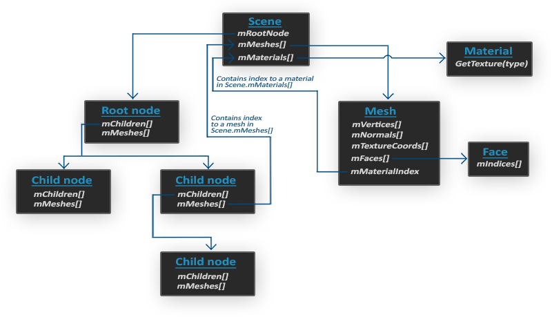

### Model Loading

---

在OpenGL中，我们可以使用Assimp这个库来导入并加载模型，然后我们从 Assimp 的数据结构中检索我们需要的所有数据。因为 Assimp 的数据结构保持不变，无论我们导入的文件格式类型如何，它都会将我们从所有不同的文件格式中抽象出来。

Assimp会将整个模型导入scene obect中，它包含了导入模型/场景的所有数据。然后，Assimp 有一个节点集合，其中每个节点都包含存储在场景对象中的数据索引，其中每个节点可以有任意数量的子节点。Assimp结构的（简单）模型如下所示：

- 场景/模型的所有数据(网格、材质等)都会被存放在**Scene Node**中
- 场景的**Root Node**可能包含子节点（像所有其他节点一样），并且可以有一组指向场景对象的**mMeshes**数组中的网格数据的索引。场景的**mMeshes**数组包含实际的Mesh对象，节点**mMeshes**数组中的值只是场景网格数组的索引。
- **Mesh Object**本身则包含了渲染相关的所有数据，比如顶点位置、法向量、纹理坐标、面、材质
- **Mesh Object**会包含**Face Object**，具体则代表了渲染图元（三角形、四边形、点），**Face Object**包含了组成图元的顶点索引
- **Mesh Object**还会包含**Material Object**，它包含了获取材质属性的一些函数

我们需要做的是：首先将物体加载进**Scene Object**，递归地从各个**Children Node**中获取对应的**Mesh Object**，然后再从**Mesh Object**中得到vertex data、indices和材质属性。最终结果是，我们在单个**Model Object**中包含了对应的mesh data，

> 通常，每个模型Model都有它所包含的几个子模型，我们将这些子模型中的每一个都称为网格Mesh。想想一个类似人类的角色：艺术家通常将头部、四肢、衣服和武器建模为单独的组件，所有这些网格的组合结果代表最终模型。Mesh是在 OpenGL 中绘制对象所需的最小表示（顶点数据、索引和材质属性）。Model（通常）由多个Mesh组成。

---
