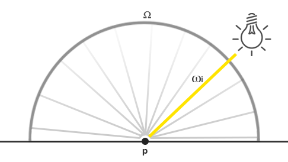

### Lighting

---

上一篇[博客](https://lovewithyou.tech/blogs/Graphics/OpenGL%E4%B8%ADPBR%E7%9A%84%E5%AE%9E%E7%8E%B0/Theory/)中，我们探讨了PBR的理论基础，现在让我们动手实现直接光下的PBR渲染。

首先我们来回顾一下反射率方程：
$$
Lo(p,\omega_o)= \underset {\Omega}{\int}(k_d\frac{c}{\pi} +\frac{DFG}{4(\omega_o\cdot n)(\omega_i\cdot n)})L_i(p, \omega_i)n\cdot \omega_id\omega_i
$$
我们大致明白反射率方程的意义，只是目前我们还不了解应该如何表示场景中的radiance总值***L***。我们已经明白了***L***代表在给定立体角***ω***下光源的能量，也就是radiant flux辐射通量***Φ***。在我们情形下，我们假定立体角***ω***无限小，这时，radiance就代表光源在一条光线或者一个方向向量上的辐射通量。

假定在场景中，我们有一个单一点光源，它的辐射通量用RGB表示为**（23.47, 21.31, 20.79）**。那么这个点光源的radiant intensity辐射强度就等于光源在所有方向上的radiant flux辐射通量。然而，当我们为表面上一点***p***着色时，在其半球领域***Ω***内所有可能的入射方向上，只有一个入射方向向量***ωi***会直接来自点光源。这也就是说，假设我们的场景中只有一个光源，对p点来说，***ωi***以外的入射光线方向上的radiance为0。

假设点光源不受光线衰减的影响，那么将点光源放置在场景中任意位置，入射光线的radiance都会是一样的（除了会受到入射角度***cosθ***的影响）。因为点光源在任何方向上的radiant intensity相同，我们可以有效地将其辐射强度建模为其辐射通量: 一个常量向量**（23.47, 21.31, 20.79）**
