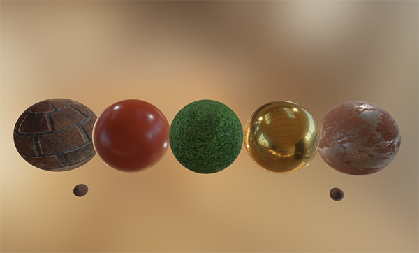
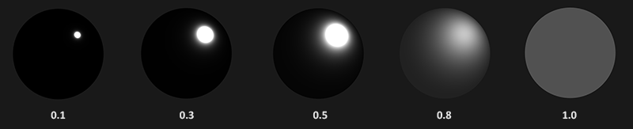
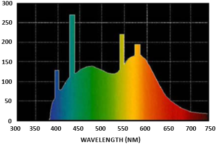
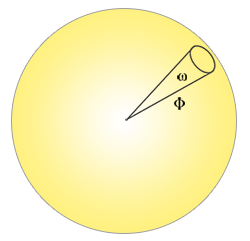
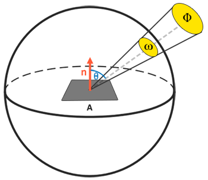
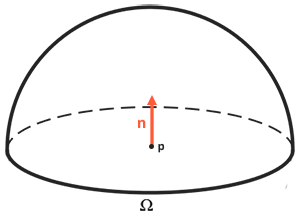
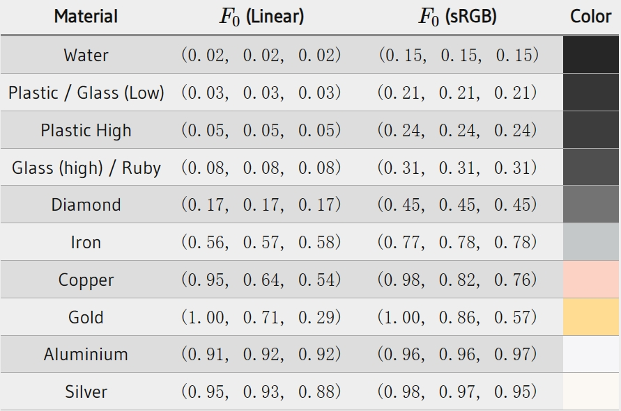

### Theory

---

Physically Based Rendering(简称为PBR)是一系列的渲染技术的集合。这些技术基于相同的底层理论，更符合现实世界的物理环境。BBR比我们之间接触的到照明算法要更真实，同时，因为PBR是基于物理的，我们可以基于物理参数来创建表面材质。也就是说，无论照明条件如何，我们的材质看起来都是正确的。

PBR依旧是一种对现实的模拟，对于一个PBR光照模型来说，需要满足三个条件才能被认为是physically based：

- 基于微表面模型
- 满足能量守恒
- 使用基于物理的BRDF

在后续的PBR章节中，我们将会集中讨论金属度工作流的PBR，最终实现这样的效果：



---

#### The microfacet model

所有的PBR技术都是基于微表面理论的，这个理论描述了在微观尺度上，任何表面都可以被描述为微小的、完全镜面反射的镜子。不同粗糙度的表面，这些小镜子的排列方式很大的不同：


在粗糙的表面上，微表面的排列非常混乱，使得光线在多个方向上散射，从而导致了广泛的反射效果。而在光滑的表面上，这些微表面的排列更整齐，使得反射光线的方向基本一致，形成了一种更集中、更锐利的反射效果。这就从微观层面解释了不同材质表面在光照下产生不同视觉效果的原因：


在微观层面上，没有表面是完全光滑的，但是考虑到微表面足够小，我们无法在像素的尺度上区分它们，所以我们可以通过一个粗糙度参数来近似表面的粗糙程度。基于表面的粗糙度，我们可以计算出与某个***h***向量粗略对齐的微表面所占的比例。向量***h***就是我们所说的半程向量，它是光线方向与观察向量的中间向量

与半程向量对齐的微表面越多，则高光反射越锐利、越强。使用半程向量与范围在[0, 1]之间的粗糙度，我们可以近似出微表面的对齐情况：



---

#### Energy Conservation

微表面的近似采用一种能量守恒的形式：出射光的能量应该小于等于入射光的能量（自发光除外）。结合上图，我们可以看到，当粗糙度增大时，镜面反射区域的增大，但是亮度值却在减小。

为了满足能量守恒定律，我们需要明确的区分开漫反射和镜面反射。当一束光击中表面时，会分为折射和反射两部分。反射指的是光会直接反射出去，而不会进入表面，这就是我们所说的镜面反射。折射指的是剩余的光线会进入表面并被吸收，这就是我们所说的漫反射部分。

这里有一些微妙之处，折射的光不会在击中表面的那一刻瞬间被吸收。在物理学上，光可以被视为一束能量，直至失去所有能量后才会停止前行。光线损失能量的方式是碰撞。物质的材质都有一些微小的粒子组成，这些粒子可以与光线碰撞，如图所示，每次碰撞中，粒子都会吸收部分或者所有能量：


通常来说，并不是所有能量都会被吸收，光将继续在一个（大致）随机的方向上散射，然后与其他粒子碰撞，直到它的能量耗尽或者再次离开表面。从表面重新散射出来的光线会对漫反射造成一些影响。但是，在PBR中，处于简化的目的，我们假定所有折射的光线都会在很小的撞击区域内被吸收和散射，从而忽略掉从表面内散射出来的光线。一些特定的shader会考虑这一部分，主要是用在皮肤、石蜡、翡翠这种次表面散射的材质。

当涉及到反射和折射时，金属表面是一个额外的微妙点。金属表面对光的反应与非金属表面（也被称为电介质）不同。金属表面遵循相同的反射和折射原则，但所有折射的光都会直接被吸收，而不进行散射。这意味着金属表面只会留下反射的或镜面的光；金属表面不展现漫反射颜色。由于这种明显的金属和电介质之间的区别，它们在PBR管线中被不同地处理，我们将在本章后面进一步探讨这个问题。

另外，我们也可以得出另一个结论：折射光与反射光之间是互斥的，也就是说，当光线的一部分能量用于折射后，剩余的能量就都会被用来反射，用代码来表述就是这样的：

```c++
float kS = calculateSpecularComponent(...) // reflection/specular fraction
float kD = 1.0 - kS;                       // refraction/diffuse  fraction
```

我们在之前涉及到的光照模型都没有考虑到能量守恒，所以是不符合physically based。

---

#### The reflectance equation

要正确地理解PBR，我们首先要对反射率方程有一个深入的认识：
$$
L_o(p, \omega_o) = \underset {\Omega}{\int} f_r(p, \omega_i,\omega_o)L_i(p,\omega_i)n\cdot\omega_id\omega_i
$$
反射率方程看起来很复杂，不过随着我们一步步地剖析，你会发现这个方程很好理解。我们首先来了解以下**radiometry**这个概念，翻译为辐射测量，是一种包括可见光在内的电磁辐射的度量。有很多种辐射度量可以用来测量表面或者某个方向上的光，但是我们只讨论和反射率方程有关的一种，被称为**radiance**，翻译为辐射率，用***L***表示。Radiance是用来量化来自单一方向上的光的强度或大小的物理量。由于这个概念是多个物理概念的集合，所以我们首先了解一下这些概念：

**Radiant flux**：翻译为辐射通量，用***Φ***表示。它代表一个光源所输出的能量，以瓦特为单位。光是由多种不同波长的能量集合而成，每种波长都对应着一个特定的可见的颜色。因此，一个光源所发出的能量可以视为这个光源包含的所有各种波长的一个函数。波长介于390nm和700nm之间的光被认为在可见光的光谱上，也就是人眼可见的波长。下图展示了日光中不同波长的光所具有的能量：



Radiant flux将会计算这个由不同波长构成的函数的总面积。但是，直接将这种对不同波长的计量作为参数输入参与渲染计算有些不切实际，所有我们通常不直接使用波长的强度，而是使用三原色编码来作为辐射通量的简化。这种编码方式可能会带来一些信息上的损失，不过在视觉效果上的影响可以忽略不计。

**Solid angle**：翻译为立体角，用***ω***表示。它代表投射到一个单位球体上的一个截面的大小或者面积。我们可以将立体角视为一个带有体积的方向：


想象你作为一个观察者，站在单位球体的中心点，看向投影的方向，这个投影的轮廓的大小就是立体角

**Radiant intensity**：翻译为辐射强度，它代表在单位球体上，一个光源向单位立体角所投送的辐射通量。举例来说，有一个向全方向投射的光源，均匀地向各个方向辐射能量，那么辐射强度就可以告诉我们在一个特定区域(特定立体角)内的能量有多少：



描述辐射强度的方程定义如下：
$$
I=\frac{d\Phi}{d\omega}
$$
其中***I***表示辐射通量**Φ**除以立体角**ω**

理解了辐射通量，立体角，辐射强度这些物理概念后，我们终于可以试着了解辐照度方程(the equation of **radiance**)了。该方程描述的是，一个拥有辐射强度**Φ**的光源在单位面积A，单位立体角**ω**上的辐射出的总能量，计算公式为：
$$
L = \frac {d^2\Phi} {dAd\omega cos\theta}
$$


**Radiance**表示的是一个区域平面上光线总量的物理量，它受到入射光线与平面法向夹角的余弦值的影响。这与我们之前所了解到的漫反射中的概念类似，其中***cosθ***对应的是光线方向与平面法线的点积：

```c++
float cosTheta = dot(lightDir, N);
```

Radiance方程相当有意义，它包含了我们感兴趣的绝大多数物理量。如果我们将立体角***ω***和面积***A***视作无限小，那么我们就可以使用Radiance来测量一条单独的光线射中表面上的一个点上的辐射通量radiant flux。这就意味我们可以计算出作用与单个片段上的单束光线的Radiance，实际上也就是将立体角***ω***看作一个方向向量，面积A视作一个点p。

事实上，当涉及到Radiance时，我们通常所关心的是所有投射到p点上的光线的总和，也就是所有radiance的总和，我们将其称为irradiance。当我们已经理解radiance和irradiance后，我们就可以回过头来看反射率方程了：
$$
L_o(p, \omega_o) = \underset {\Omega}{\int} f_r(p, \omega_i,\omega_o)L_i(p,\omega_i)n\cdot\omega_id\omega_i
$$
现在我们已经知道，***L***在渲染方程中代表通过一个无限小的立体角***ω<sub>i</sub>***，在某点***p***上的radiance，这个立体角也可以被认为是一个方向向量***ω<sub>i</sub>***。我们前面有提到，我们使用光线在平面的入射角的余弦值***cosθ***来衡量光线的能量，这个计算过程体现在反射率方程中的***n ⋅ ω<sub>i</sub>*** 。反射率方程计算的是点***p***在方向***ω<sub>o</sub>***上被反射出来的radiance***L<sub>o</sub>(p,ω<sub>o</sub>)***的总和。换句话说，***L<sub>o</sub>***表示的是从***ω<sub>o</sub>***方向上观察，光线投射到***p***点反射出来的radiance。

反射率公式是基于irradiance的，也就是所有入射radiance的总和。所以我们需要计算的就不只是一个单一方向上的入射光，而是一个以点***p***为球心的半球领域**Ω**内所有方向上的入射光。半球可以描述为以平面法线***n***为轴所环绕的半个球体：



为了计算一个区域或（在半球的情况下）体积内的值的总和，我们使用一种称为积分的数学方法，在反射率方程中表示为***∫***，它包括了半球范围***Ω***内所有的入射方向***ω<sub>i</sub>***。积分运算的值实际上就是函数曲线的面积，它的计算结果要么为解析值，要么是数值解。由于渲染方程和反射率方程都没又解析解，所以我们会使用离散的方法来得到积分的数值解。所以，这个问题就转换为，在半球范围***Ω***内，按照一定的步长将反射率方程分散求解，然后再根据步长大小将所得结果平均化。这种方法被称为黎曼和，用代码粗略地解释为：

```c++
int steps = 100;
float sum = 0.0f;
vec3 P = ...;
vec3 Wo = ...;
vec3 N = ,,,;
float dW = 1.0f / steps;
for (int i = 0; i < steps; i++)
{
	vec3 Wi = getNextIncomingLightDir(i);
	sum += Fr(p, Wi, Wo) * L (p, Wi) * dot(N, Wi) * dW;
}
```

`dW`代表黎曼和中的离散步长，我们用它来对所有离散部分进行缩放，其和最后就等于积分函数的总面积/体积的一个近似值。我们可以通过增加里三部分的数量来提高黎曼和的准确度。

反射率方程求和了***p***点所在的半球范围***Ω***内，所有入射方向***ω<sub>i</sub>***的radiance，并按照***f<sub>r</sub>***缩放，然后返回观察方向上反射光的***L<sub>o</sub>***。我们之前已经探讨过如何计算光源的入射radiance，或者我们还可以通过环境贴图从所有方向上获取radiance，这个部分我们会在IBL的章节中讨论。

现在，我们唯一还不了解的部分就是***f<sub>r</sub>***了，它代表的是**BRDF**，也就是**bidirectional reflective distribution function**。BRDF的作用是根据物体的表面材质，对入射radiance进行缩放或加权。

---

BRDF的参数包括入射光方向***ω<sub>i</sub>***，出射光方向***ω<sub>o</sub>***，表面法线***n***，和代表微表面粗糙程度的表面参数***a***。BRDF可以根据一个不透明表面的材质属性，近似计算得到每个独立的光线***ω<sub>i</sub>***对最终的反射光的贡献程度。比如说，一个平面的表面是完全光滑的(比如镜面)，那么对于所有的入射光线***ω<sub>i</sub>***，BRDF都会返回0.0，除了一束与出射光线***ω<sub>o</sub>***角度相同的入射光线会返回1.0。

BRDF对于材质的反射属性和折射属性的近似建立在微表面理论的基础之上。想让BRDF在物理学上可信，还需要遵守能量守恒定律，反射出的光线的能量不会大于入射光线的能量。理论上来说，同样使用***ω<sub>i</sub>***和***ω<sub>o</sub>***作为参数的Blinn-Phong模型也属于一种BRDF，但是Blinn-Phong模型并非基于物理的，因为它不遵守能量守恒定律。在实时渲染领域，BRP管线下最常使用的BRDF是**Cook-Torrance** BRDF。

Cook-Torrance BRDF同时包含了漫反射和镜面反射：
$$
f_r=k_df_{lambert}+k_sf_{cook-torrance}
$$
其中，***k<sub>d</sub>***表示入射光线中被折射部分的能量所占的比率，***k<sub>s</sub>***则表示被反射部分的比例。***f<sub>lambert</sub>***代表Lambertian漫反射，这和我们之前研究漫反射着色中使用的常数因子类似， 用如下的公式来表示：
$$
f_r=\frac {c}{\pi}
$$
***c***表示表面颜色（回想一下漫反射纹理），除以***π***是为了对漫反射光进行归一化，因为反射率方程中的积分方程是受***π***影响的，这一点我们会在后续的IBL中探讨。

可以思考一下，Lambertian漫反射与我们之前所用到的漫反射有什么关系：之前我们的漫反射中，通过表面法向量与光线方向点乘，然后再将结果与平面颜色相乘得到漫反射参数。在Lambertian漫反射中，点乘依然存在，但并不在BRDF中，而是变成了L<sub>o</sub>积分末尾处的***n ⋅ ω<sub>i</sub>***。

BRDF中有多种模型可以实现漫反射的部分，大多数看上去都相当真实，但是相应的计算开销也较大，Lambertian漫反射就足以应付大多数实时渲染的要求了。

BRDF中的镜面反射部分会稍微复杂一点，表达式如下：
$$
f_{cook-torrance}=\frac {DFG}{4(\omega_o\cdot n)(\omega_i\cdot n)}
$$
Cook-Torrance BRDF的镜面反射部分包含三个函数，此外分母上还有一个归一化参数。D、F、G各自代表一种类型的函数，分别用来近似处表面反射的一个特定部分。具体来说，它们分别代表：

- 法线分布函数 Normal **D**istribution Function：在表面粗糙度属性的影响下，近似出与半程向量朝向一直的微表面的数量
- 菲涅尔方程 **F**resnel Equation：描述了在不同表面角度下，表面反射的光线所占的比例
- 几何函数 **G**eometry Function：描述了微表面自成阴影的属性，也就是说，当一个平面相对粗糙时，表面的微表面遮挡住其他微表面，从而减少表面所反射的光线

以上的每一个函数都是用来近似相应的物理参数的，只是用来估计物理机制的函数有很多种，我们这里采用虚幻引擎所使用的函数，其中，D使用Trowbridge-Reitz GGX，F使用Fresnel-Schlick近似，G使用Smith’s Schlick-GGX

---

法线分布函数，从统计学上近似地表示了与半程向量***h***朝向一直的微表面的比率。比如说，如果有35%的微表面与***h***朝向一直，那法线分布函数就会返回0.35。我们所用到的Trowbridge-Reitz GGX表示为：
$$
NDF_{GGXTR}(n, h, \alpha)=\frac {\alpha^2}{\pi((n \cdot h)^2(\alpha^2-1)+1)^2}
$$
其中，***a***表示平面的粗糙度。

如果我们将h作为不同粗糙度下，法向量与光线方向向量的中间向量的话，就会得到图下的效果：


当粗糙度很低时，与半程向量朝向一致的微表面会高度集中在一个小范围内，由于它们的集中性，NDF最终会生成一个非常明亮的光斑。但是当表面粗糙时，微表面的取向会更加随机，与半程向量朝向一致的微表面会分布在一个半径较大的范围内，同时也会显得更灰暗一些。用GLSL来表达这个函数的话，代码如下：

```
float D_GGX_TR(vec3 N, vec3 H, float a)
{
	float a2 = a * a;
	float NdotH = max(dot(N, H), 0.0);
	float NdotH2 = NdotH * NdotH;
	
	float nom = a2;
	float denom = (NdotH2 * (a2 - 1.0) + 1.0);
    denom = PI * denom * denom;
    
    return nom / denom;
}
```

---

菲涅尔方程描述的是被反射的光线对比光线被折射的部分所占的比率，这个比率会随着我们观察的角度不同而不同。当光线碰撞到一个表面的时候，菲涅尔方程会根据观察角度告诉我们被反射的光线所占的百分比。利用这个反射比率和能量守恒原则，我们可以直接得出光线被折射的部分以及光线剩余的能量。

当我们垂直观察时，任何物体或者材质表面都有一个**基础**反射率，但是当我们从一定角度观察表面时，所有的反射都会变得更加明显。

菲涅尔方程是一个相当复杂的表达式，但是我们可以通过Fresnel-Schlick求得近似解：
$$
F_{Shlick}(h,v,F_0)=F0+(1-F_0)(1-(h\cdot v))^5
$$
其中，F<sub>0</sub>表示平面的基础反射率，它是由**折射指数IOR**计算得出的。

菲涅尔方程还存在一些细微的问题，其中一个是Fresnel-Schlick近似法仅仅对非金属有定义。对于金属表面来说，使用它们的IOR计算基础反射率往往是不对的，这就需要我们针对金属表面使用另一个菲涅尔方程。为了方便，我们预计算在垂直入射（即光线垂直击中表面）时的反射比例（记为F0），然后根据观察角度来插值这个值。这样，我们就可以使用同一Fresnel-Schlick近似来处理所有类型的材质，无论是金属还是非金属。

基础反射率可以在一些大型数据库中找到，比如[这个](http://refractiveindex.info/)。下面列举的这一些常见数值就是从Naty Hoffman的课程讲义中所得到的：



不难注意到，所有非金属物体的基础反射率都不会告诉0.17，金属的基础反射率通常在0.5和1.0之间。另外，金属表面的基础反射率通常是带有颜色的，这也是为什么我们用RGB的形式来表示***F<sub>0</sub>***。

由于金属表面相对于非金属表面有着独特的属性，所以我们引入了金属度工作流这个概念，我们使用一个金属度的参数作为一个材质属性，来表示表面是金属还是非金属的。

通过预计算金属与非金属的***F<sub>0</sub>***值，我们可以使用相同的Fresnel-Schlick近似法，只不过对于金属表面，我们需要对基础反射率添加色彩：

```glsl
vec3 F0 = vec3(0.04);
F0 = mix(F0, surfaceColor.rgb, metalness);
```

在这里，我们为大多数非金属度定义了一个近似的基础反射率，也就是`F0 = vec3(0.04)`。根据表面的金属性，他们选择是使用电介质的基本反射率还是使用表面颜色作为F0。 他们提到，由于金属表面会吸收所有的折射光，因此它们没有漫反射（即散射的光），可以直接使用表面颜色纹理作为基本反射率。

用GLSL表示Fresnel Schlick为：

```glsl
vec3 fresnelShlick(float cosTheta, vec3  F0)
{
	return F0 + (1.0 - F0) * pow(1.0 - cosTheta, 5.0);
}
```

这里的`cosTheta`是法向量***n***与半程向量***h***的点乘

---

几何函数从统计学上近似计算了微表面间相互遮蔽的比率，这种相互遮蔽会损耗光线的能量。它的值域为[0.0, 1.0]，其中1.0表示没有微平面阴影，而0.0则表示微平面彻底被遮蔽。


与NDF类似，几何函数采用一个材料的粗糙度参数作为输入参数，粗糙度较高的表面其微平面间相互遮蔽的概率就越高。我们将要使用的几何函数是GGX与Schlick-Beckmann近似的结合体，因此又称为Schlick-GGX：
$$
G_{SchlickGGX}(n, v, k)=\frac {n \cdot v}{(n \cdot v)(1-k)+k}
$$
其中，***k***是***a***的重映射，重映射具体的算法取决于我们针对的是直接光照还是IBL光照：
$$
k_{direct}=\frac {(\alpha+1)^2}{8}
\newline
k_{IBL}=\frac {\alpha^2}{2}
$$
需要注意的是，不同引擎中将粗糙度转换为***a***的方式可能有所不同，在后续的博客中，我们也会再次研究重映射这个过程。

为了有效地估计几何部分，我们还需要将观察方向（几何遮蔽Geometry Obstruction）与光线方向向量（几何阴影Geometry Shadowing）都考虑进去。这个步骤我们可以使用Smith法完成：
$$
G(n, v, l, k) = G_{sub}(n, v, k)G_{sub}(n, l, k)
$$
当不同粗糙度下，我们得到的视觉效果是这样的：


使用GLSL编写的几何函数如下：

```glsl
float GeometrySchlickGGX(gloat NdotV, float k)
{
	float nom = NdotV;
	float denon = NdotV * (1.0 - k) + k;
	
	return nom / denom;
}

float GeometrySmith(vec3 N, vec3 V, vec3 L, float k)
{
	float NdotV = max(dot(N, V), 0.0);
    float NdotL = max(dot(N, L), 0.0);
    float ggx1 = GeometrySchlickGGX(NdotV, k);
    float ggx2 = GeometrySchlickGGX(NdotL, k);

    return ggx1 * ggx2;
}
```

---

PBR渲染管线中的材质参数都可以通过纹理来定义，下面是我们经常会使用到的纹理列表：


- **Albedo**：指定表面颜色或基础反射率
- **Normal**：逐片段地指定法线方向
- **Metallic**：指定金属度
- **Roughness**：以纹素为单位指定某个表面有多粗糙。采样得来的粗糙度数值会影响一个表面的微平面统计学上的取向度。一个比较粗糙的表面会得到更宽阔更模糊的镜面反射（高光），而一个比较光滑的表面则会得到集中而清晰的镜面反射。某些PBR引擎预设采用的是对某些美术师来说更加直观的光滑度(Smoothness)贴图而非粗糙度贴图，不过这些数值在采样之时就马上用（1.0 – 光滑度）转换成了粗糙度。
- **AO**：环境光遮蔽(Ambient Occlusion)贴图或者说AO贴图为表面和周围潜在的几何图形指定了一个额外的阴影因子。比如如果我们有一个砖块表面，反照率纹理上的砖块裂缝部分应该没有任何阴影信息。然而AO贴图则会把那些光线较难逃逸出来的暗色边缘指定出来。在光照的结尾阶段引入环境遮蔽可以明显的提升你场景的视觉效果。网格/表面的环境遮蔽贴图要么通过手动生成，要么由3D建模软件自动生成。

