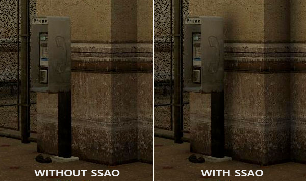
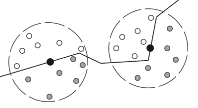
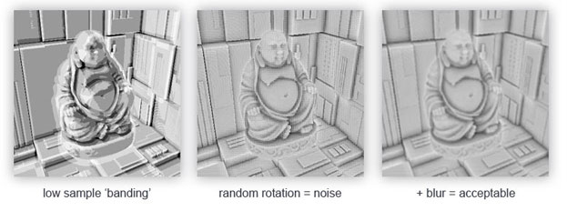
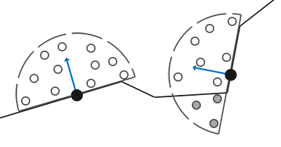
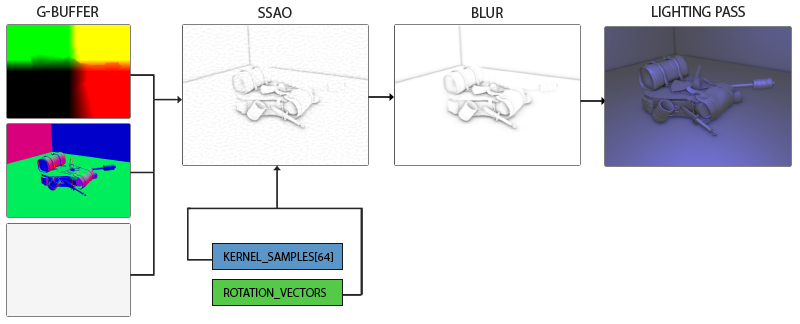
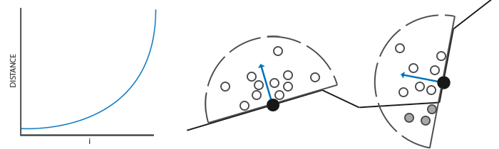

### OpenGL实现SSAO

---

环境光照是我们在场景中增加的固定的光线常数，用于模拟光线的散射。在现实中，光线以各种不同的方向和强度散射，所以场景的间接照亮部分也应该有不同的强度。有一个被称为Ambient Occlusion的间接光照模拟，通过暗化折缝、孔洞、彼此靠近的表面来近似地模拟光照。下图是一组有无Ambient Occlusion的对比图：



环境光遮蔽的技术通常来说是比较消耗性能的，因为它需要考量附近的几何体。我们可以为空间中的每个点发射大量的射线，来判断遮蔽的情况，但是这在实时渲染中是不可行的。Crytek引入了SSAO的技术，它使用屏幕空间中的场景深度信息来判断遮蔽，而非真实的几何体数据。

SSAO的原理很简单：对于screen quad的每个片段，根据它周围的深度值，计算得到一个**occlusion factor**，这个值用来减少或者取消片段的环境光。在片段周围的一个球形sampler kernel中取多个深度样本，并将每个样本与当前片段的深度值进行比较，得到occlusion factor。深度值高于片元深度的样本数量代表了遮挡因子



在几何体内，灰色的depth sample会参与计算occlusion factor，我们得到的采样越多，片段得到的环境光越少。

显然，SSAO的效果与精度与采样点的数量有直接关系。采样点数量过少则可能会导致效果不够真实，采样点过多则会带来性能压力。我们可以为sampler kernel引入一些随机值，通过随机旋转每个片段的sampler kernel，这样一来，我们可以大量减少采样点的数量。但是随机性也会带来明显的噪点，所以我们还需要通过blur来降低噪点。



可以看到，再引入噪声之后，banding效果明显消失了

只不过，Crytek开发的SSAO方法具有一种特定的视觉样式。由于使用的样本核是球体，它导致平坦的墙看起来呈灰色，因为一半的核样本都在周围的几何体中。下面是一张Crysis的屏幕空间环境光遮蔽的图像，清楚地展示了这种灰色的感觉


因此，我们不会使用球形sampler kernel，而是使用沿着表面的法向量为朝向的半球形sample kernel：



---

要实现SSAO，我们在fragment shader中需要如下信息：

- per-fragment position
- per-fragment normal
- per-fragment albedo
- sample kernel
- per-fragment random rotation

使用per-fragment的观察空间位置，我们可以沿着观空间下的表面法线方向，取一个半球形的sample kernel，并使用这个kernel在position buffer texture上进行不同偏移量的采样。对于每个per-fragment kernel样本，我们将其深度与位置缓冲中的深度进行比较，以确定遮蔽的程度。得到的遮蔽因子随后被用来限制最终的环境光照分量。同时，通过包含per-fragment旋转向量，我们可以显著降低需要采样的样本数量，这一点我们将在后文看到



SSAO所需要的信息也是我们在延迟渲染中需要存储的信息，所有我们将在延迟渲染的基础上实现SSAO，G-buffer Pass中的片段着色器也很简单：

```glsl
#version 330 core
layout (location = 0) out vec3 gPosition;
layout (location = 1) out vec3 gNormal;
layout (location = 2) out vec4 gAlbedoSpec;

in vec2 TexCoords;
in vec3 FragPos;
in vec3 Normal;

void main()
{
	gPosition = FragPos;
	gNormal = normalize(Normal);
	// diffuse per-fragment color, ignore specular
	gAlbedoSpec.rgb = vec3(0.95);
}
```

因为SSAO是屏幕空间的操作，其中的遮挡关系是根据可见的视图计算出来的，我们在观察空间中进行计算比较合理。这样一来，`FragPos`与`Normal`也由G-Buffer Pass中的顶点着色器转换到观察空间

我们举例看看`gPosition`color buffer texture是怎样创建并配置的：

```c++
glGenTextures(1, &gPosition);
glBindTexture(GL_TEXTURE_2D, gPosition);
glTexImage2D(GL_TEXTURE_2D, 0, GL_RGBA16F, SCR_WIDTH, SCR_HEIGHT, 0, GL_RGBA, GL_FLOAT, nullptr);
glTexParameteri(GL_TEXTURE_2D, GL_TEXTURE_MIN_FILTER, GL_NEAREST);
glTexParameteri(GL_TEXTURE_2D, GL_TEXTURE_MAG_FILTER, GL_NEAREST);
glTexParameteri(GL_TEXTURE_2D, GL_TEXTURE_WRAP_S, GL_CLAMP_TO_EDGE);
glTexParameteri(GL_TEXTURE_2D, GL_TEXTURE_WRAP_T, GL_CLAMP_TO_EDGE);  
```

接下来，我们就需要半球的sample kernel了

---

我们需要生成一定数量的samples，它们组成的半球朝向表面法线的方向，按照我们的经验，在切线空间中进行是最合适的。假设半球中有64个sample

```c++
std::uniform_real_distribution<float> randomFloats(0.0, 1.0) // random floats between [0.0, 1.0]
std::default_random_engine generator;
std::vector<glm::vec3> ssaoKernel;
for (unsigned int i = 0; i < 64; i++)
{
	glm::vec3 sample
	(
        randomFloats(generator) * 2.0 - 1.0,
        randomFloats(generator) * 2.0 - 1.0
        randomFloats(generator)
    );
    sample = glm::normalize(sample)
    sample *= randomFloats(generator);
    ssaoKernel.push_back(sample);
}
```

因为我们要创建一个半球形sample kernel，所有x和y分量的范围是[-1.0, 1.0]，z分量的范围是[0.0, 1.0]。

当前，我们创建的sample都是随机分布在sampler kernel中的，但我们更希望对接近实际片段的遮挡放置更大的权重。我们希望在原点附近分布更多的kernel样本。我们可以通过一个加速的插值函数来实现这个目标：

```c++
float scale = (float)i / 64.0;
scale = lerp(0.1f, 1.0f, scale * scale);
sample *= scale;
ssaoKernel.push_back(sample);
```

它对sample分布的影响如图所示：



现在，我们要在这个基础上，引入一些semi-random旋转，从而大大减少所需的sample数量，优化性能。

---

