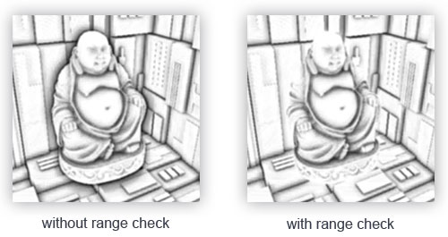
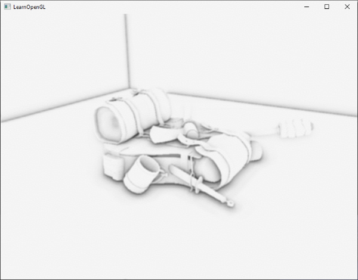

### OpenGL实现SSAO

---

环境光照是我们在场景中增加的固定的光线常数，用于模拟光线的散射。在现实中，光线以各种不同的方向和强度散射，所以场景的间接照亮部分也应该有不同的强度。有一个被称为Ambient Occlusion的间接光照模拟，通过暗化折缝、孔洞、彼此靠近的表面来近似地模拟光照。下图是一组有无Ambient Occlusion的对比图：


环境光遮蔽的技术通常来说是比较消耗性能的，因为它需要考量附近的几何体。我们可以为空间中的每个点发射大量的射线，来判断遮蔽的情况，但是这在实时渲染中是不可行的。Crytek引入了SSAO的技术，它使用屏幕空间中的场景深度信息来判断遮蔽，而非真实的几何体数据。

SSAO的原理很简单：对于screen quad的每个片段，根据它周围的深度值，计算得到一个**occlusion factor**，这个值用来减少或者取消片段的环境光。在片段周围的一个球形sampler kernel中取多个深度样本，并将每个样本与当前片段的深度值进行比较，得到occlusion factor。深度值高于片元深度的样本数量代表了遮挡因子


在几何体内，灰色的depth sample会参与计算occlusion factor，我们得到的采样越多，片段得到的环境光越少。

显然，SSAO的效果与精度与采样点的数量有直接关系。采样点数量过少则可能会导致效果不够真实，采样点过多则会带来性能压力。我们可以为sampler kernel引入一些随机值，通过随机旋转每个片段的sampler kernel，这样一来，我们可以大量减少采样点的数量。但是随机性也会带来明显的噪点，所以我们还需要通过blur来降低噪点。


可以看到，再引入噪声之后，banding效果明显消失了

只不过，Crytek开发的SSAO方法具有一种特定的视觉样式。由于使用的样本核是球体，它导致平坦的墙看起来呈灰色，因为一半的核样本都在周围的几何体中。下面是一张Crysis的屏幕空间环境光遮蔽的图像，清楚地展示了这种灰色的感觉


因此，我们不会使用球形sampler kernel，而是使用沿着表面的法向量为朝向的半球形sample kernel：


---

要实现SSAO，我们在fragment shader中需要如下信息：

- per-fragment position
- per-fragment normal
- per-fragment albedo
- sample kernel
- per-fragment random rotation

使用per-fragment的观察空间位置，我们可以沿着观空间下的表面法线方向，取一个半球形的sample kernel，并使用这个kernel在position buffer texture上进行不同偏移量的采样。对于每个per-fragment kernel样本，我们将其深度与位置缓冲中的深度进行比较，以确定遮蔽的程度。得到的遮蔽因子随后被用来限制最终的环境光照分量。同时，通过包含per-fragment旋转向量，我们可以显著降低需要采样的样本数量，这一点我们将在后文看到


SSAO所需要的信息也是我们在延迟渲染中需要存储的信息，所有我们将在延迟渲染的基础上实现SSAO，G-buffer Pass中的片段着色器也很简单：

```glsl
#version 330 core
layout (location = 0) out vec3 gPosition;
layout (location = 1) out vec3 gNormal;
layout (location = 2) out vec4 gAlbedoSpec;

in vec2 TexCoords;
in vec3 FragPos;
in vec3 Normal;

void main()
{
	gPosition = FragPos;
	gNormal = normalize(Normal);
	// diffuse per-fragment color, ignore specular
	gAlbedoSpec.rgb = vec3(0.95);
}
```

因为SSAO是屏幕空间的操作，其中的遮挡关系是根据可见的视图计算出来的，我们在观察空间中进行计算比较合理。这样一来，`FragPos`与`Normal`也由G-Buffer Pass中的顶点着色器转换到观察空间

我们举例看看`gPosition`color buffer texture是怎样创建并配置的：

```c++
glGenTextures(1, &gPosition);
glBindTexture(GL_TEXTURE_2D, gPosition);
glTexImage2D(GL_TEXTURE_2D, 0, GL_RGBA16F, SCR_WIDTH, SCR_HEIGHT, 0, GL_RGBA, GL_FLOAT, nullptr);
glTexParameteri(GL_TEXTURE_2D, GL_TEXTURE_MIN_FILTER, GL_NEAREST);
glTexParameteri(GL_TEXTURE_2D, GL_TEXTURE_MAG_FILTER, GL_NEAREST);
glTexParameteri(GL_TEXTURE_2D, GL_TEXTURE_WRAP_S, GL_CLAMP_TO_EDGE);
glTexParameteri(GL_TEXTURE_2D, GL_TEXTURE_WRAP_T, GL_CLAMP_TO_EDGE);  
```

接下来，我们就需要半球的sample kernel了

---

我们需要生成一定数量的samples，它们组成的半球朝向表面法线的方向，按照我们的经验，在切线空间中进行是最合适的。假设半球中有64个sample

```c++
std::uniform_real_distribution<float> randomFloats(0.0, 1.0) // random floats between [0.0, 1.0]
std::default_random_engine generator;
std::vector<glm::vec3> ssaoKernel;
for (unsigned int i = 0; i < 64; i++)
{
	glm::vec3 sample
	(
        randomFloats(generator) * 2.0 - 1.0,
        randomFloats(generator) * 2.0 - 1.0
        randomFloats(generator)
    );
    sample = glm::normalize(sample)
    sample *= randomFloats(generator);
    ssaoKernel.push_back(sample);
}
```

因为我们要创建一个半球形sample kernel，所有x和y分量的范围是[-1.0, 1.0]，z分量的范围是[0.0, 1.0]。

当前，我们创建的sample都是随机分布在sampler kernel中的，但我们更希望对接近实际片段的遮挡放置更大的权重。我们希望在原点附近分布更多的kernel样本。我们可以通过一个加速的插值函数来实现这个目标：

```c++
float scale = (float)i / 64.0;
scale = lerp(0.1f, 1.0f, scale * scale);
sample *= scale;
ssaoKernel.push_back(sample);
```

它对sample分布的影响如图所示：


现在，我们要在这个基础上，引入一些semi-random旋转，从而大大减少所需的sample数量，优化性能。

---

首先，我们创建一个4x4的数组来包含随机旋转值，请留意，这些代表旋转的向量是朝向切线空间中法线方向的：

```c++
std::vector<glm::vec3> ssaoNoise;
for (unsigned int i = 0; i < 16; i++)
{
	glm::vec3 noise
	(
		randomFloats(generator) * 2.0 - 1.0,
		randomFloats(generator) * 2.0 - 1.0,
		0.0f
	);
	ssaoNoise.push_back(noise);
}
```

我们将随机的旋转值存储在一个4x4大小的纹理之中，并确保我们将wrapping mode设置为`GL_REPEAT`

```c++
unsigned int noiseTexture;
glGenTextures(1, &noiseTexture);
glBindTexture(GL_TEXTURE_2D, noiseTexture);
glTexImage2D(GL_TEXTURE_2D, 0, GL_RGBA16F, 4, 4, 0, GL_RGB, GL_FLOAT, &ssaoNoise[0]);
glTexParameteri(GL_TEXTURE_2D, GL_TEXTURE_MIN_FILTER, GL_NEAREST);
glTexParameteri(GL_TEXTURE_2D, GL_TEXTURE_MAG_FILTER, GL_NEAREST);
glTexParameteri(GL_TEXTURE_2D, GL_TEXTURE_WRAP_S, GL_REPEAT);
glTexParameteri(GL_TEXTURE_2D, GL_TEXTURE_WRAP_T, GL_REPEAT);  
```

这样一来，我们就准备好了SSAO需要的所有输入信息了

---

SSAO的shader是为了绘制一个screen-quad，为这个quad的每一个片段计算遮蔽值。因为我们要存储SSAO的结果，并用在后续的lighting pass中，所以我们还需要创建一个新的frame buffer object：

```c++
unsigned int ssaoFBO;
glGenFramebuffer(1, &ssaoFBO);
glBindFramebuffer(GL_FRAMEBUFFER, ssaoFBO);

unsigned int ssaoColorBuffer;
glGenTextures(1, &ssaoColorBuffer);
glBindTexture(GL_TEXTURE_2D, ssaoColorBuffer);
glTexImage2D(GL_TEXTURE_2D, 0, GL_RED, SCR_WIDTH, SCR_HEIGHT, 0, GL_RED, GL_FLOAT, NULL);
glTexParameteri(GL_TEXTURE_2D, GL_TEXTURE_MIN_FILTER, GL_NEAREST);
glTexParameteri(GL_TEXTURE_2D, GL_TEXTURE_MAG_FILTER, GL_NEAREST);
```

因为环境光遮蔽的结果是一个单纯的灰度值，我们需要将其存储在纹理的r通道即可。

绘制SSAO的伪代码是这样的：

```c++
// geometry pass: render stuff into G-buffer
glBindFramebuffer(GL_FRAMEBUFFER, gBuffer);
[...]
glBindFramebuffer(GL_FRAMEBUFFER, 0);  

// use G-buffer to render SSAO texture
glBindFramebuffer(GL_FRAMEBUFFER, ssaoFBO);
glClear(GL_COLOR_BUFFER_BIT);    
glActiveTexture(GL_TEXTURE0);
glBindTexture(GL_TEXTURE_2D, gPosition);
glActiveTexture(GL_TEXTURE1);
glBindTexture(GL_TEXTURE_2D, gNormal);
glActiveTexture(GL_TEXTURE2);
glBindTexture(GL_TEXTURE_2D, noiseTexture);
shaderSSAO.use();
SendKernelSamplesToShader();
shaderSSAO.setMat4("projection", projection);
RenderQuad();
glBindFramebuffer(GL_FRAMEBUFFER, 0);

// lighting pass: render scene lighting
glClear(GL_COLOR_BUFFER_BIT | GL_DEPTH_BUFFER_BIT);
shaderLightingPass.use();
[...]
glActiveTexture(GL_TEXTURE3);
glBindTexture(GL_TEXTURE_2D, ssaoColorBuffer);
[...]
RenderQuad();  
```

我们需要将相关的G-buffer纹理、噪声纹理、kernel samples传递给SSAO的fragment shader：

```glsl
#version 330 core
out float FragColor;

in vec2 TexCoords;

uniform sampler2D gPosition;
uniform sampler2D gNormal;
uniform sampler2D texNoise;

uniform vec3 sampler[64];
uniform mat4 projection;

// tile noise texture over screen, based on screen dimensions divided by noise size
const vec2 noiseScale = vec2(800.0 / 4.0, 600.0 / 4.0);

void main()
{
	[...]
}
```

我们希望噪声纹理能够平铺整个屏幕，但是screen quad的`TexCoords`的范围在[0, 1]，是不足以平铺的。所以我们计算出`noiseScale`这个变量。

接下来对纹理进行采样：

```glsl
vec3 fragPos   = texture(gPosition, TexCoords).xyz;
vec3 normal    = texture(gNormal, TexCoords).rgb;
vec3 randomVec = texture(texNoise, TexCoords * noiseScale).xyz;  
```

前面我们提到过，我们要在观察空间下进行SSAO的计算，但是我们获得的变量都是在切线空间下的，我们需要创建一个TBN矩阵：

```
vec3 tangent = normalize(randomVec - normal * dot (randomVec, normal));
vec3 bitangent = cross(normal, tangent);
mat3 TBN = mat3(tangent, bitangent, normal);
```

现在，我们可以对每一个kernel sample循环了，将sample从切线空间转换到观察空间，将它与当前片段的位置相加，将片段的深度值与depth buffer中的值比较。我们一步步分析完成这些工作的代码：

```glsl
float occlusion = 0.0;
for (int i = 0; i < kernelSize; i++)
{
	// get sampler position
	vec3 samplePos = TBN * sample[i]; // from tangent to view-space
	samplePos = fragPos + samplePos * radius;
	
	[...]
}
```

接下来我们将sample变换到屏幕空间，然后我们就可以获取sample对应的position/depth值了：

```glsl
vec4 offset = vec4(samplePos, 1.0);
offset = projection * offset; // from view to clip space
offset.xyz /= offset.w;
offset.xyz = offset.xyz * 0.5 + 0.5;
```

我们用offset采样给Position：

```glsl
float sampleDepth = texture(gPosition, offset.xy).z; 
```

我们将得到的采样值与存储的深度值比较：

```glsl
occlusion += (samplerDepth >= samplePos.z + bias ? 1.0 : 0.0);
```

我们添加了一个bias来帮助消除SSAO中的acne

我们还并没有完成SSAO的算法，仍有一些小问题我们没有解决。当一个片段处于表面的边缘时，算法会将片段后面的表面的深度值纳入计算，从而会导致错误的AO贡献值，所以我们要引入range check这个概念。下图为我们展示了引入range check后解决的问题，主要体现在佛像的边缘：



我们引入range check的目的是，只有当一个片的深度值在sample radius的范围内时，才会对AO有贡献值，代码上我们这样修改：

```glsl
float rangeCheck = smoothstep(0.0, 1.0, radius / abs(fragPos.z - sampleDepth));
occlusion += (sampleDepth >= samplePos.z + bias ? 1.0 : 0.0) * rangeCheck;
```

最后一步，我们要根据kernel size取平均值，并且提前计算`oneMinus`，后续我们在lighting pass中就可以直接乘上ambient了

```
occlusion = 1.0 - (occlusion / kernelSize);
FragColor = occlusion;
```

我们现在已经能得到SSAO的效果了：



只是噪点纹理的重复模式清晰可见。为了创建平滑的SSAO结果，我们需要模糊环境光遮蔽纹理

---

在SSAO pass和lighting pass之间，我们要模糊SSAO的纹理，让我们创建一个新的framebuffer object：

```c++
unsigned int ssaoBlurFBO, ssaoColorBufferBlur;
glGenFramebuffers(1, &ssaoBlurFBO);
glBindFramebuffer(GL_FRAMEBUFFER, ssaoBlurFBO);
glGenTextures(1, &ssaoColorBufferBlur);
glBindTexture(GL_TEXTURE_2D, ssaoColorBufferBlur);
glTexImage2D(GL_TEXTURE_2D, 0, GL_RED, SCR_WIDTH, SCR_HEIGHT, 0, GL_RED, GL_FLOAT, NULL);
glTexParameteri(GL_TEXTURE_2D, GL_TEXTURE_MIN_FILTER, GL_NEAREST);
glTexParameteri(GL_TEXTURE_2D, GL_TEXTURE_MAG_FILTER, GL_NEAREST);
glFramebufferTexture2D(GL_FRAMEBUFFER, GL_COLOR_ATTACHMENT0, GL_TEXTURE_2D, ssaoColorBufferBlur, 0);
```

blur shader也比较简单：

```glsl
#version 330 core
out float FragColor;

in vec2 TexCoords;

uniform sampler2D ssaoInput;

void main() {
    vec2 texelSize = 1.0 / vec2(textureSize(ssaoInput, 0));
    float result = 0.0;
    for (int x = -2; x < 2; ++x) 
    {
        for (int y = -2; y < 2; ++y) 
        {
            vec2 offset = vec2(float(x), float(y)) * texelSize;
            result += texture(ssaoInput, TexCoords + offset).r;
        }
    }
    FragColor = result / (4.0 * 4.0);
}  
```

---

最后lighting pass就不再赘述了，很简单
