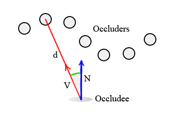

## SSAO的实现

当光线穿过场景并在物体表面反弹时，有些地方被光线照射到的几率较小，比如角落、物体之间的狭小缝隙、折痕等。这就导致这些区域比周围环境更暗。这种效果称为环境遮蔽（AO），模拟场景中这些变暗的区域的通常方法是测试每个表面被其他表面 "遮蔽 "或 "阻挡光线 "的程度。

SSAO最早由 Crytek 公司在其 "孤岛危机 "系列游戏中使用。

### Prerequisites

Crytek 最初的实现方式是将depth buffer作为输入，工作原理大致如下：对于depth buffer中的每个像素，在其周围的三维空间中采样几个点，将其投射回屏幕空间，然后比较采样的深度和depth buffer中该位置的深度，以确定采样是在表面的前面（无遮挡）还是后面（碰到遮挡物体）。

occlusion buffer是通过平均遮挡样本到深度缓冲区的距离来生成的。但这种方法存在一些问题（比如自遮挡、光晕），本文在后面会加以说明。本文现在介绍的算法是在 2D 环境中进行所有计算，所以暂时不需要考虑投影(Projection)。它使用每个像素的位置和normal buffer，因此如果使用延迟渲染，就已经完成了一半的工作。

### Algorithm

给定场景中的任何一个像素，将所有相邻像素视为小球体，并将它们的贡献相加，就可以计算出它的环境遮挡。为了简化操作，我们将用点来代替球体：遮挡者只是没有方向的点，而被遮挡者（接受遮挡的像素）将是一对。那么，每个遮挡物的遮挡贡献取决于两个因素：

- 与被遮挡物之间的距离**d**
- 被遮挡物的法线向量**n**与遮挡物和被遮挡物连接的向量**v**之间的夹角

根据这两个因素，一个计算遮蔽的简单公式为
$$
Occlusion = saturate(dot(n, v)) * (1.0/(1.0+d))
$$
这个公式可以分为两项，前一项基于一个很直观的想法，就是遮挡物正上方的点对被遮挡物具有最大的贡献值。第二项则是让遮蔽程度随着距离的增加而线性衰减。当然也可以使用二次方的衰减，这取决于开发者。

这个算法非常简单：对当前像素的几个邻近像素进行采样，然后利用上述公式累计它们对遮蔽的贡献值

为了获取遮蔽值，我们可以使用 4 个样本（<1,0>,<-1,0>,<0,1>,<0,-1>），分别以 45* 和 90* 的角度旋转，并使用随机法线纹理进行反射。可以使用一些技巧来加快计算速度：可以使用half-sized位置缓冲区和法线缓冲区，也可以根据需要对生成的 SSAO 缓冲区应用双侧模糊来隐藏采样伪影。请注意，这两种技术可以应用于任何 SSAO 算法。以下是基于这个算法的HLSL代码

