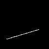

### Lesson 1：Bresenham's Line Drawing Algorithm

---

#### First Attempt

Lesson 1的目标是绘制出线组成的网格体。为了实现这个目标，我们首先应该了解如何绘制出一条线段。Bresenham给出了一个算法，可以绘制连接(x0, y0)和(x1, y1)两个点的线段

```c++
void line(int x0, int y0, int x1, int y1, TGAImage &image, const TGAColor& color)
{
    for (float t = 0.; t < 1.; t += .01)
    {
        int x = x0 + (x1 - x0) * t;
        int y = y0 + (y1 - y0) * t;
        image.set(x, y, color);
    }
}
```



---

#### Second Attempt

上面这段代码，除了性能不好以外，步进常量的选择也是一个问题，当步进常数设置为0.1时，线段就会变成一些在同一条直线上的点。

与其使用固定的步进值，我们使用一个所谓的*必要*步进值，也就是需要绘制的像素的数量。最简单的代码如下（虽然有一些错误）

```c++
void line(int x0, int y0, int x1, int y1, TGAImage &image, TGAColor color)
{
	for(int x = x0; x < x1; x++)
    {
        float t = (x - x0) / (float)(x1 - x0);
        int y = y0 * (1. - t) + y1 * t;
        image.set(x, y, color);
    }
}
```

不过为什么说这段代码是错误的呢？因为如果x0>x1, 那这段代码将不会绘制任何线段

我们的算法应该满足线段绘制的对称性，即(a, b)线段应该和(b, a)线段完全相同

---

#### Third Attempt

为了解决上面代码的问题，我们确保x0永远小于x1，同时我们也会一并修复当线段的高度大于宽度时，线段出现孔洞的情况

```c++
void line(int x0, int y0, int x1, int y1, TGAImage &image, TGAColor color)
{
    bool steep = false;
    if (abs(x0 - x1) < abs(y0 - y1))
    {
        // this line is too steep, shuold be transposed
        swap(x0, y0);
        swap(x1, y1);
        steep = true;
    }
    
    if (x0 > x1)
    {
        // make it left-to-right
        swap(x0, x1);
        swap(y0, y1);
    }
    
    for (int x = x0; x < x1; x++)
    {
        float t = (x - x0) / (float)(x1 - x0);
        int y = y0 * (1. - t) + y1 * t;
        if (steep)
            image.set(y, x, color);
        else
            image.set(x, y, color);
    }
}
```

---

#### Fourth Attempt

我们可以注意到，除法运算中的除数都是固定的，所有我们可以将它从循环中拿出来。

此外，让我们额外设置一个误差变量，它为我们提供了从当前像素到最佳直线的距离，如果误差值大于一个像素，我们就让y加1，反之亦然

```c++
void line(int x0, int y0, int x1, int y1, TGAImage &image, TGAColor color)
{
    bool steep = false;
    if (abs(x0 - x1) < abs(y0 - y1))
    {
        // this line is too steep, shuold be transposed
        swap(x0, y0);
        swap(x1, y1);
        steep = true;
    }
    
    if (x0 > x1)
    {
        // make it left-to-right
        swap(x0, x1);
        swap(y0, y1);
    }
    
    int dx = x1 - x0;
    int dy = y1- y0;
    float dError = abs(dy / float(dx));
    float error = 0;
    int y = y0;
    
    for (int x = x0; x < x1; x++)
    {
        if (steep)
        {
            image.set(y, x, color);
        }
        else
        {
            image.set(x, y, color);
        }
        if (error > .5)
        {
            y += y1 > y0 ? 1 : -1;
            error -= 1;
        }
    }
}
```

