### Baked Light

---

#### 1 Baking Static Light

我们已经实现了实时的光照计算，但是，光照计算也可以预先计算，然后存储在light map与light probe中。预先计算光照主要有两个目的，一是减少实时的计算量，二是添加无法实时计算的间接光照。后者是我们所说的全局光照的一部分，也就是并非直接来自光照的光，而是间接的通过环境、反射、以及自发光而来。

烘焙光照的缺点是它是静态的，无法在运行时更改，同时光照结果需要存储，增加了内存与储存的占用。

##### 1.1 Scene Lighting Settings

Unity中的每个场景对应一个独立的GI，烘培光照在*Mixed Lighting*中开启，同时我们设置*Lighting Mode*为*Baked Indirect*，代表我们将烘培所有静态间接光照。

*Lightmapping Settings*的大部分设置我们先使用默认值，*LightMap Resolution*降低至20， 同时关闭*Compress Lightmaps*，将*Directional Mode*设置为*Non-Directional*，另外我们使用*Progressive GPU*渲染。

> 如果将*Directional Mode*设置为*Directional*，方向性的数据也会被烘培，法线贴图就可以影响烘焙光照，但是我们还没有实现法线映射，所有暂时设置为*Non-Directional*

##### 1.2 Static Objects

搭建出一个场景用于烘焙光照的测试：

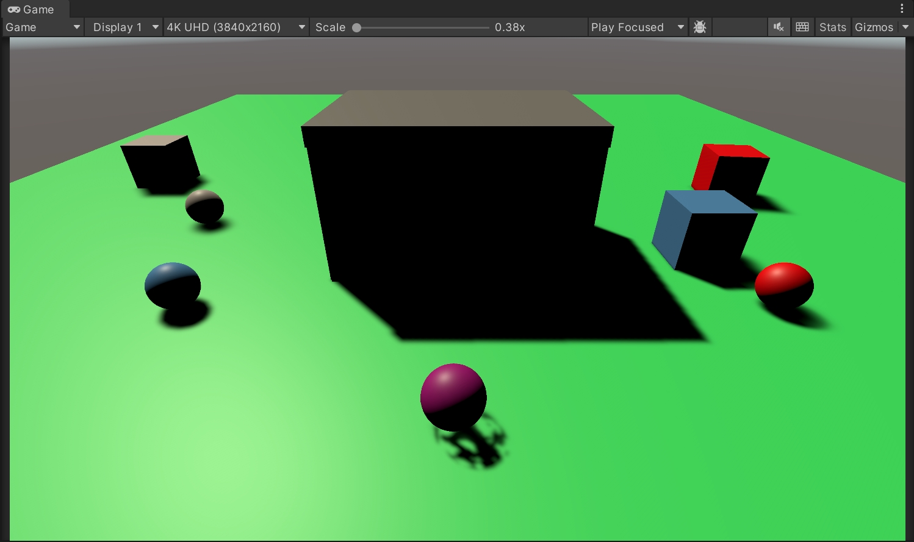

场景中只有一个光源：平行光。将平行光的*Mode*设置为*Mixed*，告诉Unity烘焙这个灯光的间接光照，并且不会影响它的实时光照。

我们要将地面和所有的cube（包含组成房屋的cube）都纳入烘培过程。选择这些物体的*MeshRenderer*，并启用*Contribute Global Illumination*。这一步会自动将这些物体的*Receive Global Illumination*切换至*Lightmaps*，代表这些物体会从lightmap中获取GI。我们得到的lightmap如下：

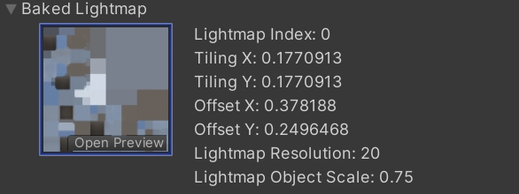

lightmap中并没有场景中的球体，因为这些球体是动态的，不会参与GI运算，它们需要依赖light probes，我们后面会接着探讨这个。

同时，如果我们将cube的*Receive Global Illumination*模式切换至*LightProbes*，那么这些cube也不会出现在lightmap上，但是仍然会贡献GI计算

##### 1.3 Fully-Baked Light

现在烘培的得到的光照主要是蓝色的，这主要是来自天空盒，light map中间较亮的部分是光线在墙壁与地面之间碰撞的结果。

我们也可以将所有的光照都烘焙进lightmap，将平行光的*Mode*设置为*Baked*，这样一来就没有实时光照了，但是由于直接光照的部分被作为间接光照烘焙进了lightmap，我们得到的lightmap会变得很亮。

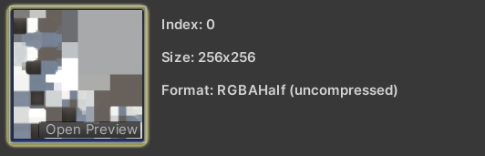

---

#### 2 Sample Baked Light

现在，场景中的物体变成了完全的黑色，这是因为没有实时光照了，但是我们的shader还没有GI的相关代码，所以接下来我们要在shader中采样lightmap

##### 2.1 Global Illumination

我们将GI相关的代码放在*ShaderLibrary/GI.hlsl*中。定义一个**GI **struct，以及**GetGI**函数来获取GI，暂时先输出`lightMapUV`用来debug。由于间接光照来自各个方向，所以我们只能用作漫反射光照。

```glsl
#ifndef CUSTOM_GI_INCLUDED
#define CUSTOM_GI_INCLUDED

struct GI
{
	float3 diffuse;
};

GI GetGI(float2 lightMapUV)
{
	GI gi;
	gi.diffuse = float3(lightMapUV, 0.0);
	return gi;
}
```

> Specular GI需要使用反射探针来实现，或者通过屏幕空间反射来实现

给GetLighting添加一个GI的参数，同样直接输出来debug

```glsl
float3 GetLighting (Surface surfaceWS, BRDF brdf, GI gi)
{
	ShadowData shadowData = GetShadowData(surfaceWS);
	float3 color = gi.diffuse;
	...
	return color;
}
```

将*GI.hlsl*包含进*LitPass*

```glsl
#include "../ShaderLibrary/GI.hlsl"
#include "../ShaderLibrary/Lighting.hlsl"
```

我们在`LitPassFragment`中获取`GI`，并初始化，传给`GetLighting`

```glsl
GI gi = GetGI(0.0);
float3 color = GetLighting(surface, brdf, gi);
```

##### 2.2 Light Map Coordinates

为了使用`lightMapUV`，Unity需要将`lightMapUV`传递给Shader。我们需要让管线对每个lightmapped的物体执行这个操作。完成这一步，我们需要设置**CameraRenderer**.`DrawVisibleGeometry`中drawing settings中的per-object data这是为**PerObjectData.**`Lightmaps`

```c#
var drawingSettings = new DrawingSettings(
	unlitShaderTagID, sortingSettings)
{
	enableDynamicBatching = useDynamicBatching.
	enableInstancing = useGPUInstancing,
	perObjectData = PerObjectData.Lightmaps
}
```

这样一来，Unity会渲染有*LIGHTMAP_ON*关键字的shader变体的lightmapped物体，所以，我们在*Lit* Shader中的*CustomLit* pass中添加这一关键字

```glsl
#pragram multi_compile _ _LIGHTMAP_ON
```

lightmap的UV坐标属于vertex data的一部分，我们需要将其从**Attributes**中传递到**Varyings**中，从而在`LitPassFragment`中使用。但是，我们希望只有使用到lightmap时才会进行这个操作，所以我们可以通过宏：`GI_ATTRIBUTE_DATA` `GI_VARYINGS_DATA` `TRANSFER_GI_DATA`来实现

```glsl
struct Attributes
{
	...
	GI_ATTRIBUTE_DATA
	...
};

struct Varyings {
	...
	GI_VARYINGS_DATA
	...
};

Varyings LitPassVertex (Attributes input) {
	...
	TRANSFER_GI_DATA(input, output);
	...
}
```

GetGI函数所需要的参数，我们通过宏`GI_FRAGMENT_DATA`来实现

```glsl
GI gi = GetGI(GI_FRAGMENT_DATA(input));
```

当然了，这些宏并不是Unity提供给我们的，我们需要在*GI.hlsl*中自己定义出来。当*LIGHTMAP_ON*这个关键字启用时，这些宏对应真正的代码，否则这些宏可以直接定义为nothing

```glsl
#if defined(LIGHTMAP_ON)
	#define GI_ATTRIBUTE_DATA float2 lightMapUV : TEXCOORD1;
	#define GI_VARYINGS_DATA float2 lightMapUV : VAR_LIGHT_MAP_UV;
	#define TRANSFER_GI_DATA(input, output) output.lightMapUV = input.lightMapUV;
	#define GI_FRAGMENT_DATA(input) input.lightMapUV
#else
	#define GI_ATTRIBUTE_DATA
	#define GI_VARYINGS_DATA
	#define TRANSFER_GI_DATA(input, output)
	#define GI_FRAGMENT_DATA(input) 0.0
#endif
```

现在，我们可以看到场景中的静态烘焙物体显示的是它们的light map uv，动态物体仍然保持全黑的状态。

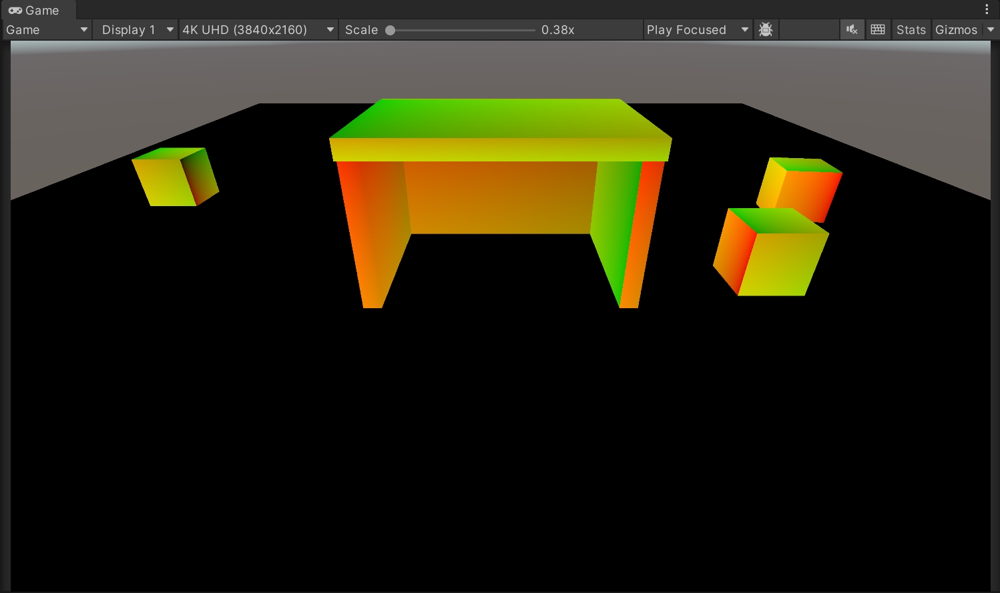

##### 2.3 Transformed Light Map Coordinates

light map的坐标通常要么是Unity自动为每个mesh生成，要么是导入的mesh数据中的一部分。我们需要添加光照贴图的uv变换的支持。因为光照贴图的uv坐标也需要传入GPU，所以我们将其添加进`UnityPerDraw`，需要留意的是，虽然`unityDynamicLightmapST`已经过时了，但是还是需要一并添加。

```glsl
CBUFFER_START(UnityPerDraw)
	float4x4 unity_ObjectToWorld;
	float4x4 unity_WorldToObject;
	float4 unity_LODFade;
	real4 unity_WorldTransformParams;

	float4 unity_LightmapST;
	float4 unity_DynamicLightmapST;
CBUFFER_END
```

同时还需要修改TRANSFER_GI_DATA这个宏。请留意，当宏的代码涉及多行时，需要添加下划线。

```
#define TRANSFER_GI_DATA(input, output) \
    output.lightMapUV = input.lightMapUV * \
    unity_LightmapST.xy + unity_LightmapST.zw;
```

下图是经过变换的lightmap

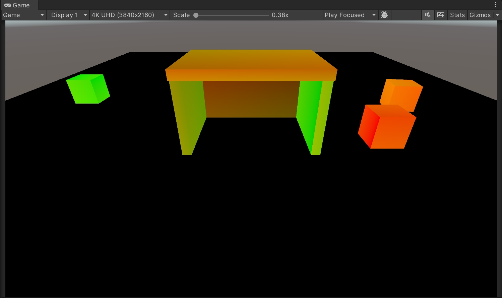

##### 2.4 Sampling the Light Map

Unity中的光照贴图在Shader中可以通过`unity_Lightmap`获取，我们需要引用EntityLighting.hlsl文件，这个文件包含了`unity_Lightmap`的声明和一些其他有用的函数

```glsl
#include "Packages/com.unity.render-pipelines.core/ShaderLibrary/EntityLighting.hlsl"

TEXTURE2D(unity_Lightmap);
SAMPLER(samplerunity_Lightmap);
```

我们创建一个`SampleLightMap`函数，当有lightmap存在时，我们调用`SampleSingleLightMap`，否则返回0。我们在`GetGI`中调用`SampleLightMap`，从而为漫反射赋值

```glsl
float3 SampleLightMap(float2 lightMapUV)
{
#if define(LIGHTMAP_ON)
	return SampleSingleLightmap(lightMapUV);
#else
	return 0.0;
#endif
}

GI GetGI(float2 lightMapUV)
{
	GI gi;
	gi.diffuse = SampleLightMap(lightMapUV);
	return gi;
}
```

实际上，`SampleSingleLightMap`还需要其他参数，首先需要传给它光照贴图和对应的采样器，我们通过`TEXTURE_ARGS`这个宏来完成这一步

```glsl
return SampleSingleLightmap(TEXTURE_ARGS(unity_Lightmap, samplerunity_Lightmap), lightMapUV);
```

其次，SampleSingleLightMap还想要应用光照贴图的缩放和平移，但是我们已经在UV中实现好了，所以这里就直接传给一个单位变换

```glsl
return SampleSingleLightmap(
	TEXTURE_ARGS(unity_Lightmap, samplerunity_Lightmap), 
	lightMapUV，
	float4(1.0, 1.0, 0.0, 0.0)
);
```

接下来是一个布尔值，用来表示光照贴图是否有压缩，这与*UNITY_LIGHTMAP_FULL_HDR*这个关键字有关。最后一个参数是一个`float4`，包含了光照贴图的解码方式

```glsl
return SampleSingleLightmap(
	TEXTURE_ARGS(unity_Lightmap, samplerunity_Lightmap), 
	lightMapUV，
	float4(1.0, 1.0, 0.0, 0.0),
#if defined(UNITY_LIGHTMAP_FULL_HDR)
	false,
#else
	true,
#endif
	float4(LIGHTMAP_HDR_MULTIPLIER, LIGHTMAP_HDR_EXPONENT, 0.0, 0.0)
);
```

现在我们已经可以得到采样结果了

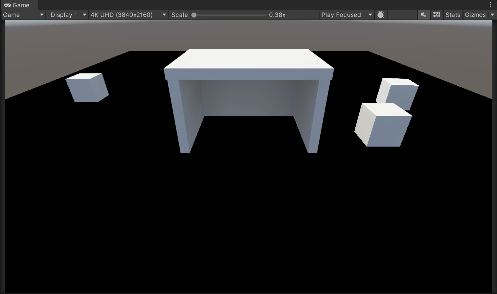

##### 2.5 Disabling Environment Lighting

可以看到烘焙光照现在处于一个很亮的状态，因为它同样包含了来自天空的间接光照。我们可以设置环境光的Itensity Multiplier为0，这样我们就专注于场景中的单个平行光了

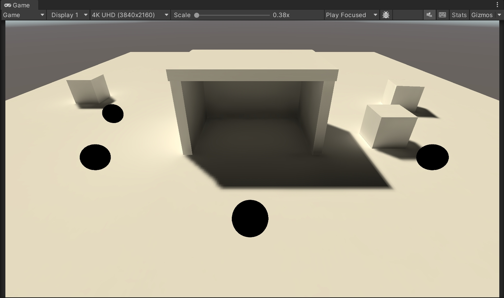

> 写到这里我才发现一直没把地板加入GI。。。

---

#### 3 Light Probes

场景中的动态物体并不会影响烘培GI，但是却可以通过光照探针受到GI的影响。光照探针是存在于场景中的一个点，它通过三阶多项式，尤其是L2球谐来烘培所有入射光。光照探针放置在场景周围，Unity 在每个对象之间进行插值，以得出其位置的最终光照近似值。

##### 3.1 Light Probe Group

如何在Unity的场景中创建光照探针就不说了。

场景中可以存在多个光照探针组。Unity会将所有探针组合在一起，然后创建一个四面体体积网格来链接它们。每个动态物体都会在这个四面体内部。四面体四个顶点上的光照探针会通过插值的方式，最终得出应用在动态物体上的光照。如果一个物体最终超出了探针覆盖的区域，则使用最近的三角形，因此照明可能会显得很奇怪

默认情况下，当选中一个动态物体时，Unity会为我们显示出影响该物体的探针和物体所在位置上的插值结果。


摆放光照探针的位置取决于场景。首先，动态物体的目标位置需要有光照探针。其次，光照探针也需要在光照改变的地方拜访。每个探针都是插值的一个端点。第三，不要将光照探针放在烘焙的几何体内部，这样的话探针就会变成黑色的。最后，光照探针的原理是插值，如果光照在墙的两面不一样，那就将探针尽可能地靠近两面墙放置，这样就不会有物体用的是墙两侧的光照的插值结果。

##### 3.2 Sampling Probes

插值的光照探针数据也需要针对每个物体来传递给GPU，这一步需要像lightmap一样，告知Unity。

```c#
perObjectData = PerObjectData.Lightmaps | PerObjectData.LightProbe
```

对应的，`UnityPerDraw`需要包含七个`float4`向量，代表了多项式的红绿蓝分量，这些向量都是以`unity_SH*`命名，其中的`*`是A、B或C。

```glsl
CBUFFER_START(UnityPerDraw)
	…

	float4 unity_SHAr;
	float4 unity_SHAg;
	float4 unity_SHAb;
	float4 unity_SHBr;
	float4 unity_SHBg;
	float4 unity_SHBb;
	float4 unity_SHC;
CBUFFER_END
```

我们创建一个新的函数`SampleLightProbe`，用来采样GI中的light probe。采样需要一个方向向量，所以我们传入世界空间下的surface结构体。

如果当前的物体使用了light map，`SampleLightProbe`就返回0，否则返回0和`SampleSH9`的最大值。SampleSH9接受probe data和法线向量作为参数，其中probe data由一个系数数组提供。

```
float3 SampleLightProbe(Surface surfaceWS)
{
#if defined(LIGHTMAP_ON)
	return 0.0;
#else
	float4 coefficients[7];
    coefficients[0] = unity_SHAr;
    coefficients[1] = unity_SHAg;
    coefficients[2] = unity_SHAb;
    coefficients[3] = unity_SHBr;
    coefficients[4] = unity_SHBg;
    coefficients[5] = unity_SHBb;
    coefficients[6] = unity_SHC;
    return max(0.0, SampleSH9(coefficients, surfaceWS.normal));
#endif
}
```

在`GetGI`中，我们需要传进surface，同时加入`SampleLightProbe`的计算结果

```
GI GetGI(float2 lightMapUV, Surface surfaceWS)
{
	GI gi;
	gi.diffuse = SampleLightMap(lightMapUV) + SampleLightProbe(surfaceWS);
	return gi;
}
```

最后，修改`LitPassFragment`中`GetGI`的调用，我就不写了。得到的结果是这样的：

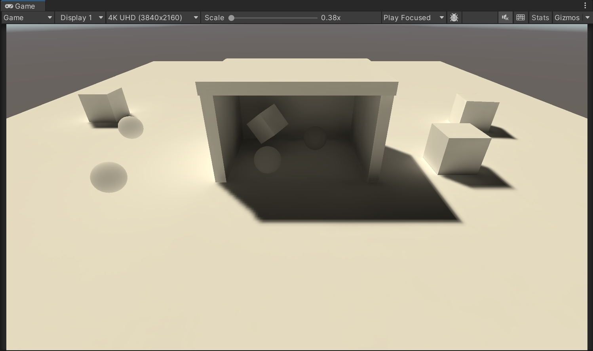

##### 3.3 Light Probe Proxy Volumes

对于较小的动态物体，光照探针的效果很好，因为光照探针的计算就是基于点的。但是对于一些较大的物体，效果可能会很差。比如，我们在场景中加入两个缩放的cube，因为它们所在的位置在一个较暗的区域内，然而采样就只是根据这个点而进行的，所以这两个cube整体都会很暗，显然效果是不对的。

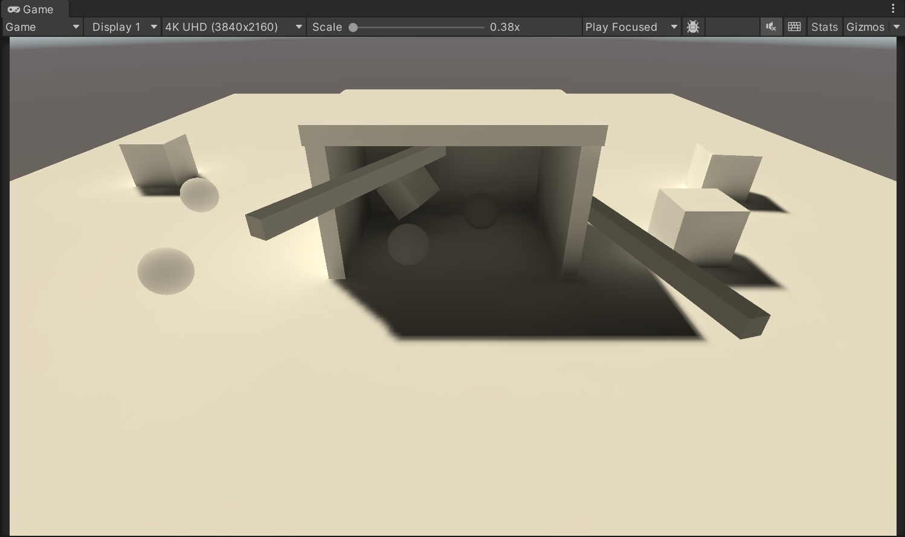

所以我们要使用light probe proxy volume，简称LPPV，使用方法是：给动态物体添加*LightProbeProxyVolume*组件，然后将*Light Prob*e模式设置为*Use Proxy Volume*，同时将`Resolusion Mode`设置为`Custom`

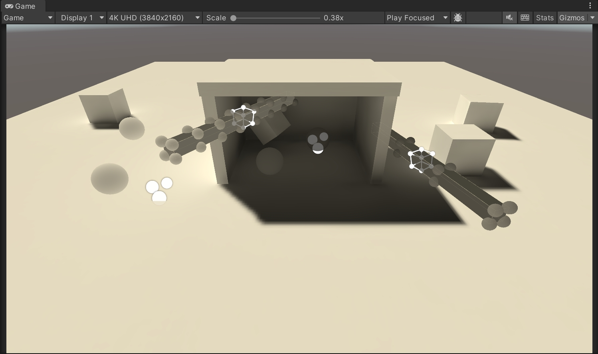

##### 3.4 Sampling LPPVs

LPPV也同样需要针对每个物体将数据传递给GPU，我们需要启用`PerObjectData.LightProbeProxyVolume`

```c#
perObjectData =
    PerObjectData.Lightmaps | PerObjectData.LightProbe |
    PerObjectData.LightProbeProxyVolume
```

对于UnityPerDraw，我们需要添加四个变量

```glsl
CBUFFER_START(UnityPerDraw)
	…

	float4 unity_ProbeVolumeParams;
	float4x4 unity_ProbeVolumeWorldToObject;
	float4 unity_ProbeVolumeSizeInv;
	float4 unity_ProbeVolumeMin;
CBUFFER_END
```

volume data存储在3D纹理`unity_ProbeVolumeSH`中，我们需要在GI.hlsl中声明纹理及其采样器。

```glsl
TEXTURE3D_FLOAT(unity_ProbeVolumeSH);
SAMPLER(samplerunity_ProbeVolumeSH);
```

我们使用`unity_ProbeVolumeParams`的x分量来判断当前使用的是LPPV还是插值的光照探针，如果判断为前者，我们通过`SampleProbeVolumeSH4`来采样volume。

```glsl
    if (unity_ProbeVolumeParams.x) {
        return SampleProbeVolumeSH4(
            TEXTURE3D_ARGS(unity_ProbeVolumeSH, samplerunity_ProbeVolumeSH),
            surfaceWS.position, surfaceWS.normal,
            unity_ProbeVolumeWorldToObject,
            unity_ProbeVolumeParams.y, unity_ProbeVolumeParams.z,
            unity_ProbeVolumeMin.xyz, unity_ProbeVolumeSizeInv.xyz
        );
    }
    else {
        float4 coefficients[7];
        coefficients[0] = unity_SHAr;
        coefficients[1] = unity_SHAg;
        coefficients[2] = unity_SHAb;
        coefficients[3] = unity_SHBr;
        coefficients[4] = unity_SHBg;
        coefficients[5] = unity_SHBb;
        coefficients[6] = unity_SHC;
        return max(0.0, SampleSH9(coefficients, surfaceWS.normal));
    }
```

可以看到修改的结果

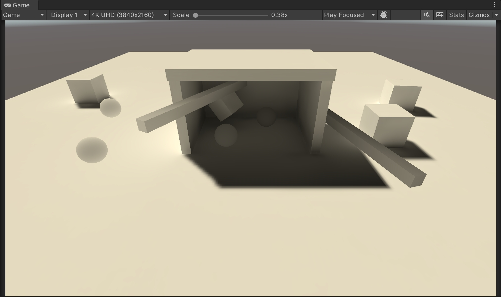

---

#### 4 Meta Pass

