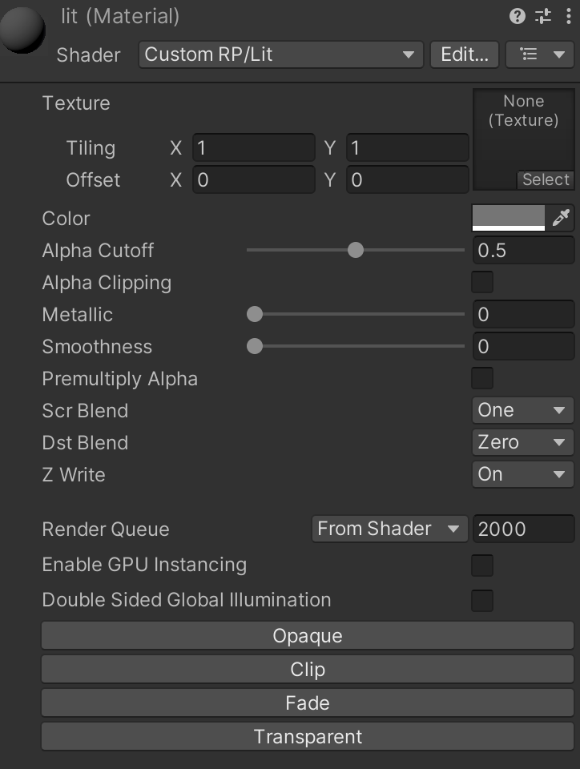

### Unity中的Shader GUI

在Unity中，一个Shader可以支持多种渲染模式，不同的渲染模式都需要特定的设置。使用Shader GUI可以预设各种配置，方便美术人员使用

#### Custom Shader GUI

对于需要使用Shader GUI的Shader，在它的main block的底部添加这样一行代码
```glsl
Shader "Custom RP/Lit"
{
	...
	CustomEditor "CustomShaderGUI"
}
```
<br>Unity会使用`CustomShaderGUI`类的实例来创建对应材质编辑器的GUI。我们需要把`CustomShaderGUI`这个脚本放在`Editor`文件夹中。这个类会继承自`ShaderGUI`，并且重载`OnGUI`方法

```c#
using UnityEditor;
using UnityEngine;

public class CustomShaderGUI : ShaderGUI
{
    public override void OnGUI(
      MaterialEditor materialEditor, MaterialProperty[] properties)
    {
        base.OnGUI(materialEditor, properties);
        editor = materialEditor;
        materials = materialEditor.targets;
        this.properties = properties;
    }
}
```

#### Setting Properties and Keywords

在脚本中，我们需要存储以下三个字段

- material editor
- 被编辑的材质的索引，可以用MaterialEditor的targets中获取
- Material Property 的数组

<br>在Unity中，多个使用相同Shader的材质是可以同时选中并修改参数的，我们的Shader GUI也会支持这个功能

```c#
private MaterialEditor editor;
private Object[] materials;
private MaterialProperty[] properties;

public override void OnGUI(
  MaterialEditor materialEditor, MaterialProperty[] properties)
{
    base.OnGUI(materialEditor, properties);
    editor = materialEditor;
    materials = materialEditor.targets;
    this.properties = properties;
}
```
<br>想设置一个材质属性，可以使用`ShaderGUI.FindProperties`方法从properties数组中获取这个属性，然后再用`floatValue`来修改，我们把这个功能封装为一个方法

```c#
private void SetProperty(string name, float value)
{
  	FindProperty(name, properties).floatValue = value;
}
```
<br>同样的，keyword的设置也可以封装起来

```c#
private void SetKeyword(string keyword, bool enabled)
{
    if (enabled)
    {
        foreach (Material material in materials)
        {
            material.EnableKeyword(keyword);
        }
    }
    else
    {
        foreach (Material material in materials)
        {
            material.DisableKeyword(keyword);
        }
    }
}
```
<br>对于[Toggle]类型的材质属性，我们使用这样的方法

```c#
private void SetProperty(string name, string keyword, bool value)
{
    SetProperty(name, value ? 1f : 0f);
    SetKeyword(keyword, value);
}
```
<br>有了这些方法，我们就可以先定义出一些材质设置的Setter

```c#
private bool Clipping
{
    set => SetProperty("_Clipping", "_CLIPPING", value);
}

private bool PremultiplyAlpha {
    set => SetProperty("_PremulAlpha", "_PREMULTIPLY_ALPHA", value);
}

private BlendMode SrcBlend {
    set => SetProperty("_SrcBlend", (float)value);
}

private BlendMode DstBlend {
    set => SetProperty("_DstBlend", (float)value);
}

private bool ZWrite {
    set => SetProperty("_ZWrite", value ? 1f : 0f);
}
```

<br>RenderQueue同样需要设置

```c#
private RenderQueue RenderQueue
{
    set
    {
        foreach (Material material in materials)
        {
            material.renderQueue = (int)value;
        }
    }
}
```

#### Preset Buttons

接下来我们为预设选项创建按钮。按钮的创建可以使用`GUILayout.Button`，因为有多个预设的存在，我们将其封装成一个方法

```c#
private bool PresetButton(string name)
{
    if (GUILayout.Button(name))
    {
        editor.RegisterPropertyChangeUndo(name);
        return true;
    }
    return false;
}
```
<br>现在，我们就可以为每一个预设创建单独的方法，修改对应的设置，就以Opaque为例

```c#
private void OpaquePreset()
{
    if (!PresetButton("Opaque")) return;
    Clipping = false;
    PremultiplyAlpha = false;
    SrcBlend = BlendMode.One;
    DstBlend = BlendMode.Zero;
    ZWrite = true;
    RenderQueue = RenderQueue.Geometry;
}
```
<br>我们在OnGUI中调用每个预设所使用的方法
```c#
public override void OnGUI (
  MaterialEditor materialEditor, MaterialProperty[] properties
) 
{
  …
  OpaquePreset();
  ClipPreset();
  FadePreset();
  TransparentPreset();
}
```
<br>我们预设的按钮们就会出现在材质面板上

#### 折叠预设按钮

如果使用预设按钮的频率不高，或者出于材质检查器的整洁美观，也可以选择收起这些按钮。具体的实现方式是使用`EditorGUILayout.Foldout`

```c#
private bool showPresets;

public override void OnGUI(
  MaterialEditor materialEditor, MaterialProperty[] properties)
{
		...
    
    EditorGUILayout.Space();
    showPresets = EditorGUILayout.Foldout(showPresets, "Presets", true);
    if (!showPresets) return;
    OpaquePreset();
    ClipPreset();
    FadePreset();
    TransparentPreset();
}
```

#### 最后附上源码

```c#
using UnityEditor;
using UnityEngine;
using UnityEngine.Rendering;

public class CustomShaderGUI : ShaderGUI
{
    private MaterialEditor editor;
    private Object[] materials;
    private MaterialProperty[] properties;

    private bool showPresets;
    
    public override void OnGUI(MaterialEditor materialEditor, MaterialProperty[] properties)
    {
        base.OnGUI(materialEditor, properties);
        editor = materialEditor;
        materials = materialEditor.targets;
        this.properties = properties;
        
        EditorGUILayout.Space();
        showPresets = EditorGUILayout.Foldout(showPresets, "Presets", true);
        if (!showPresets) return;
        OpaquePreset();
        ClipPreset();
        FadePreset();
        TransparentPreset();
    }

    private bool PresetButton(string name)
    {
        if (!GUILayout.Button(name)) return false;
        editor.RegisterPropertyChangeUndo(name);
        return true;
    }
    
    private void SetProperty(string name, float value)
    {
        FindProperty(name, properties).floatValue = value;
    }

    private void SetKeyword(string keyword, bool enabled)
    {
        if (enabled)
        {
            foreach (Material material in materials)
            {
                material.EnableKeyword(keyword);
            }
        }
        else
        {
            foreach (Material material in materials)
            {
                material.DisableKeyword(keyword);
            }
        }
    }

    private void SetProperty(string name, string keyword, bool value)
    {
        SetProperty(name, value ? 1f : 0f);
        SetKeyword(keyword, value);
    }
    
    private bool Clipping
    {
        set => SetProperty("_Clipping", "_CLIPPING", value);
    }
    
    private bool PremultiplyAlpha {
        set => SetProperty("_PremulAlpha", "_PREMULTIPLY_ALPHA", value);
    }

    private BlendMode SrcBlend {
        set => SetProperty("_SrcBlend", (float)value);
    }

    private BlendMode DstBlend {
        set => SetProperty("_DstBlend", (float)value);
    }

    private bool ZWrite {
        set => SetProperty("_ZWrite", value ? 1f : 0f);
    }

    private RenderQueue RenderQueue
    {
        set
        {
            foreach (Material material in materials)
            {
                material.renderQueue = (int)value;
            }
        }
    }

    private void OpaquePreset()
    {
        if (!PresetButton("Opaque")) return;
        Clipping = false;
        PremultiplyAlpha = false;
        SrcBlend = BlendMode.One;
        DstBlend = BlendMode.Zero;
        ZWrite = true;
        RenderQueue = RenderQueue.Geometry;
    }

    private void ClipPreset ()
    {
        if (!PresetButton("Clip")) return;
        Clipping = true;
        PremultiplyAlpha = false;
        SrcBlend = BlendMode.One;
        DstBlend = BlendMode.Zero;
        ZWrite = true;
        RenderQueue = RenderQueue.AlphaTest;
    }

    private void FadePreset ()
    {
        if (!PresetButton("Fade")) return;
        Clipping = false;
        PremultiplyAlpha = false;
        SrcBlend = BlendMode.SrcAlpha;
        DstBlend = BlendMode.OneMinusSrcAlpha;
        ZWrite = false;
        RenderQueue = RenderQueue.Transparent;
    }

    private void TransparentPreset ()
    {
        if (!PresetButton("Transparent")) return;
        Clipping = false;
        PremultiplyAlpha = true;
        SrcBlend = BlendMode.One;
        DstBlend = BlendMode.OneMinusSrcAlpha;
        ZWrite = false;
        RenderQueue = RenderQueue.Transparent;
    }
}

```

