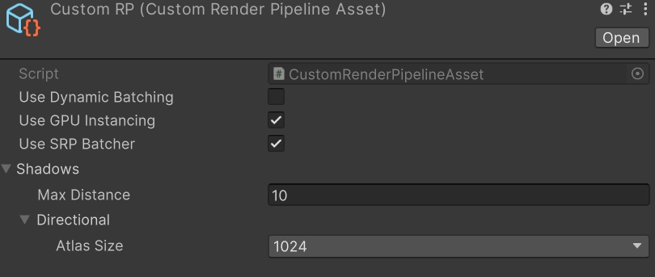
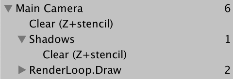

### SRP中的平行光阴影

这篇博客主要翻译自[Catlike的博客](https://catlikecoding.com/unity/tutorials/custom-srp/directional-shadows/)，我想试着从管线和Shader的角度全面地剖析Unity中阴影是如何绘制出来的。请注意，我们将直接考虑级联形式的阴影的实现。

<br>本篇博客中的代码不能保证正确，可能一个手抖就写错了，所以请参照原链接。

#### 1 Rendering Shadows

Unity基于ShadowMap实现了阴影的渲染，主要原理可以概括为：生成一个shadow map，存储了光线从光源出发，到照射到物体表面所经过的距离，在光线方向上，更远距离的任何物体都无法被相同的光线照亮。

##### Shadow Settings

在着手实现阴影之前，我们需要首先确定阴影的设置，这里主要包括两个方面：

- 渲染阴影的最大距离
- shadow map的分辨率

<br>我们当然可以在相机的可视范围内将阴影完全绘制出来，但是这可能需要我们提供一个分辨率很高很高的shadow map，在实时渲染中是不可行的。为了便于我们更改阴影的设置，我们可以创建一个可序列化的类来管理。

<br> 同时，因为Unity中不止平行光这一种形式的灯光，各个类型灯光的阴影的设置和实现方法存在区别，所以我们把平行光相关的设置单独放进一个结构体中。

```c#
// ShadowSettings Class
using UnityEngine

[System.Serializable]
public class ShadowSettings
{
    // 阴影距离
	[Min(0f)] public float maxDistance = 100f;
    
    // ShadowMap分辨率
    public enum TextureSize
    {
        _256 = 256, _512 = 512, _1024 = 1024,
		_2048 = 2048, _4096 = 4096, _8192 = 8192
    }
    
    // 平行光的阴影设置
    [System.Serializable]
    public struct Directional
    {
        public TextureSize atlasSize;
	}
    public Directional directional = new Directional {atlasSize = TextureSize._1024};
}
```

<br>接下来，为我们的SRP管线实例化阴影的设置。

```c#
// CustomRenderPipelineAsset Class
[SerializeField] private ShadowSettings shadows;
```

<br>完成之后，我们就可以像URP那样在Inspector面板中修改阴影的相关参数了，虽然目前比URP简陋了很多。

<br>不过目前我们的阴影设置还没有参与进管线，我们需要把shadow settings作为Custom RP Asset创建的参数之一，并进一步被传递给渲染每个相机时所调用的方法。本篇博客就暂且不展示这部分的代码了。

<br>SRP中，场景中的相机逐次渲染。每个相机渲染阴影时，不能只考虑全局范围内的阴影设置，还需要把相机的剔除和灯光的设置纳入考虑范围。比如说渲染阴影的距离应该从Max Distance和相机的远裁截面中选择较小的那个，每个灯光的阴影也有强弱、软硬之分。我们在`CameraRender.Render`中修改相应的代码，并把shadow settings也作为参数传入灯光的设置中。

```c#
// CameraRenderer Class
public void Render (
    ScriptableRenderContext context, Camera camera,
    bool useDynamicBatching, bool useGPUInstancing,
    ShadowSettings shadowSettings
) {
    …
    if (!Cull(shadowSettings.maxDistance)) {
        return;
    }

    Setup();
    lighting.Setup(context, cullingResults, shadowSettings);
    …
}

private bool Cull (float maxShadowDistance) {
    if (camera.TryGetCullingParameters(out ScriptableCullingParameters p)) {
        p.shadowDistance = Mathf.Min(maxShadowDistance, camera.farClipPlane);
        cullingResults = context.Cull(ref p);
        return true;
    }
    return false;
}
```
```c#
// Lighting Class
public void Setup (
    ScriptableRenderContext context, CullingResults cullingResults,
    ShadowSettings shadowSettings
) { … }
```

##### shadows类

虽然阴影的渲染可以视为灯光的一部分，但是因为阴影渲染本身也是一个复杂的过程，我们把相关的逻辑单独放在`shadows`类中。这个类和我们所定义的`Lighting`类有相似之处，除了ShadowSettings之外，我们需要context、cullingResults以及command buffer。

```c#
// Shadows Class
using UnityEngine;
using UnityEngine.Rendering;

public class Shadows
{
    private const string bufferName = "Shadows";
    private CommandBuffer buffer = new CommandBuffer {name = bufferName};
    
    private ScriptableRenderContext context;
    private CullingResults cullingResults;
    private ShadowSettings settings;
    
    public void Setup (
        ScriptableRenderContext context, 
    	CullingResults cullingResults，
    	ShadowSettings settings)
    {
        this.context = context;
        this.cullingResults = cullingResults;
        this.settings = settings;
    }
    
    private void ExecuteBuffer()
    {
        context.ExecuteCommandBuffer(buffer);
        buffer.Clear();
    }
}
```

<br>当然，这只是阴影渲染的开始，之后所有的逻辑都会在`Shadows`这个类中实现，`Lighting`类所需要的只是将阴影的绘制添加进它的渲染流程。

```c#
// Lighting Class
private Shadows shadows = new Shadows();

public void Setup(...)
{
    this.cullingResults = cullingResults;
    buffer.BeginSample(bufferName);
    shadows.Setup(context, cullingResults, shadowSettings);
    SetupLights();
}
```

##### Lights with Shadows

尽管我们的最终目标是实现多个平行光的阴影，不过让我们先从一个开始，也就是：假定场景中有且只有一个shadow-cast的灯光。但是这也会带来一个问题，到底是哪个灯光投影呢？不过我们定义一个结构体，并且用一个数组来管理这些结构体。目前，这个结构体只包含灯光在可见光数组中的索引。

```c#
// Shadows Class
private const int maxShadowedDirectionalLightCount = 1;

private struct ShadowedDirectionalLight
{
    public int visibleLightIndex;
}
private ShadowedDirectionalLight[] shadowedDirectionalLights = 
    new ShadowedDirectionalLight[maxShadowedDirectionalLightCount];
```

<br>现在，我们需要确定哪个灯光是需要投影的。为此，我们定义一个方法`ReserveDirectionalShadows()`，如果判断得到某个灯是投影的，我们把它加入我们的`ShadowedDirectionalLight[]`，并把它的索引一并存储。~~我们还会通过在阴影图集(shadow atlas)中为shadow map预留空间，并且存储渲染阴影所需要的信息。~~

<br>我们必须明确的是，如果判断一个灯光是需要投影的。目前，我们要考虑以下因素并在代码中实现

- 当前投影的灯光数量小于最大投影灯光数量
- 灯光的投影模式不能为none
- 灯光的阴影强度大于0
- 灯光如果只影响在Max Shadow Distance之外的物体，那这个灯光就没有阴影需要渲染。这需要我们在cullingResults中调用`GetShadowCasterBounds`来检测，它需要我们提供当前的可见光的索引

```c#
// Shadows Class
private int shadowedDirectionalLightCount;

public void Setup(...)
{
    ...
    shadowedDirectionalLightCount = 0; // 归零计数
}

public void ReserveDirectionalShadows(
    Light light, int visibleLightIndex)
{
    if (shadowedDirectionalLightCount < maxShadowedDirectionalLightCount && 
       light.shadows != LightShadows.None &&
       light.shadowStrength > 0f &&
       cullingResults.GetShadowCasterBounds(visibleLightIndex, out Bounds bounds))
    {
        shadowedDirectionalLights[shadowedDirectionalLightCount++] = 
            new ShadowedDirectionalLight {visibleLightIndex = visibleLightIndex};
    }
}
```

<br>如此一来，我们就可以在`Lighting`遍历灯光时插入这个方法了

```c#
// Lighting Class
private void SetupDirectionalLight (int index, ref VisibleLight visibleLight)
{
    dirLightColors[index] = visibleLight.finalColor;
    dirLightDirections[index] = -visibleLight.localToWorldMatrix.GetColumn(2);
    shadows.ReserveDirectionalShadows(visibleLight.light, index);
}
```

##### Creating the Shadow Atlas

完成了对灯光的筛选，就要着手实现阴影的绘制了。我们把相关逻辑放在一个单独的方法`Render()`中，并在`Lighting`类调用这个方法。但实际上`Render()`也只是一个入口，我们将平行光阴影的渲染委托给另一个方法`RenderDirectionalShadows()`，这里存放真正的阴影渲染逻辑。

```c#
// Lighting Class
shadows.Setup(context, cullingResults, shadowSettings);
SetupLights();
shadows.Render();
```

```c#
// Shadows Class
public void Render()
{
    if (shadowedDirectionalLightCount > 0)
    {
        RenderDirectionalShadows();
    }
}

private void RenderDirectionalShadows() {}
```
<br>阴影渲染的逻辑从创建shadow map开始，也就是把投影的物体绘制到一张纹理中，在级联阴影的前提下，我们把这个贴图命名为*_DirectionalShadowAtlas*，纹理的分辨率我们已经设置好了，余下的就是确认纹理的位深、格式、filterMode。**请注意，shadow map的纹理设置要考虑不同平台的要求。**<br>当然，既然我们创建了一个RenderTexture，也必然要考虑到RT的释放以及释放的时机。在我们的管线中，应该是在相机结束一次渲染时释放。<br>问题又来了，想CameraRenderer所写的释放RT的操作是不加逻辑判断的，所以我们必须考虑到如果场景没有阴影需要渲染，shadow map的RT没有创建的这种情况。同时，在一些较旧的图形API上，纹理和纹理采样器是绑定的，当shadow map RT没有被创建是，材质会使用默认贴图，也会使用shadow map的采样器，二者是不匹配的。为了避免以上种种情况，我们可以在不绘制阴影时创建一个dummy shadow map。

```c#
// Shadows Class
private int dirShadowAtlasID = Shader.PropertyToID("_DirectionalShadowAtlas");

public void Render()
{
    if (shadowedDirectionalLightCount > 0)
    {
        RenderDirectionalShadows();
    }
    else
    {
        buffer.GetTemporaryRT(dirShadowAtlasID, 1, 1, 
                              32, FilterMode.Bilinear, RenderTextureFormat.Shadowmap);
    }
}

private void RenderDirectionalShadows() 
{
    int atlasSize = (int)settings.directional.atlasSize;
    buffer.GetTemporaryRT(dirShadowAtlasID, atlasSize, atlasSize, 
                         32, FilterMode.Bilinear, RenderTextureFormat.Shadowmap);
}

public void Cleanup()
{
    buffer.ReleaseTemporaryRT(dirShadowAtlasID);
    ExecuteBuffer();
}
```

```c#
// Lighting Class
public void Cleanup()
{
    shadows.Cleanup();
}
```

```c#
// CameraRenderer Class
public void Render(...)
{
    ...
    lighting.Cleanup();
    Submit();
}
```

<br>在创建完shadow map RT后，我们必须命令GPU绘制到Render Target上，而不是camera target上，这一步我们可以通过`buffer.SetRenderTarget()`来实现。考虑到这个RT是实时clear的，并且需要RT来存储shadow data。<br>作为阴影渲染的Render Target，我们需要考虑到depth buffer的clear，颜色缓存在此时不重要

```c#
// Shadows Class
private void RenderDirectionalShadows() 
{
    buffer.GetTemporaryRT(...);
    buffer.SetRenderTarget(
        dirShadowAtlasID, 
        RenderBufferLoadAction.DontCare,
    	RenderBufferStoreAction.Store);
    buffer.ClearRenderTarget(true, false, Color.clear);
    ExecuteBuffer();
}
```

<br>此时，如果场景中有投影的平行光，就可以在frame debugger中看到阴影绘制的指令了

##### Shadows First

虽然可以看到Shadows的buffer已经生效了，但是为了不影响相机正常的渲染流程和结果，我们应该把阴影的绘制与相机的渲染分离开来。也就是先调用`Lighting`类的`Setup()`，再调用相机的Setup()。同时为了保持frame debugger里嵌套的合理性，我们用buffer.BeginSample()和buffer.EndSample()包围`Lighting`中`Setup()`的调用

```c#
// CameraRenderer Class
buffer.BeginSample(sampleName);
ExecuteBuffer();
lighting.Setup(context, cullingResults, shadowSettings);
buffer.EndSample(sampleName);
Setup();
DrawVisibleGeometry(useDynamicBatching, useGPUInstancing);
```

##### Rendering Single Light

和`Lighting`类相似，我们创建一个`RenderDirectionalShadows()`的重载，把单个灯光阴影的逻辑放在这个重载方法内，同时提供两个参数，一个是当前灯光在`ShadowedDirectionalLight[]`中的索引，另一个是当前灯光的shadow map tile的分辨率。不过，我们暂时先只考虑灯光，让tile的分辨率和atlas的分辨率相等。

```c#
// Shadows Class
private void RenderDirectionalShadows()
{
    ...
    buffer.ClearRenderTarget(true, false, Color.clear);
    
    buffer.BeginSample(bufferName);
    ExecuteBuffer();
    
    for (int i = 0; i < shadowedDirectionalLightCount; i++)
    {
        RenderDirectionalShadows(i, atlasSize);
    }
    
    buffer.EndSample(bufferName);
    ExecbuteBuffer();
}

private void RenderDirectionalShadows(int index, int tileSize) {}
```

<br>Unity SRP中绘制阴影是通过`context.DrawShadows()`实现的，它会将单个灯光的阴影绘制纳入管线之中，参数是一个`ShadowDrawingSettings`的结构体。让我们逐步配置好`ShadowDrawingSettings`，它包含以下属性

- cullingResult
- lightIndex
- projectionType
- splitData：包含了给定的级联阴影的剔除信息， 决定如何渲染一个split的阴影

<br>前三者可以直接通过`ShadowDrawingSettings`的构造函数设置，splitData则需要使用culllingResults中的`ComputeDirectionalShadowMatricesAndCullingPrimitives()`来获取。这个方法不仅能计算出splitData，还可以为我们提供两个别的重要数据：

- 与平行光方向所匹配的view project矩阵
- 一个clip space的立方体，这个立方体与包含可见光阴影的摄像机的可见区域重叠

<br>Unity为什么要专门封装出一个这样的方法呢？这还要回到shadow map的原理上来：从光线的角度渲染场景，只存储深度信息，得到的结果代表着光线在照到物体之前经过了多远的距离。但是在Unity中，平行光的距离被设置为无限远，并不存在一个真实有效的位置，这就可以解释`ComputeDirectionalShadowMatricesAndCullingPrimitives()`的意义了。注意，这个方法也是级联阴影相关的，我们暂时都按不采用级联处理。<br>在提交绘制阴影的指令之前，我们还需要把绘制转换到平行光的视角。这样，单个平行光的阴影绘制就算完成了。

```c#
// Shadows Class
private void RenderDirectionalShadows(int index, int tileSize)
{
    ShadowedDirectionalLight light = shadowedDirectionalLights[index];
    ShadowDrawingSettings shadowSettings = 
        new ShadowDrawingSettings(cullingResults, light.VisibleLightInidex,
                                 BatchCullingProjectionType.Orthographic);
    cullingResults.ComputeDirectionalShadowMatricesAndCullingPrimitives(
    light.VisibleLightIndex, 0, 1, Vector3.zero, tileSize, 0f, 
    out Matrix4x4 viewMatrix, out Matrix4x4 projectionMatrix,
    out ShadowSplitData splitData);
    shadowSettings.splitData = splitData;
    buffer.SetViewProjectionMatrices(viewMatrix, projectionMatrix);
    ExecuteBuffer();
    context.DrawShadows(ref shadowSettings);
}
```

##### Shadow Caster Pass

虽然目前来看，管线上的工作已经准备好了，但是我们的阴影图集并没有被绘制上任何内容。这是因为`context.DrawShadows()`只会渲染材质中包含`ShadowCasterpass`的物体。`ShadowCasterpass`与`LitPass`类似，它的顶点着色器和片段着色器中传递的数据更少，同时因为我们只需要写入深度指，我们可以添加`ColorMask 0`而不向`SV_Target`输出任何内容。

##### Mutiple Lights

终于，我们可以着手实现多个平行光的阴影了。让我们调整最大可投影平行光的数量。<br>按照我们之前的代码，场景中现在多个平行光阴影的shadow map会叠加在一张图上。我们需要的效果是将一个atlas分割为多个tile，平行光的shadowmap绘制在对应的tile中。这也是需要调整的一部份。

```c#
// Shadows Class
private const int maxShadowedDirectionalLightCount = 4;

private void RenderDirectionalShadows()
{
    ...
    int split = shadowedDirectionalLightCount <= 1 ? 1 : 2;
    int tileSize = atlasSize / split;
    
    for (int i = 0; i < shadowedDirectionalLightCount; i++)
    {
        RenderDirectionalShadows(i, split, tileSize);
    }
}

private void RenderDirectionalShadows(int index, int split, int tileSize)
{
    ...
    SetTileViewport(index, split, tileSize);
    buffer.SetViewProjectionMatrices(viewMattix, projectionMatrix);
}

private void SetTileViewport(int index, int split)
{
    Vector2 offset = new Vector2(index % split, index / split);
    buffer.SetViewport(new Rect(offset.x * tileSize , offset.y * tileSize, tileSize, tileSize));
}
```

#### 2 Sampling Shadows

阴影的渲染还需要我们在`CustomLit`Pass中采样shadow map，从而判断一个片段是否处于阴影之中。

##### Shadow Matrices

对于每个片段，我们需要在atlas中选取恰当的tile来采样深度信息，所以需要从世界空间中获取对应的shadow map的纹理坐标。我们的实现方式是通过为每个投影的平行光创建一个shadow transformation矩阵，并传进GPU。

```c#
// Shadows Class
private static int dirShadowMatricesID = Shader.PropertyToID("_DirectionalShadowMatrices");
private static Matrix4x4[] dirShadowMatrices = new Matrix4x4[maxShadowedDirectionalLightCount];

private void RenderDirectionalShadows()
{
    ...
    buffer.SetGlobalMatrixArray(dirShadowMatricesID, dirShadowMatrices);
    buffer.EndSample(bufferName);
    ExecuteBuffer();
}

private void RenderDirectionalShadows(int index, int split, int tileSize)
{
    ...
    SetTileViewport(index, split, tileSize);
    dirShadowMatrices[index] = projectionMatrix * viewMatrix;
    buffer.SetViewProjectionMatrices(viewMattix, projectionMatrix);
}
```

<br>实际上我们还需要考虑到级联阴影的存在，也就是说，我们需要从世界空间转换到tile space，我们创建一个新的方法来实现这个功能，具体实现的细节在代码注释中说明。之前我们在`SetTileViewport`中计算了tile的偏移，现在让我们把偏移值返回出来。

```c#
// Shadows Class

private void RenderDirectionalShadows(int index, int split, int tileSize)
{
    ...
    dirShadowMatrices[index] = ConvertToAtlasMatrix(projectionMatrix * viewMatrix, SetTileViewport(index, split, tileSize), split);
    buffer.SetViewProjectionMatrices(viewMattix, projectionMatrix);
}

Matrix4x4 ConvertToAtlasMatrix(Matrix4x4 m, Vector2 offset, int split)
{
    // Check if revserse Z-Buffer is neceserray
    if (SystemInfo.usesReversedZBuffer) 
    {
        m.m20 = -m.m20;
        m.m21 = -m.m21;
        m.m22 = -m.m22;
        m.m23 = -m.m23;
    }
    // Clip Space的范围是[-1, 1]的立方体，但是纹理坐标的范围是[0, 1]
    // Also tile offset and scale
    float scale = 1f / split;
    m.m00 = (0.5f * (m.m00 + m.m30) + offset.x * m.m30) * scale;
    m.m01 = (0.5f * (m.m01 + m.m31) + offset.x * m.m31) * scale;
    m.m02 = (0.5f * (m.m02 + m.m32) + offset.x * m.m32) * scale;
    m.m03 = (0.5f * (m.m03 + m.m33) + offset.x * m.m33) * scale;
    m.m10 = (0.5f * (m.m10 + m.m30) + offset.y * m.m30) * scale;
    m.m11 = (0.5f * (m.m11 + m.m31) + offset.y * m.m31) * scale;
    m.m12 = (0.5f * (m.m12 + m.m32) + offset.y * m.m32) * scale;
    m.m13 = (0.5f * (m.m13 + m.m33) + offset.y * m.m33) * scale;
    
    return m;
}

Vector2 SetTileViewport(int index, int split, int tileSize)
{
    ...
    return offset;
}
```

##### Storing Shadow Data Per Light

采样灯光的阴影需要确定对应的是哪个tile，二者的关系是一一对应的，我们可以在`ReserveDirectionalShadows`中明确这个关系，同时一并返回shadow strength。

```c#
// Shadows Class
public Vector2 ReserveDirectionalShadows(...)
{
    if (...)
    {
        shadowedDirectionalLights[shadowedDirectionalLightCount] = new ShadowedDirectionalLight {visibleLightIndex = visibleLightIndex};
        return new Vector(light.shadowStrength, shadowedDirectionalLightCount++);
    }
    return Vector2.zero;
}
```

<br>现在我们获取了每个投影的平行光的shadowStrength和对应的tile索引，和灯光的颜色、方向一样，这两个也属于灯光的信息，所以我们在`Lighting`中一起传给Shader。Shader中也要在CBuffer中添加对应的全局变量，这里就先省略了。

```c#
// Lighting Class
private static int dirLightShadowDataID = Shader.PropertyToID("_DirectionalLightShadowData");
private staic Vector4[] dirLightShadowData = new Vector[maxDirLightCount];

private void SetupLights()
{
    ...
    buffer.SetGlobalVectorArray(dirLightShadowDataID, dirLightShadowData);
}

private void SetupDirectionalLight (int index, ref VisibleLight visibleLight)
{
    dirLightColors[index] = visibleLight.finalColor;
    dirLightDirections[index] = -visibleLight.localToWorldMatrix.GetColumn(2);
    dirLightShadowData[index] = shadows.ReserveDirectionalShadows(visibleLight.light, index);
}
```

##### Shadows HLSL File

因为在Shader中采样阴影也是庞杂的一部份，我们将相关代码独立出来，放在`Shadows.hlsl`中，并在`LitPass`中把这个hlsl文件包含在`Light.hlsl`之前。在这个文件里，我们定义最大投影平行光数量、阴影图集以及空间转换所使用的矩阵数组。<br>由于阴影图集并非常规的纹理，Unity提供了特别的宏、采样器已经采样方式。需要注意的是，`TEXTURE2D_SHADOW`和`TEXTURE2D`并没有什么区别，只是强调了采样的是ShadowMap而不是常规的贴图。

```glsl
// Shadows.hlsl
#ifndef CUSTOM_SHADOWS_INCLUDED
#define CUSTOM_SHADOWS_INCLUDED

#define MAX_SHADOWED_DIRECTIONAL_LIGHT_COUNT 4

TEXTURE2D_SHADOW(_DirectionalShadowAtlas);
#define SHADOW_SAMPLER sampler_linear_clamp_compare
SAMPLER_CMP(SHADOW_SAMPLER);

CBUFFER_START(_CustomShadows)
    float4x4 _DirectionalShadowMatrices[MAX_SHADOWED_DIRECTIONAL_LIGHT_COUNT];
CBUFFER_END

#endif
```

##### Sampling Shadows

前面提到过，采样贴图涉及到片段从世界空间到灯光空间中的转换，在`Surface.hlsl`中添加position，并在片段着色器中赋值，代码就不展示了。<br>采样shadows还需要知道每个平行光所对应的阴影信息，在管线中我们已经传进Shader里了，现在让我们在`Shadows.hlsl`中定义出来。<br>在Shader中过采样阴影图集得到的结果，可以视为一个范围[0,1]的参数，用来衡量光线到达物体表面的距离，如果一个片段被完全遮挡，这个参数就是0，没有遮挡便为1，中间值表示该片段被部分遮挡。<br>不同灯光可能有不同的阴影强度，我们应该在根据这个强度对采样的结果进行插值。如果阴影强度小于等于0，我们甚至都没有必要再为这个灯光进行采样，直接定义这个灯光带给片段的阴影衰减为1。基于以上的思考，我们将这两个方法定义出来。

```glsl
// Shadows.hlsl
struct DirectionalShadowData
{
    float strength;
    int tileIndex;
};
    
float SampleDirectionalShadowAtlas(float3 positionSTS)
{
    // positionSTS 代表 position in Shadow Texture Space
    return SAMPLE_TEXTURE2D_SHADOW(_DirectionalShadowAtlas, SHADOW_SAMPLER, positionSTS);
}

float GetDirectionalShadowAttenuation(DirectionalShadowData data, Surface surfaceWS)
{
    if (data.strength <= 0.0)
        return 1.0;
    
    float3 positionSTS = mul(_DirectionalShadowMatrices[data.tileIndex], float4(surfaceWS.position, 1.0)).xyz;
    float shadow = SampleDirectionalShadowAtlas(positionSTS);
    return lerp(1.0, shadow, data.strength);
}
```
