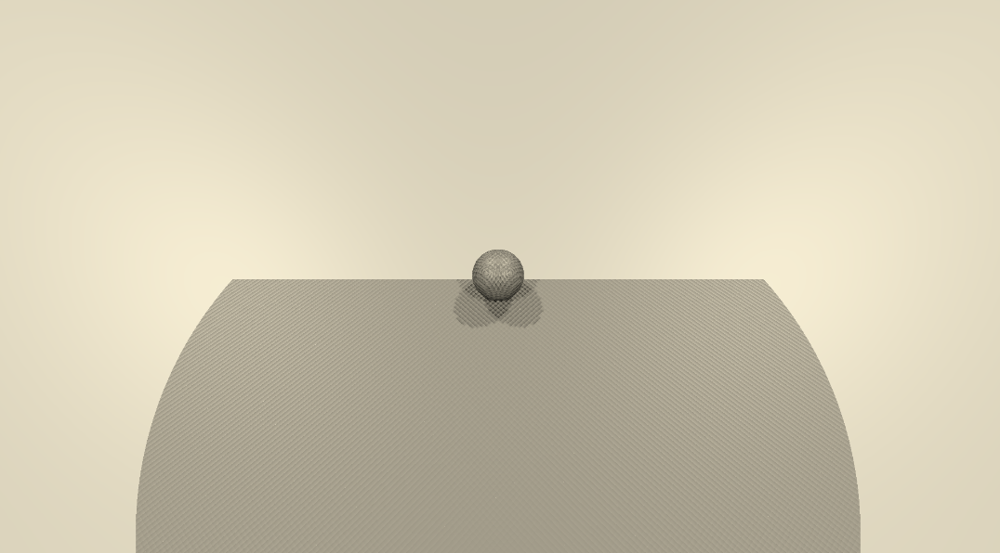
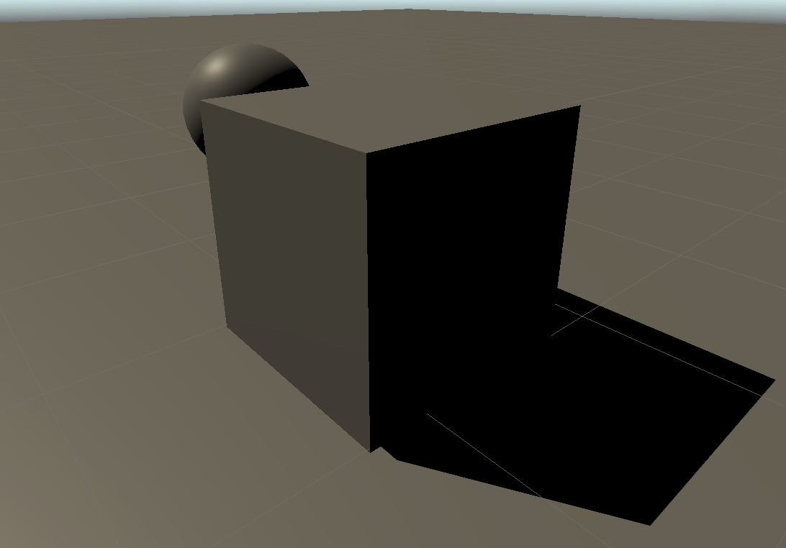

### SRP中的平行光阴影 下篇

#### 3 Cascaded Shadow Maps

因为平行光会影响max shadow distance以内的所有可投影物体，得到的shadow map需要覆盖很大一片区域。另外，因为我们是采用正交投影来计算shadow map的，shadow map内的每个纹理像素都有一个固定的world space分辨率。如果分辨率过大，会导致每个纹素都清晰可见，从而产生锯齿，已经一些小的阴影可能会消失。尽管可以通过增大阴影atlas的分辨率来缓解这种情况，但是也仅限于一定程度。

当使用透视相机时，远处的物体会在视觉上较小。理论上最佳的阴影分辨率，应该是在任意可视距离上，shadow map的一个纹素可以映射到一个单独的camera target上的像素。所以接近摄像机的物体需要更高的分辨率，远处的物体则可以使用较低的分辨率，也就是说，我们应该根据接受投影的物体的距离使用多重分辨率的shadow map。

级联阴影便是一个可行的解决方法。它的思路是，shadow- receiver会被渲染多次，以便每个光源在atlas中获得多个tile，这些tile被称为级联。第一个级联只覆盖靠近相机的一个小区域，随后级联会逐渐扩大覆盖范围，但纹素的总数量不变。Shader会为每个片段采样最合适的级联。

级联阴影允许我们在不同的距离区域使用不同分辨率的shadow map，从而保证性能的同时也获取一个更好的视觉效果。

##### Settings

目前为止，我们仅仅实现了用一个级联去覆盖整个max shadow distance。我们调整`ShadowSettings`的代码，从而可以调整阴影的级联数量、每个级联所占的比例

```c#
// ShadowSettings Class
public struct Directional
{
    public TextureSize atlasSize;
    [Range(1, 4)] public int cascadeCount;
    [Range(0f, 1f)] public float cascadeRation1, cascadeRation2, cascadeRation3;
}
public Directional directional = new Directinoal 
{
    atlasSize = TextureSize._1024,
    cascadeCount = 4,
    cascadeRatio1 = 0.1f,
    cascadeRatio2 = 0.25f,
    cascadeRatio3 = 0.5f
};

public Vecor3 CascadeRations => new Vector3(cascadeRaio1, cascadeRaio2, cascadeRaio3);
```

##### Rendering Cascades

每个级联需要自己的转换矩阵，所以shadow matrices数组的大小需要在最大投影平行光的基础上再乘最大级联数量。同时在C#脚本和Shader中调整。

因为现在每个灯光都会占用多个连续的tile，我们需要在`Shadows.ReserveDirectionalShadows()`调整tile偏移的计算方式，也就是乘上级联数量。此外，tile的总数量也需要调整。在这里我对split的理解是，split是对分辨率在数字上的分割，1024被split两份，每份便是512，也就是一个shadow atlas会被分割为`split ^ 2`份，当split等于二，总共有4个tile，当split等于四，总共有16个tile。

```c#
// Shadows Class
private void RenderDirectionalShadows()
{
    ...
    int tiles = shadowedDirectionalLightCount * setting.directional.cascadeCount;
    int split = tiles <= 1 ? 1 : tiles <= 4 ? 2 : 4;
    int tileSize = atlasSize / split;
	...
}

public Vector2 ReserveDirectionalShadows(Light light, int visibleLightIndex)
{
    if (...)
    {
        shadowedDirectionalLights[shadowedDirectionalLightCount] =
            new ShadowedDirectionalLight { visibleLightIndex = visibleLightIndex };
        return new Vector2(light.shadowStrength, settings.directional.cascadeCount * shadowedDirectionalLightCount++);
    }
    return Vector2.zero;
}
```

级联阴影下，需要对每个级联绘制阴影，也就是循环调用`cullingResults.ComputeDirectionalShadowMatricesAndCullingPrimitives()`和`context.DrawShadows()`

```c#
// Shadows Class
private void RenderDirectionalShadows(int index, int split, int tileSize)
{
    ShadowedDirectionalLight light = shadowedDirectionalLights[index];
    ShadowDrawingSettings shadowDrawingSettings = ...;
    
    int cascadeCount = settings.directional.cascadeCount;
    int tileOffset = index * cascadeCount;
    Vector3 ratios = settings.directinoal.CascadeRatios;
    
    for (int i = 0; i < cascadeCount; i++)
    {
        cullingResults.ComputeDirectionalShadowMatricesAndCullingPrimitives(
        light.visibleIndex, i, cascadeCount, ratios, tileSize, 0f,
        out Matrix4x4 viewMatrix, out Matrix4x4 projectionMatrix, out ShadowSplitData splitData);
        shadowDrawingSettings.splitData = splitData;
        int tileIndex = tileOffset + i;
        dirShadowMatrices[tileIndex] = ConvertToAtlasMatrix(projectionMatrix * viewMatrix, SetTileViewport(tileIndex, split, tileSize), split);
        buffer.SetViewProjectionMatrices(viewMatrix, projectionMatrix);
        ExecuteBuffer();
        context.DrawShadows(ref shadowDrawingSettings);
    }
}
```

##### Culling Spheres

Unity通过一个Culling Sphere来确定每个级联所覆盖的区域。剔除是球形的，但是阴影的投影是正交且正方形的，所以Culling Sphere还会包围投影周围的一些区域，这也是为什么一些因为在剔除区域以外也是可见的。

CullingSphere是Unity为我们创建的，它被包含在`ComputeDirectionalShadowMatricesAndCullingPrimitives`的`ShadowSplitData`中。此外，平行光的照射角度与Culling Sphere并没有什么关系，所有平行光都会使用同一套CullingSpheres。所以我们只需要从splitData中获取一次就可以，因为级联对所有灯光都是等价的。

我们在Shader中判断使用哪个级联，所以就需要判断片段是否在球体中，方法是比较片段和cullingSphere中心的平方距离与cullingSphere的平方半径。我们应该在获取culling Sphere之后就计算出平方半径，这样就不用在Shader里再次计算了。

```c#
// Shadows Class
private int 
	cascadeCountID = Shader.PropertyToID("_CascadeCount"),
	cascadeCullingSpheresID = Shader.PropertyToID("_CascadeCullingSphere");

private static Vector4[] cascadeCullingSpheres = new Vector4[maxCascades];

private void RenderDirectionalShadows () {
    …
    buffer.SetGlobalInt(cascadeCountId, settings.directional.cascadeCount);
    buffer.SetGlobalVectorArray(
        cascadeCullingSpheresId, cascadeCullingSpheres
    );
    buffer.SetGlobalMatrixArray(dirShadowMatricesId, dirShadowMatrices);
    buffer.EndSample(bufferName);
    ExecuteBuffer();
}

private void RenderDirectionalShadows(int index, int split, int tileSize)
{
	...
    for (int i = 0; i < cascadeCount; i++)
    {
        cullingResults.ComputeDirectionalShadowMatricesAndCullingPrimitives(...);
        shadowDrawingSettings.splitData = splitData;
        if (index == 0)
        {
            Vector4 cullingSphere = splitData.cullingSphere;
            cullingSphere.w *= cullingSphere.w;
            cascadeCullingSpheres[i] = cullingSphere;
        }
        ...
    }
}
```

##### Sampling Cascades

首先是在`Shadows.hlsl`中定义管线中传进的值。级联的索引应该是根据片段决定，而不是逐灯的，所以我们新建一个`ShadowData`结构体来存储下标，同时创建一个方法从结构体中获取下标。

```glsl
// Shadows.hlsl
CBUFFER_START(_CustomShadows)
	int _CascadeCount;
	float4 _CascadeCullingSpheres[MAX_CASCADE_COUNT];
	float4x4 _DirectionalShadowMatrices
		[MAX_SHADOWED_DIRECTIONAL_LIGHT_COUNT * MAX_CASCADE_COUNT];
CBUFFER_END
    
struct ShadowData
{
    int cascadeIndex;
};
    
ShadowData GetShadowData(Surface surfaceWS)
{
    ShadowData data;
    data.cascadeIndex = 0;
    return data;
}
```

因为级联的引入，`GetDirectionalShadowData`这个方法所计算的tile的偏移已经改变了，我们要把ShadowData作为`GetDirectionalShadowData`的新参数，从而让后续灯光阴影的采样不会出错。为了保证Shader正常编译，要确保各个方法的参数都是正确的。

```glsl
// Light.hlsl
DirectionalShadowData GetDirectionalShadowData(int index, ShadowData shadowData)
{
	DirectinalShadowData data;
	data.strength = _DirectionalLightShadowData[index].x;
	data.tileIndex = _DirectionalLightShadowData[index].y + shadowData.cascadeIndex;
}

Light GetDirectionalLight(int index, Surface surfaceWS, ShadowData shadowData)
{
    ...
    DirectionalShadowData dirShadowData = GetDirectionalShadowData(index, shadowData);
    light.attenuation = GetDirectionalShadowAttenuation(dirShadowData, surfaceWS);
    return light;
}
```

```glsl
// Lighting.hlsl
float3 GetLighting (Surface surfaceWS, BRDF brdf)
{
    ShadowData shadowData = GetShadowData(surfaceWS);
    float3 color = 0;
    for (int i = 0; i < GetDirectionalLightCount(); i++)
    {
        Light light = GetDirectionalLight(i, surfaceWS, shadowData);
        color += GetLighting(surfaceWS, brdf, light);
    }
    return color;
}
```

不过现在的ShadowData里，cascadeIndex默认是0。前面提到，我们要通过比较片段到cullingSphere中心的平方距离与culling Sphere的平方半径。我们可以在`Common.hlsl`中创建一个新的方法来计算平方距离。

```glsl
// Common.hlsl
float DistanceSquared(float3 pA, float3 pB)
{
    return dot(pA - pB, pA - pB);
}
```

我们在`GetShadowData`中循环查看所有级联culling spheres，看看是哪一个包含了当前的片段，一旦确认就可以结束循环了，然后使用当前循环的迭代器作为级联索引。当然了，如果一个片段不被任何一个culling sphere包含，我们最终会得到一个无效索引。

```glsl
// Shadows.hlsl
ShadowData GetShadowData(Surface surfaceWS)
{
    ShadowData data;
    
    int i;
    for (i = 0; i < _CascadeCount; i++)
    {
        float4 cullingSphere = _CascadeCullingSpheres[i];
        float distanceSqr = DistanceSquared(surfaceWS.position, cullingSphere.xyz);
        if (distanceSqr < cullingSphere.w)
            break;
    }
   
    data.cascadeIndex = i;
   
    return data;
}
```

##### Culling Shadow Sampling

超出最后一个级联的话，很可能就意味着没有有效的阴影数据，所以我们应该避免对这部分的shadow map进行采样。一个简单的方法是，在`ShadowData`中添加一个`strength`字段，默认为1，如果超出最后一个级联就设置为0。把这个值应用在全局阴影衰减值上。

```glsl
// Shadows.hlsl
struct ShadowData
{
	int cascadeIndex;
    float strength;
}

ShadowData GetShadowData (Surface surfaceWS)
{
    ShadowData data;
    data.strength = 1;
    ...
    if (i == _CascadeCount)
    {
        data.strength = 0;
    }
    ...
}
```

```glsl
// Light.hlsl 
DirectionalShadowData GetDirectionalShadowData(int lightIndex, ShadowData shadowData)
{
    DirectionalShadowData data;
    data.strength = _DirectionalLightShadowData[lightIndex].x * shadowData.strength;
    data.tileIndex = _DirectionalLightShadowData[lightIndex].y + shadowData.cascadeIndex;
    return data;
}
```

##### Max Distance

让我们考虑一种情况，当max distance设置的较小时，可能最大的一个级联cullingSphere的覆盖范围超过了max distance，此时就会导致最后一个级联阴影突然消失，这种视觉效果是错误的。为了解决这个问题，我们可以让阴影在到达max distance时停止渲染，我们将max distance传入GPU

```c#
// Shadows Class

private static int shadowDistanceID = Shader.PropertyToID("_ShadowDistance");

private void RenderDirectionalShadows()
{
    ...
    buffer.SetGlobalFloat(shadowDistanceID, settings.maxDistance);
    buffer.EndSample(bufferName);
    ExecuteBuffer();
}
```

Max Shadow Distance是基于观察空间内的深度值，并非相对于相机位置的深度。所以为了实现在max distance的culling，我们该需要知道片段的深度，所以我们最好调整一下`Surface`

```glsl
// Surface.hlsl
struct Surface
{
	float3 position;
	...
	float depth;
	...
};
```

dept的值我们可以在`LitPassFragment`中通过世界空间下的position到观察空间的转换获取，因为这个转换只是相对于世界空间的旋转和偏移，因为深度值在世界空间和观察空间中都是相等的。

```glsl
// LitPass.hlsl
float4 LitPassFragment(Varyings input) : SV_Target
{
    ...
    surface.viewDirection = normalize(_WorldSpaceCameraPos - input.positionWS);
    surface.depth = -TransformWorldToView(input.positionWS).z;
}
```

之前我们在`Shadows.hlsl`的`GetShadowData`里，将strength初始化为1。现在让我们给render Shadow的初始化添加一个条件，只有当片段的深度小于max shadow distance时，才执行这个初始化。

```glsl
// Shadows.hlsl

CBUFFER_START(_CustomShadows)
    ...
    float _ShadowDistance;
CBUFFER_END
    
ShadowData GetShadowData (Surface surfaceWS)
{
    ShadowData data;
    data.strength = surfaceWS.depth < _ShadowDistance ? 1.0 : 0.0;
    ...
}
```

这样一来，阴影剔除就包含了基于max shadow、也就是基于深度的部分了。



##### Fading Shadows

阴影突然截断消失的效果不太美观，作为技术美术能忍吗？不能忍！我们可以使用线性渐变来让阴影的过渡更加平滑，渐变从max distance之前的一段距离开始，直到max distance的强度为0。我们把公式 
$$
\frac{1 - \frac{d}{m}}{f}
$$
计算得到的值钳制在【0，1】的范围内，用来表示衰减关系。其中*d*代表片段深度值，*m*代表max shadow distance，*f*代表衰减范围，以max distance的一部分来表示。让我们把这个衰减范围*f*在`ShadowSettings`中暴露出来。因为max distance和*f*都要做出除数，限制这俩数的最小值不为0。

```c#
// ShadowSettings Class
[Min(0.001f)] public float maxDistance = 100f;
[Range(0.001f, 1f)] public float distanceFade = 0.1f;
```

衰减距离同样需要传进GPU，我们可以将它和max Distance一并打包，同时因为公式中两个数都是作为除数，我们在传给GPU之前就预先进行除法运算，从而避免在Shader里使用效率相对不高的除法。

```c#
// Shadows Class
private static int shadowDistanceFadeID = Shader.PropertyToID("_ShadowDistanceFade");

private void RenderDirectionalShadows()
{
    ...
    buffer.SetGlobalVector(shadowDistanceFadeID, new Vector4(1f / settings.maxDistance, 1f / settings.distanceFade));
}
```

```glsl
// Shadows.hlsl
CBUFFER_START(_CustomShadows)
    ...
    float _ShadowDistanceFade;
CBUFFER_END
    
float FadeShadowStrength(float distance, float scale, float fade)
{
    return saturate((1.0 - distance * scale) * fade);
}

ShadowData GetShadowData (Surface surfaceWS)
{
    ShadowData data;
    data.strength = FadeShadowStrength(surfaceWS.depth, _ShadowDistanceFade.x, _ShadowDistanceFade.y);
    ...
}
```

##### Fading Cascades

目前我们实现了让阴影在达到max shadow distance时是线性衰减，而不是粗暴截断的。现在我们可以使用相同的方法，在最后级联的边缘淡化阴影。为此，我们在`ShadowSettings`中设置一个级联淡化阴影的滑块。

```c#
// ShadowSettings Class
pubic struct Directional
{
    ...
    [Range(0.001f, 1f)] public float cascadeFade;
}
public Directional directinal = new Directional
{
    ...
    cascadeRatio3 = 0.5f,
    cascadeFade = 0.1f
}
```

只不过，我们在级联相关的阴影渐变中，使用的是非线性的公式
$$
\frac{1 - \frac{d^2}{r^2}}{1-(1-f)^2}
$$
其中*r*代表cullingSphere的半径，分母改变主要是为了保持渐变在级联之间的比例不变。接下来的步骤类似，我们把cullingSphere的半径同样打包进`shadowDistanceFade`中。在Shader中，我们要检查是否处于`GetShadowData`循环中的最后一个级联中，如果是的话，计算渐变阴影强度，并计入最终强度。

```c#
// Shadows Class
private void RenderDirectionalShadows()
{
    ...
    float f = 1f - settings.directional.cascadeFade;
    buffer.SetGlobalVector(shadowDistanceFadeID,
        new Vector4(1f / shadowSettings.maxDistance, 1f / shadowSettings.distanceFade, 1f / (1f - f * f));
    buffer.EndSample(bufferName);
    ExecuteBuffer();
}
```

```glsl
// Shadows.hlsl
ShadowData GetShadowData (Surface surfaceWS)
{
	...
    for (i = 0; i < _CascadeCount; i++)
    {
        float4 cullingSphere = _CascadeCullingSpheres[i];
        float distanceSqr = DistanceSquared(surfaceWS.position, cullingSphere.xyz);
        if (distanceSqr < cullingSphere.w)
        {
            if (i == _CascadeCOunt - 1)
            {
                data.strength *= FadeShadowStrenght(distanceSqr, 1.0 / cullingSphere.w, _ShadowDistanceFade.z);
            }
        }
    }

    if (i == _CascadeCount)
    {
        data.strength = 0;
    }
    
    data.cascadeIndex = i;

    return data;
}
```

#### Shadow Quality

目前来看，我们已经实现了级联阴影的功能，现在还需要提高阴影质量。我们一直所观察到的伪影，也就是出现在本不该被投影的区域的阴影，也被称为shadow acne，它是由于和光线方向不完全一致的表面产生了错误的自阴影，当表面越来越与光线方向平行时，shadow arne就会越严重。

增加atlas的尺寸可以减小纹素在世界空间下的尺寸，shadow arne会变小，但是伪影的数量也会增加，所以提升阴影质量还需要别的方法。

##### Depth Bias

最简单的方法是，给shadow-caster的物体的深度添加一个恒定的偏移，将它们推离光线，这样就不会再出现错误的自阴影了。我们可以在渲染是应用全局深度偏移，在绘制阴影前在在缓冲区上调用SetGlobalDepthBias，然后将其设回零。这是在clip space中应用的深度偏移，其数值是非常小的，具体则取决于shadow map所使用的确切格式。

但是，当深度偏移将shadow-caster推离光线时，采样的阴影也会向同一方向移动，当偏移量过大时，阴影就会被移到较远的距离，看起来就像是脱离了shadow-caster的物体，这种现象被称为Peter-Panning彼得平移。



另一种方法是应用斜率缩放偏置，方法是在 `SetGlobalDepthBias` 的第二个参数中使用非零值。该值用于沿 X 和 Y 维度缩放绝对剪辑空间深度导数的最高值。因此，对于正面照射的表面，该值为零；当光线在两个维度中至少有一个维度以 45° 角照射时，该值为 1；当表面法线与光线方向的点积为零时，该值接近无穷大。因此，当需要更多偏差时，偏差会自动增加，但没有上限。因此，消除粉刺所需的系数要低得多，例如 3 而不是 500000。

斜率刻度偏差虽然有效，但并不直观。因此，让我们暂时放弃这个方法它，寻找一种更直观、更可预测的方法。

##### Cascade Data

由于acne的大小取决于世界空间的像素大小，因此一种适用于所有情况的一致方法必须考虑到这一点。由于每个级联的像素大小不同，这意味着我们需要向 GPU 发送更多的级联数据。为此，我们将在 `Shadows` 中添加一个通用的级联数据向量数组，并传进GPU。

