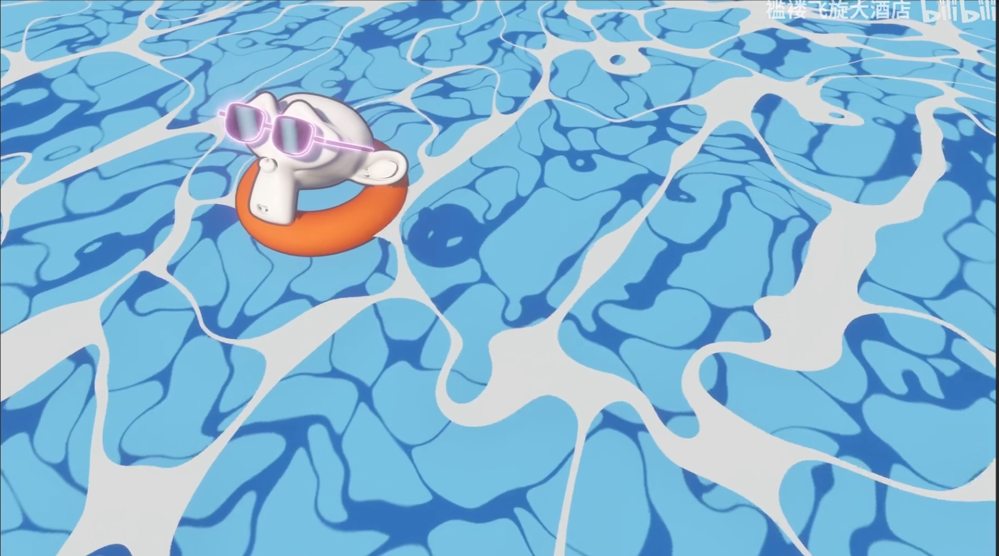
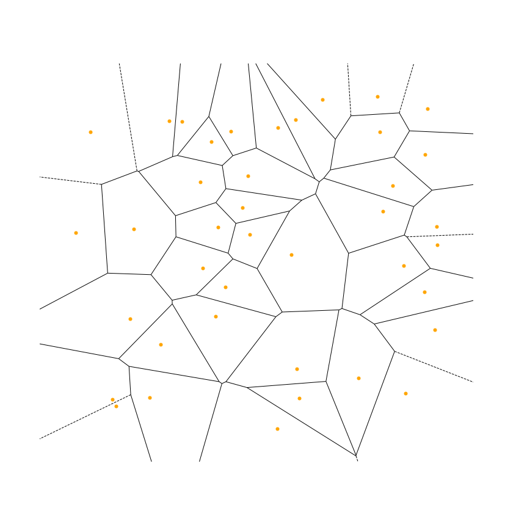

### 效果演示

[视频效果](https://www.bilibili.com/video/BV1ee41127KK/?vd_source=cc41a7cc9c44f49732f73a9e9ce74f80)

### 什么是Voronoi

在下图中，我们在一个二维平面上随机放置了一组40个橙色的点，这些点周围的区块被称为voronoi单元。

Voronoi图是基于一组离散点的空间分割图，它将空间划分为多个区域，以使每个区域内的点离其对应的离散点最近。

具体来说，给定一组离散点，称为生成点（generators）或者种子点（seeds），Voronoi图将空间分割为多个细胞，每个细胞都与一个生成点关联。每个细胞是由与相应生成点最接近的空间区域内的点组成的。也就是说，对于一个给定的细胞，其中的所有点到达该细胞关联的生成点的距离最短，而与其他生成点的距离则更远。

### 如何计算Voronoi图

计算Voronoi图的常用方法是通过以生成点为中心，逐个计算每个细胞的边界。以下是一种基本的算法：

1. 首先，给定一个二维空间和一组生成点。
2. 对于每个生成点，以它为中心，计算它与其他所有生成点之间的距离，并找到最近的那些点。
3. 根据这些最近的点，构建多边形边界，形成一个细胞。
4. 重复步骤2和步骤3，为每个生成点生成相应的细胞。
5. 在这个过程中，可以采用不同的数据结构和算法来提高计算效率，比如使用**凸包**和Delaunay三角剖分。
6. 当所有细胞的边界都计算完毕后，Voronoi图就生成了。
