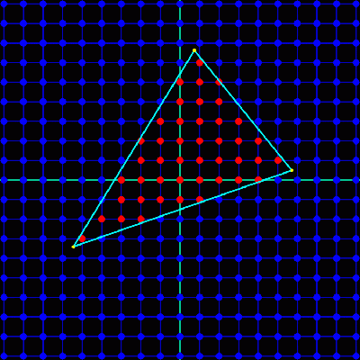
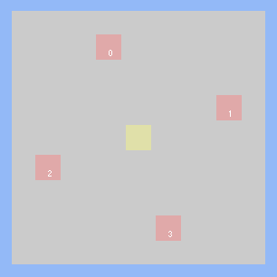
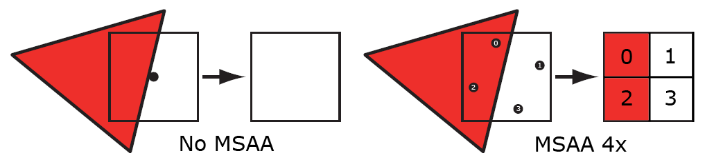

> 原文在[这里](https://mynameismjp.wordpress.com/2012/10/24/msaa-overview/)

### Rasterization Basic

GPU上的光栅化管线以图元（包括点、线、三角形）的顶点作为输入，通过模型变换、视图变换、透视投影将这些顶点变换到齐次坐标空间下，并最终用于确定当前图元在渲染目标（通常是屏幕）覆盖的像素区域。这样的过程就称为光栅化。

覆盖的像素通过两个测试进行判断：coverage与occlusion。coverage测试指的是判断图元是否与给定的像素重叠，具体则是判断图元是否与位于每个像素正中心的单个采样点重叠，如下图所示：

Occusion测试则是借助GPU中的depth buffer，判断与一个图元重叠的像素是否会与其他图元重叠。Depth buffer中存储着每个像素位置上，距离相机最近的图元的深度值。当光栅化一个图元时，它的插值深度会与depth buffer中存储的值进行比较来判断当前像素是否会被遮挡。如果通过了occlusion测试，则像素可见，同时也会刷新depth buffer中存储的值。

需要注意的是，深度测试通常发生在像素着色完成后，但现在的硬件设备基本上都可以在着色计算前实现某种形式上的深度测试，从而避免对会被遮挡的片段执行深度测试，从而减性能开支。我们将这种技术称为Early-Z。只是，在某些情况下，Early-Z会导致错误的结果，比如片段的深度值需要在fragment shader中才能计算出来。

**总而言之，coverage测试与occlusion测试共同决定了图元的可见性。**

---

### Supersampling Evolves into MSAA

与SSAA类似，在MSAA中，coverage测试与occlusion测试都会以更高的采样率执行，通常是2倍到8倍。具体而言，GPU会在一个像素中构建N个采样点，我们讲这些采样点称为子采样点subsamples。如下图所示，黄色标记了像素的中心位置，像素中的四个子采样点用红色进行了标记：

我们会对每个子采样点执行coverage测试，并最终生成一个按位覆盖掩码bitwise coverage mask。这个掩码是一个有N位数组成的二进制数，每一位对应一个采样点，如果子采样点通过了coverage测试，则位设置为1，否则为0。这个按位覆盖掩码最终表示了像素中有多少部分（即多少个采样点）被三角形覆盖。通过这个掩码，可以决定如何混合颜色来减少锯齿效应。

**总结起来，通过在每个像素内多个采样点测试三角形的覆盖情况，生成一个表示覆盖状态的掩码，从而更精确地计算像素的颜色，减少锯齿。**

同时，在MSAA中，我们会对每个子采样点进行深度测试，而非每个像素，所以depth buffer就需要存储额外的深度数据，**也就是说，depth buffer的内存占用是不使用MSAA的N倍。**

MSAA与SSAA的区别在于pixel shader执行上。在SSAA中，每个像素包含多个采样点，而像素着色器会对每个采样点执行一次。而在MSAA中，我们不会为每个子采样点都执行pixel shader。相反，我们会为至少有一个与三角形重叠的子采样点的像素执行一次pixel shader。换句话说，pixel shader会在coverage mask不为0的像素上执行一次。

当执行像素着色器时，我们也不会考虑每个子采样点的具体位置，而是依然基于像素的中心点进行插值，这意味着当开启MSAA后，像素着色器的计算成本不会显著增加。

MSAA 渲染中，尽管像素着色器只执行一次，但为了准确地记录多个三角形对一个像素的影响，渲染目标需要足够的存储空间来保存每个采样点的结果。这确保了在最终合成时，每个像素能正确地反映所有三角形的贡献，从而达到抗锯齿的效果。如下图所示：

---

### MSAA Resolve

和SSAA一样，在 MSAA 中，每个像素会有多个采样点。这些采样点的结果不能直接用于显示，因为显示设备只能显示每个像素的一个颜色值。因此，需要将这些采样点的值resample到输出分辨率。这一过程在 MSAA 中被称为resolving the render target。在 MSAA 的早期实现中，解析过程通常由 GPU 上的固定功能硬件完成。常用的解析滤波器是 1 像素宽的box filter。这个滤波器的作用就是将一个像素中的所有采样点的值平均化，从而生成一个最终的像素颜色值。但是现在，我们可以使用自定义的着色器对MSAA进行解析。

---

- [ ] HDR与ToneMapping下的MSAA

- [ ] MSAA与延迟渲染
